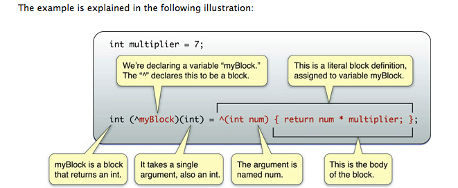

### `Block`简介

`Block`作为`C`语言的扩展，和其他语言的闭包或`lambda`表达式是一回事。由于`OC`在`iOS`中不支持`GC`机制，使用`Block`必须自己管理内存。内存管理正是使用`Block`坑最多的地方，错误的内存管理要么导致`return cycle`内存泄漏，要么内存被提前释放导致`crash`。

`lambda`表达式是一个匿名函数，即没有函数名的函数，`lambda`表达式可以表示闭包。

`Block`包含的两个部分：

1. `Block`执行的代码，这是在编译的时候已经生成好的
2. 一个包含`Block`执行时需要的所有外部变量值的数据结构。`Block`将使用到的、作用域捕获到的变量的值建立一份快照拷贝到栈上。

* `block`与函数的区别
  1. `Block`的使用很像函数指针，不过与函数最大的不同是：`Block`可以访问函数以外、词法作用域以内的外部变量的值。即，`Block`不仅实现函数的功能，还能携带函数的执行环境。
  2. `Block`与函数另一个不同是，`Block`类似`OC`的对象，可以使用自动释放池管理内存(但`Block`并不完全等同于`OC`对象)

### `Block`基本语法

`Block`语法结构如下图

### `Block`在内存中的位置

根据`Block`在内存中的位置分为三种类型`NSGlobalBlock`，`NSStackBlock`, `NSMallocBlock`

* `NSGlobalBlock`：类似函数，位于`text`段
   * 当使用`Block`时，没有使用`Block`以外的任何外部变量，`Block`不需要建立局部变量值的快照。这种情况下，使用的`Block`与函数没有任何区别，此时编译器把使用的`Block`放到了`text`代码段。
* `NSStackBlock`：位于栈内存，函数返回后`Block`将无效
   * 当使用的`Block`内部捕获了外部局部变量，此时在定义(注：是定义，不是运行)所使用的`Block`时，所捕获到的局部变量的当前值被`copy`到栈上，作为常量供当前的`Block`使用。此时在`Block`内，被捕获的变量是只读的，如果想在`Block`内改变被捕获的变量的值，在定义局部变量时要用`__block`修饰。
   * `Block`中使用`__block`修饰的变量时，将取变量此刻运行时的值，而不是定义时的快照。
* `NSMallocBlock`：位于堆内存

### `Block`的`copy`、`retain`、`release`操作

不同于`NSObject`的`copy`、`retain`、`release`操作，对`Block`进行`copy`、`retain`、`release`有以下特性：

* `Block_copy`与`copy`等效，`Block_release`与`release`等效
* 对`Block`不管是`retain`、`copy`、`release`都不会改变引用计数`retainCount`，`retainCount`始终是`1`
* **`NSGlobalBlock`：`retain`、`copy`、`release`操作都无效**
* `NSStackBlock`
   * `retain`、`release`操作无效。必须注意的是，`NSStackBlock`在函数返回后，`Block`内存将被回收，即使`retain`也没用
   * 容易犯的错误是`[[mutableArray addObject:stackBlock]`，在函数出栈后，从`mutableArray`中取到的`stackBlock`已经被回收，变成了野指针。正确的做法是先将`stackBlock``copy`到堆上，然后加入数组：`[mutableArray addObject:[[stackBlock copy] autorelease]]`
   * 支持`copy`，`copy`之后生成新的`NSMallocBlock`类型对象
* **`NSMallocBlock`支持`retain`、`release`，虽然`retainCount`始终是`1`，但内存管理器中仍然会增加、减少计数。`copy`之后不会生成新的对象，只是增加了一次引用，类似`retain`**
* 尽量不要对`Block`使用`retain`操作

### `Block`对不同类型的变量的存取

* **局部自动变量**，在`Block`中只读。`Block`定义时`copy`变量的值，在`Block`中作为常量使用，所以即使变量的值在`Block`外改变，也不影响它在`Block`中的值
* **`static`变量、全局变量**。如果把变量定义成全局的、或`static`类型的变量，`Block`就可以对它进行读写了。因为全局变量或静态变量在内存中的地址是固定的，`Block`在读取该变量值的时候是直接从其所在内存读出，获取到的是最新值，而不是在定义时`copy`的常量。这种情况下，`Block`外部对变量的更新会影响`Block`中已被捕获的变量的取值，同样在`Block`内对捕获到的变量的更新也会影响到`Block`外部对应的变量的值
* `Block`变量，被`__block`修饰的变量称作`Block`变量。基本类型的`Block`变量等效于全局变量或静态变量

`Block`被另一个`Block`使用时，另一个`Block`被`copy`到堆上时，被使用的`Block`也会被`copy`。但**作为参数的`Block`是不会发生`copy`的**。无论`Block`在堆上还是在栈上，作为参数的`Block`不会发生`copy`。

* `OC`对象，不同于基本类型，`Block`会引起对象的引用计数变化
   * 全局对象、静态对象，在内存中的位置是确定的，所以`Block copy`时不会`retain`对象
   * 实例对象，在`Block copy`时也没有直接`retain`实例对象本身，但会`retain self`，所以在`Block`中可以直接读写实例对象变量
   * 局部对象，在`Block copy`时，系统自动`retain`对象，增加其引用计数
   * `block`对象，在`Block copy`时，不会`retain`

* 非`OC`对象，如`GCD`队列`dispatch_queue_t`，`Block copy`时并不会自动增加其引用计数，这点要非常小心

### `retain cycle`

* 产生原因：`retain cycle`问题的根源在于`Block`和`obj`可能会互相强引用，互相`retain`对方，这样就导致了`retain cycle`，最后这个`Block`和`obj`就变成了孤岛，谁也释放不了谁

* 解决办法：解决这个问题的办法是使用**弱引用**打断`retain cycle`。使用`__block`修饰`obj`。

在`Block`中使用成员变量，`retain`的不是这个变量，而会`retain self`。

注：`MRC`中`__block`是不会引起`retain`；但在`ARC`中`__block`则会引起`retain`。`ARC`中应该使用`__weak`或`__unsafe_unretained`弱引用。`__weak`只能在`iOS5`以后使用。

避免`Block`使用对象被提前释放，此时必须要注意对象和`Block`的生命周期。

##### 错误使用__block的场景

因担心`retain cycle`错误的使用`__block`

将`Block`作为参数传给`dispatch_async`时，系统会将`Block`拷贝到堆上，如果`Block`中使用了实例变量，还将`retain self`，因为`dispatch_async`并不知道`self`会在什么时候被释放，为了确保系统调度执行`Block`中的任务时`self`没有被意外释放掉，`dispatch_async`必须自己`retain`一次`self`，任务完成后再`release self`。但这里使用`__block`，使`dispatch_async`没有增加`self`的引用计数，这使得在系统在调度执行`Block`之前，`self`可能已被销毁，但系统并不知道这个情况，导致`Block`被调度执行时`self`已经被释放导致`crash`。

上述情况下不要使用`__block`。