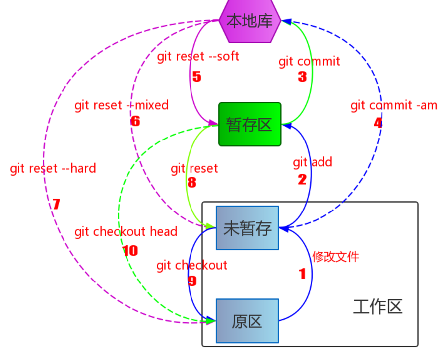
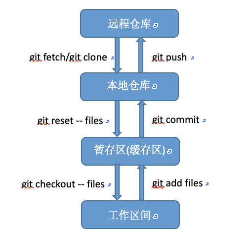
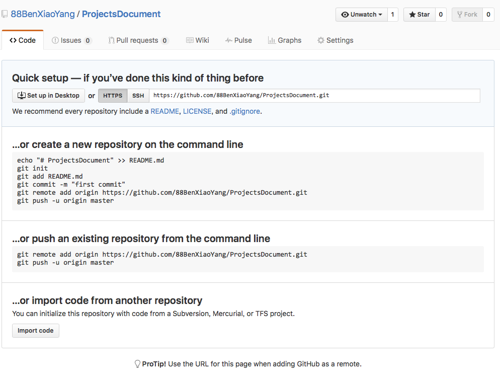
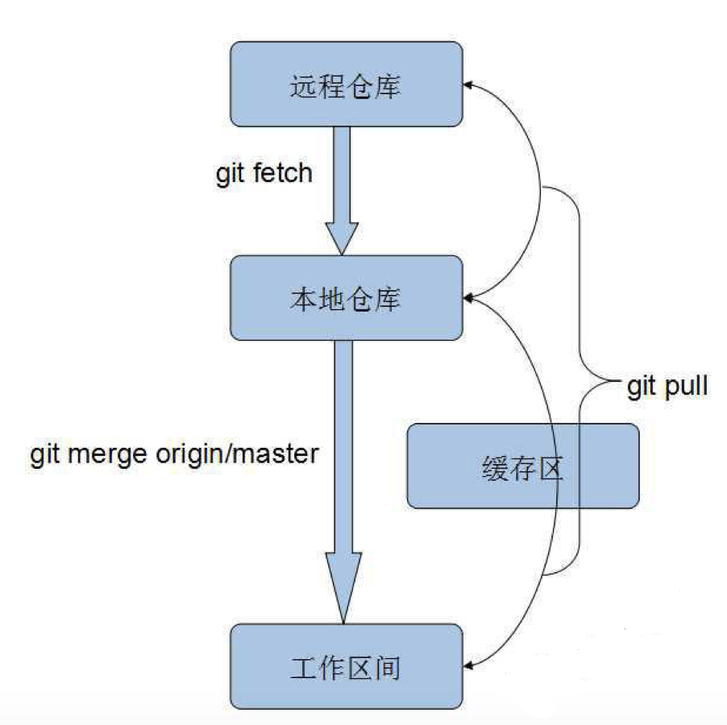
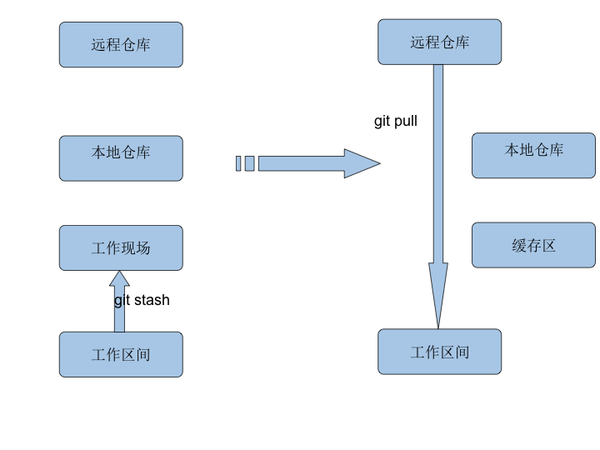
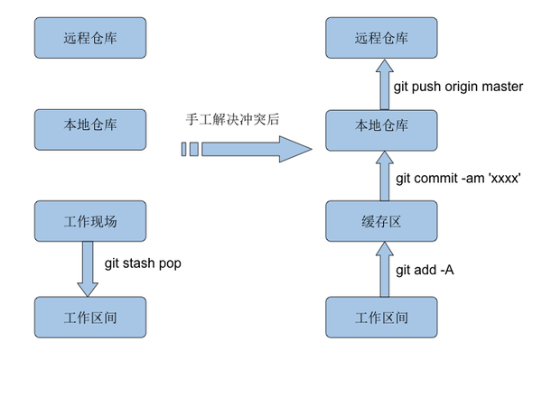
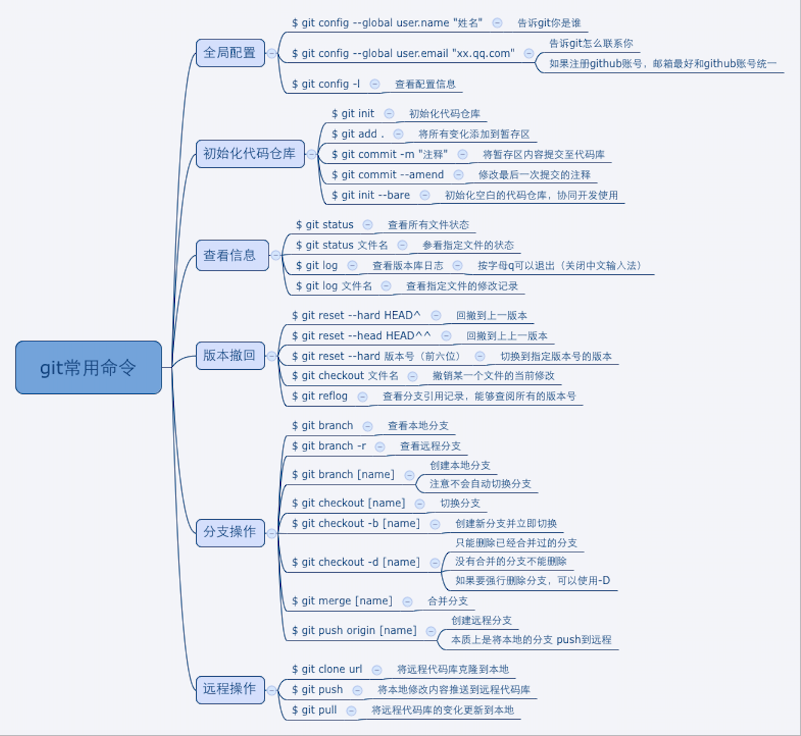

### `Git`的区域

#### `Git`本地工作区域

`git`本地工作区域分为：**工作区、暂存区、本地仓库区**，具体区域及相互交互见下图



* 工作区
  * 即我们创建的**工程文件**，在编辑器可直观显示
* 暂存区(缓存区)
  * 版本库<`.git`目录>中设立一个暂存区(`stage or index`)，作为用来直接跟工作区的文件进行交互。工作区文件的提交或者回滚首选都是通过暂存区(`stage or index`)	。**暂存区**是提交代码、解决冲突的中转站。
* 本地仓库
  * 本地仓库是针对项目而言的，用于管理本地项目的版本信息，这个区域的划分是通过与项目文件所在的同级文件目录`.git`来实现的，`.git`目录即为当前项目的本地版本库。**本地仓库**是连接本地代码跟远程代码的枢纽，不能联网时本地代码可先提交至该处。
  * 版本库中除了暂存区之外，文件的提交最终存储位置是分支(`branch`)，在创建版本库的时候默认都会有一个主分支(`master`)

###### 远程仓库与本地仓库的交互



远程仓库，即保存代码的服务器

###### 工程文件的状态

从`git`的角度来看，对工程文件的操作有四种状态：

* 原始状态
* 未暂存状态(编辑了但未执行`git add`操作)
* 暂存区状态(编辑了并进行了`git add`操作)
* 本地库状态(编辑了并进行了`git add`和`git commit`操作)

基于工程文件的状态，理解撤销操作。撤销修改(将工程撤回到最近一次正确提交的状态)，分以下三种情况：

1. 修改未提交到暂存区
  * 修改未提交到暂存区，即修改后未执行`git add`操作。如要撤销指定文件的修改操作，此时使用`git checkout 指定文件/git checkout -- 指定文件`，可对已修改的指定文件进行撤销修改操作。通常使用`git checkout -- 指定文件`，避免因文件名与分支名同名报错致使撤销不成功
2. 修改已提交到暂存区
  * 修改已提交到暂存区，即修改后执行了`git add`操作。如要撤销指定文件的修改操作。需执行以下两步
      * `git reset -- 指定文件`，该操作将暂存区内选中的目标文件从暂存区中丢弃，不影响其他任何区域的文件
      * `git checkout -- 指定文件`
3. 修改已提交到版本库
  * 修改已提交到版本库，即修改后执行了`git add`和`git commit`操作。用版本回退撤销修改，`git reset -- hard commit_id`(需要回退到的`commit_id`)。

#### 本地仓库与远程仓库的关联



* 操作步骤
  * 本地如已存在`git`仓库，使用以下指令将本地仓库与远程仓库关联
     * `git remote add origin https://(远程指定仓库的地址)`
     * `git push -u origin master`

  * 本地如无`git`仓库，需先初始化一个本地`git`仓库，如下
     * `git init`
     * `git add .`
     * `git commit -m ""`(理解：创建`commit`的`hash`值，以便`HEAD`引用指向中有值)
     * `git remote add origin https://(远程指定仓库的地址)`
     * `git push -u origin master`

Tips:

```
创建本地仓库并关联到远程仓库时，远程需已创建出一个指定的仓库

注：往git上提交文件夹时，如文件夹内容为空，则该文件夹提交不到git上
```

### 常用操作

* 创建分支(基于`commit`创建分支)
  * 可以基于当前分支创建新分支，也可以基于当前分支的某一次`commit`来创建分支。
  * 基于分支的某次提交创建新分支：`git branch new_branchName hashValue`(提交状态的`hash`值前四位)。也可以使用等价命令：`git checkout -b <new_branch> <start point>`

* 查看差异操作
  1. `git diff`：查看尚未暂存的文件更新了哪些部分，即当前状态下工作区和暂存区之间的差异
  2. `git diff - cached`：查看已暂存的文件和上次提交时的快照之间的差异，即当前状态下暂存区和分支内的差异
  3. `git diff HEAD`：查看未暂存文件(工作区文件)与最新提交文件快照的区别，即当前状态下工作区和分支内的差异

* 撤销操作
  1. `git commit -- amend`：撤销上一次提交，并将暂存区文件重新提交
  2. `git checkout -- <file>`：拉取暂存区文件，并将其替换成工作区文件
  3. `git reset HEAD -- <file>`：拉取最近一次提交到版本库的文件到暂存区，该操作不影响工作区

* `checkout`和`reset`的区别
  * `git reset - files`：用来撤销最后一次`git add files`
  * `git reset`：撤销所有暂存区域文件
  * `git checkout - files`：把文件从暂存区域覆盖到工作目录，用来丢弃本地修改
(`reset`操作是将暂存区内选中的目标文件从暂存区中丢弃，不影响其他任何区域的文件，等同于一个自刷新的动作)

* `git checkout`常用的场景是：**创建分支和切换分支**
  * 创建分支：`git branch branchName`
  * 切换分支：`git checkout branchName`
  * 上述两个命令的快捷使用：`git checkout -b branchName`

* 在已关联远程仓库的前提下，新建分支并将新建分支`push`到远程仓库
  * `git branch newBranch`(新建分支)
  * `git checkout newBranch`(切换到新分支)
  * `git push origin newBranch:remoteNewBranch`(newBranch:remoteNewBranch - 本地分支:远程分支)(将本地分支`newBranch` `push`到远程分支，并将远程分支命名为`remoteNewBranch`)

##### `checkout`

`HEAD`是`checkout`的灵魂。在进行切换分支和新建分支操作时，其背后的工作原理是通过`.git`目录下的`HEAD`引用实现的。在切换分支的时候，`HEAD`也会相应的指向对应的分支引用。

##### `git pull`

`git pull` = `git fetch` + `git merge`

如果使用`fetch`和`merge`配合来达到`pull`的效果，操作过程如下：

1. `git fetch`
2. `git merge origin/分支名`

* `fetch、merge、pull`指令区别的原理图，如下



* 执行`git pull`之后出现冲突的解决方案
  * 放弃本地修改
      * 先让本地仓库代码覆盖本地修改：`git checkout head .`
      * 然后更新远程仓库的代码：`git pull`
      * 如本地修改复杂、重要，该方案不可取
  * 解决冲突后提交本地修改
      * 涉及到`git stash`指令
      * `stash`涉及到`git`的第`5`个区，git stash操作之后会将**工作区间、缓存区间**的改动放到**工作现场**。工作现场，即`dirty working directory`
      * `git stash`成功后本地工作区间的代码跟本地仓库代码会同步
      * 跟缓存区一样，工作现场是独立存在于本地仓库、工作区间的
      * 思路：将本地修改的代码放在工作现场，然后从远程仓库拉取最新代码，拉取成功后再从工作现场将修改的代码取出，这样最新代码跟本地修改的代码就会混杂在一起，手工解决冲突后，提交解决冲突后的代码
      * 原理图如下

      
      
      
##### `stash`

因为`git stash pop`是弹出栈顶的一个`stash`，也就是最后一次存储的`stash`，此时`git stash pop`恢复的同时把`stash`内容也删了。在存储多个`stash`，想取出非栈顶的一个的情况下，是不适用的。这个时候要使用下面指令：

* `git stash list` //查看暂存区的所有暂存修改
* `git stash apply stash@{X}` //取出相应的暂存，不删除`stash`内容
* `git stash drop stash@{X}` //将记录列表中取出的对应暂存记录删除

##### 标签(`tag`)

标签是版本库的一个快照。标签实质是指向某个`commit`的指针

* `git tag`打标签，默认为`HEAD`

* 默认标签是打在最新提交的`commit`上的。如果想要打标签在以前的`commit`上，要`git log`找到历史提交的`commit id`，执行`git tag 标签名称 目标commit_id`，就把历史提交的指定的`commit id`的版本打上了指定的标签名称了

* `git tag`：查看所有标签(标签不是按时间顺序列出，而是按字母排序的)

* `git tag -a <标签名> -m "<说明>"`：创建带说明的标签。`-a`指定标签名，`-m`指定说明文字。用`show`可以查看说明

* 如果标签还未推送到远程，只存储在本地，可以使用`git tag -d 要删除的标签名`对本地打错的标签进行安全的删除

* `git push origin --tags`：一次性推送全部尚未推送到远程的本地标签

* 如果标签推送到远程。`git tag -d 指定的标签名称`先删除本地`指定的标签`。`git push origin :refs/tags/远程对应指定的标签`，删除`远程对应指定的标签`

Tips

```
在命名分支名时，应有实际意义，以避免分支名和文件名重复

新建的分支，严格意义上说，还不是一个分支，因为HEAD指向的引用中没有commit值，只有在进行一次提交后，它才算得上真正的分支

使用git checkout [<branch>]单纯的检出某个commit或分支，是会改变HEAD头指针的。而且只有当HEAD切换到某个分支的时候才可以对提交进行跟踪，否则就会进入“分离头指针”的状态
```

### 常用`Git`指令

* 初始化

```
git init
```

所在文件夹在初始化后具有`git`仓库管理功能，若要取消具有`git`仓库管理功能的文件夹，删除用于仓库管理的`.git`文件夹`rm -rf .git`（或`rm -fr .git`）即可。

* 查看项目地址：

```
git remote -v
```

* 已有分支下创建新分支，并切换到新分支：

```
git checkout -b 新分支 已有分支(能用tab键找到即可)
如：git checkout -b temp v1.0.0
(temp新分支名，v1.0.0已有分支名)

git checkout -b 新分支
(会在当前分支下创建新分支，并切换到新分支上)
```

* 版本回退：

```
git reset --hard commit_id
回退到指定的commit_id版本
```

* 查看分支

```
git branch 查看本地分支，并指示当前所在分支
git branch -a 查看所有分支，包括本地分支和远程分支，并指示当前所在分支
```

* 删除分支

```
删除分支时，当前分支不要处于将要被删除的分支上
git branch -d 将要被删除的分支名称
git branch -D 将要被删除的分支名称 该操作会强删分支（谨慎操作!!!）
```

* 查看修改的详细信息

```
针对具体文件，查看修改的详细信息
git log --pretty=oneline 文件名
git show 356f6def9d3fb7f3b9032ff5aa4b9110d4cca87e（文件提交时生成的哈希码）（可以只拷贝该哈希码的前面几位，最少7位，即可查看对应的文件）
```

* `git checkout HEAD - files`：将工作区和暂存区都同步至当前分支内的状态，也就是最后一次`commit`的状态

* `git commit -a = git add + git commit`

* `git checkout -p <branch>`：比较两个分支间的差异(比较当前分支与目标分支之间的差异)

* `git checkout .`：把当前目录所有修改的文件从`HEAD`中检出并且把它恢复成未修改时的样子

* `git reset --hard HEAD`：如果`commit`出错时，用`reset`回滚到`add`之前的状态

* `git log --graph`：查看分支合并图

* `git merge --no-ff 分支名称`：禁用`Fast forward`模式，因为使用Fast forward模式，删除分支后，分支历史信息会丢失

* `git branch --set-upstream-to origin/`：用于创建本地分支和远程分支的链接关系

* `git add -f`：强制提交已忽略的文件

* `git check-ignore -v`：检查为什么`Git`会忽略该文件

* `git diff`：查看文件修改的具体内容

* `git log`：显示从最近到最远的提交历史

* `git reflog`：显示命令历史

* **`git checkout --`：撤销命令，用版本库里的文件替换掉工作区的文件**

* `git rm 指定文件`：删除版本库的文件

* 替换指定分支上的文件
  * 场景：分支branchA上有目标文件xxx，要将分支branchB上的文件替换为分支branchA上的文件xxx
  * 操作步骤
      * git checkout branchB - 切换到分支B上
      * git checkout branchA - 文件路径(注：要指定文件的路径。文件的合并是基于分支的)

* 分支覆盖
  * 本地分支强制覆盖远程分支 - git push origin branch_name --force
  * 强制更新以远程覆盖本地 - git checkout --force

##### `git`常用命令图谱



### `Git`自定义偏好设置

* `git config --global color.ui true`：让`Git`显示颜色，会让命令输出看起来更醒目
* 忽略特殊文件：创建一个`.gitignore`文件，把需要忽略的文件名填进去，`Git`就会自动忽略这些文件
  * 忽略文件原则：
     * 忽略操作系统自动生成的文件，如缩略图
     * 忽略编译生成的中间文件、可执行文件等，也就是如果一个文件是通过另一个文件自动生成的，那自动生成的文件就没必要放进版本库
     * 忽略自己的带有敏感信息的配置文件，如存放口令的配置文件
* 给`Git`命令配别名

### 相关资料

[Git使用技巧总结](http://www.cocoachina.com/articles/68616?filter=rec)