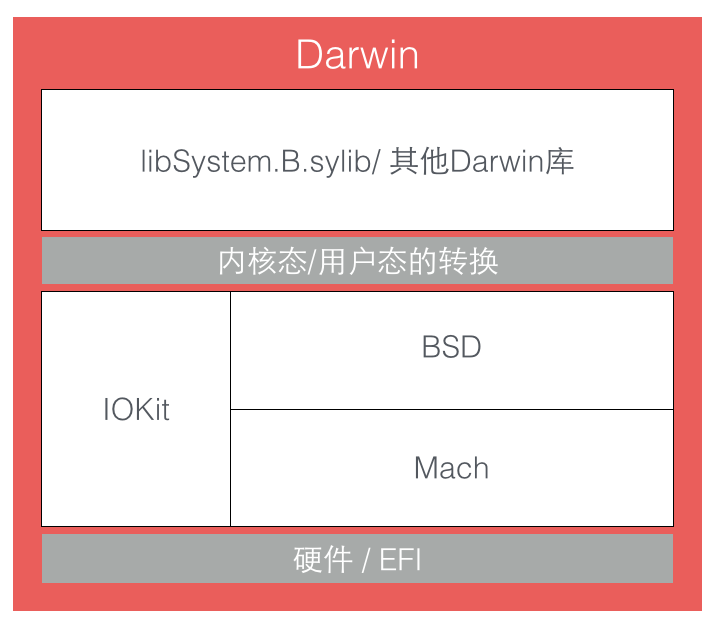

### `RunLoop`的概念

* 背景：一般情况下，**一个线程一次只能执行一个任务**，执行完任务后线程就会退出。
* 目的：需要一个机制，让线程能随时处理事件但并不退出。

为了实现上述目的，引入`Event Loop`模型(事件循环模型)。`Event Loop`在`OSX/iOS`里的实现是`RunLoop`。实现**`Event Loop`模型的关键点是：**如何管理**事件/消息**，如何让**线程**在没有消息处理时休眠以避免资源占用，在有消息到来时立刻被唤醒(`Event Loop`的核心思想)。

`Event Loop`模型的代码逻辑，通常是下面这样的：

```
function loop() {
    initialize();
    do {
        var message = get_next_message();
        process_message(message);
    } while (message != quit);
}
```

模型思想的具体实现通过对象来体现。所以，`RunLoop`实际上就是一个对象，`RunLoop`对象管理了其需要处理的事件和消息，并提供了一个入口函数来执行**`Event Loop`模型关键点**的逻辑。线程执行了这个入口函数后，就会一直处于这个**函数内部“接受消息 -> 等待 -> 处理”的循环**中，直到这个循环结束(如传入`quit`消息)，函数返回，此时执行这个函数的线程就会退出。

`OSX/iOS`系统中，提供了`NSRunLoop`和`CFRunLoopRef`两个实现了`Event Loop`模型思想的对象。

* `CFRunLoopRef`是在`CoreFoundation`框架内的，它提供了纯`C`函数的`API`，所有这些`API`都是**线程安全**的。
* `NSRunLoop`是基于`CFRunLoopRef`的封装，提供了**面向对象**的`API`，但是这些`API`不是线程安全的。

### `RunLoop`与线程的关系

`iOS`开发中会遇到的两个线程对象：`pthread_t`和`NSThread`。`pthread_t`和`NSThread`是一一对应的，即`pthread_t`中有的方法，在`NSThread`中会有与之功能相同的对应方法。

`CFRunLoop`是基于`pthread`来管理的。

苹果不允许直接创建`RunLoop`，只提供了两个自动获取的函数：`CFRunLoopGetMain()`和`CFRunLoopGetCurrent()`。两个函数内部的逻辑代码如下：

```
/// 全局的Dictionary，key 是 pthread_t， value 是 CFRunLoopRef
static CFMutableDictionaryRef loopsDic;
/// 访问 loopsDic 时的锁
static CFSpinLock_t loopsLock;
 
/// 获取一个 pthread 对应的 RunLoop。
CFRunLoopRef _CFRunLoopGet(pthread_t thread) {
    OSSpinLockLock(&loopsLock);
    
    if (!loopsDic) {
        // 第一次进入时，初始化全局Dic，并先为主线程创建一个 RunLoop。
        loopsDic = CFDictionaryCreateMutable();
        CFRunLoopRef mainLoop = _CFRunLoopCreate();
        CFDictionarySetValue(loopsDic, pthread_main_thread_np(), mainLoop);
    }
    
    /// 直接从 Dictionary 里获取。
    CFRunLoopRef loop = CFDictionaryGetValue(loopsDic, thread));
    
    if (!loop) {
        /// 取不到时，创建一个
        loop = _CFRunLoopCreate();
        CFDictionarySetValue(loopsDic, thread, loop);
        /// 注册一个回调，当线程销毁时，顺便也销毁其对应的 RunLoop。
        _CFSetTSD(..., thread, loop, __CFFinalizeRunLoop);
    }
    
    OSSpinLockUnLock(&loopsLock);
    return loop;
}
 
CFRunLoopRef CFRunLoopGetMain() {
    return _CFRunLoopGet(pthread_main_thread_np());
}
 
CFRunLoopRef CFRunLoopGetCurrent() {
    return _CFRunLoopGet(pthread_self());
}
```

分析代码可知，线程和`RunLoop`之间是一一对应的，其关系是保存在一个全局的`Dictionary`里。线程刚创建时并没有`RunLoop`，如果不主动获取，那`RunLoop`一直都不会有。`RunLoop`的创建是发生在第一次获取时，`RunLoop`的销毁是发生在线程结束时。只能在一个线程的内部获取其`RunLoop`(主线程除外？)。

### `RunLoop`对外的接口

在`CoreFoundation`里面关于`RunLoop`有`5`个类：

* `CFRunLoopRef`
* `CFRunLoopModeRef`
* `CFRunLoopSourceRef`
* `CFRunLoopTimerRef`
* `CFRunLoopObserverRef`

其中`CFRunLoopModeRef`类并没有对外暴露，只是通过`CFRunLoopRef`的接口进行了封装。

与`RunLoop`有关的`5`个类的关系如下：


一个`RunLoop`包含若干个`Mode`，每个`Mode`又包含若干个`Source/Timer/Observer`。每次调用`RunLoop`的主函数时，只能指定其中一个`Mode`，这个`Mode`被称作`CurrentMode`。**如果需要切换`Mode`，只能退出`Loop`，再重新指定一个`Mode`进入。**这样做主要是为了分隔开不同组的`Source/Timer/Observer`，让不同组的`Source/Timer/Observer`互不影响。

* `CFRunLoopSourceRef`是事件产生的地方。`Source`有两个版本：`Source0`和`Source1`
  * `Source0`只包含了一个回调(函数指针)，它并不能主动触发事件
  * `Source1`包含了一个`mach_port`和一个回调(函数指针)，被用于**通过内核**和其他线程相互发送消息

* `CFRunLoopTimerRef`是基于时间的触发器，它和`NSTimer`是`toll-free bridge`的，可以混用。`CFRunLoopTimerRef`包含一个时间长度和一个回调(函数指针)。当其加入到`RunLoop`时，`RunLoop`会注册对应的时间点，当时间点到时，`RunLoop`会被唤醒以执行那个回调

* `CFRunLoopObserverRef`是观察者，每个`Observer`都包含了一个回调(函数指针)，当`RunLoop`的状态发生变化时，观察者就能通过回调接收到这个变化。可以观测的时间点有以下几个：

```
typedef CF_OPTIONS(CFOptionFlags, CFRunLoopActivity) {
    kCFRunLoopEntry         = (1UL << 0), // 即将进入Loop
    kCFRunLoopBeforeTimers  = (1UL << 1), // 即将处理 Timer
    kCFRunLoopBeforeSources = (1UL << 2), // 即将处理 Source
    kCFRunLoopBeforeWaiting = (1UL << 5), // 即将进入休眠(RunLoop将从用户态切到内核态)
    kCFRunLoopAfterWaiting  = (1UL << 6), // 刚从休眠中唤醒
    kCFRunLoopExit          = (1UL << 7), // 即将退出Loop
};
```

`Source/Timer/Observer`被统称为`mode item`，一个`item`可以被同时加入多个`mode`。但一个`item`被重复加入同一个`mode`时是不会有效果的。如果一个`mode`中一个`item`都没有，则`RunLoop`(里面的主函数)会直接退出，不进入循环

### `RunLoop`的`Mode`

从`CFRunLoopMode`和`CFRunLoop`的结构去分析理解

`CFRunLoopMode`和`CFRunLoop`的结构如下：

```
struct __CFRunLoopMode {
    CFStringRef _name;            // Mode Name, 例如 @"kCFRunLoopDefaultMode"
    CFMutableSetRef _sources0;    // Set
    CFMutableSetRef _sources1;    // Set
    CFMutableArrayRef _observers; // Array
    CFMutableArrayRef _timers;    // Array
    ...
};
 
struct __CFRunLoop {
    CFMutableSetRef _commonModes;     // Set
    CFMutableSetRef _commonModeItems; // Set<Source/Observer/Timer>
    CFRunLoopModeRef _currentMode;    // Current Runloop Mode
    CFMutableSetRef _modes;           // Set
    ...
};
```

一个`Mode`可以将自己标记为`Common`属性(通过将其`ModeName`添加到`RunLoop`的`commonModes`中）。每当`RunLoop`的内容发生变化时(即`RunLoop`的成员变量发生了变化)，`RunLoop`都会自动将`_commonModeItems`里的`Source/Observer/Timer`同步到具有`Common`标记的所有`Mode`里。`commonModes`的特殊性，是同步`Source/Timer/Observer`到多个`Mode`中的一种技术方案。

有时需要一个`Timer`，在两个`Mode`中都能得到回调，解决方法有两种：

* 一种办法就是将这个`Timer`分别加入这两个`Mode`
* 还有一种方式，就是将`Timer`加入到顶层的`RunLoop`的`commonModeItems`中，`commonModeItems`被`RunLoop`自动更新到所有具有`Common`属性的`Mode`里去

##### 操作相关的`API`

* `CFRunLoop`对外暴露的管理`Mode`的接口只有`2`个

```
CFRunLoopAddCommonMode(CFRunLoopRef runloop, CFStringRef modeName);
CFRunLoopRunInMode(CFStringRef modeName, ...);
```

* `Mode`暴露的管理`mode item`的接口有下面几个

```
CFRunLoopAddSource(CFRunLoopRef rl, CFRunLoopSourceRef source, CFStringRef modeName);
CFRunLoopAddObserver(CFRunLoopRef rl, CFRunLoopObserverRef observer, CFStringRef modeName);
CFRunLoopAddTimer(CFRunLoopRef rl, CFRunLoopTimerRef timer, CFStringRef mode);
CFRunLoopRemoveSource(CFRunLoopRef rl, CFRunLoopSourceRef source, CFStringRef modeName);
CFRunLoopRemoveObserver(CFRunLoopRef rl, CFRunLoopObserverRef observer, CFStringRef modeName);
CFRunLoopRemoveTimer(CFRunLoopRef rl, CFRunLoopTimerRef timer, CFStringRef mode);
```

只能通过`mode name`来操作内部的`mode`，当你传入一个新的`mode name`但`RunLoop`内部没有对应`mode`时，`RunLoop`会自动帮你创建对应的`CFRunLoopModeRef`。对于一个`RunLoop`来说，其内部的`mode`只能增加不能删除

### `RunLoop`的内部逻辑

`RunLoop`内部的逻辑大致如下


`RunLoop`内部主要函数(`CFRunLoopRunSpecific`)的内部是一个`do-while`循环。当调用`CFRunLoopRun()`时，线程就会一直停留在这个循环里，直到超时或被手动停止，该函数才会返回。

### `RunLoop`的底层实现

`RunLoop`的核心是基于`mach port`的，其进入休眠时调用的函数是`mach_msg()`。要理解`RunLoop`底层实现的逻辑，从`OSX/iOS`系统架构和`Darwin`核心架构进行分析。

###### `OSX/iOS`系统架构


```
苹果官方将整个系统大致划分为上述4个层次：
应用层包括用户能接触到的图形应用；
应用框架层即开发人员接触到的Cocoa等框架；
核心框架层包括各种核心框架、OpenGL等内容；
Darwin即操作系统的核心，包括系统内核、驱动、Shell等内容。
```

###### `Darwin`核心架构



```
在硬件层上面的三个组成部分：Mach、BSD、IOKit，共同组成了XNU内核

XNU内核的内环被称作Mach，其作为一个微内核，仅提供了诸如处理器调
度、IPC(进程间通信)等非常少量的基础服务

BSD层可以看作围绕Mach层的一个外环，其提供了诸如进程管理、文件系统
和网络等功能

IOKit层是为设备驱动提供了一个面向对象(C++)的一个框架
```

在`Mach`中，所有的东西都是通过自己的对象实现的，进程、线程和虚拟内存都被称为“对象”。和其他架构不同，`Mach`的对象间不能直接调用，只能通过**消息传递**的方式实现**对象间的通信**。“消息”是`Mach`中最基础的概念，**消息在两个端口(`port`)之间传递**，这就是`Mach`的`IPC`(进程间通信)的核心。

一条`Mach`消息实际上就是一个二进制数据包(`BLOB`)，其头部定义了当前端口`local_port`和目标端口`remote_port`，发送和接受消息是通过同一个`API`进行的，其`option`标记了消息传递的方向。

为了实现消息的发送和接收，`mach_msg()`函数实际上是调用了一个`Mach`陷阱(`trap`)，即函数`mach_msg_trap()`，陷阱这个概念在`Mach`中等同于系统调用。当在用户态调用`mach_msg_trap()`时会触发陷阱机制，切换到内核态。内核态中内核实现的`mach_msg()`函数会完成实际的工作。状态切换流程图如下：


`RunLoop`的核心就是一个`mach_msg()`，`RunLoop`调用这个函数去接收消息，如果没有发送`port`消息过来，内核会将线程置于等待状态。

### `RunLoop`的应用

对监听者(`observers`)而言，线程即将进入`RunLoop`，此处有`Observer`会创建`AutoreleasePool:_objc_autoreleasePoolPush();`，线程即将休眠，会通知`Observers`，即将进入休眠，此处有`Observer`释放并新建`AutoreleasePool: _objc_autoreleasePoolPop();``_objc_autoreleasePoolPush();`，线程即将退出`RunLoop`，通知`Observers`，即将退出`RunLoop`，此处有`Observer`释放`AutoreleasePool: _objc_autoreleasePoolPop();`

##### `AutoreleasePool`

主线程中的自动释放池，首次创建时，优先级最高，保证创建释放池发生在其他所有回调之前；最后释放时，优先级最低，保证其释放池子发生在其他所有回调之后。

在主线程执行的代码，通常是写在诸如事件回调、`Timer`回调内的。这些回调会被`RunLoop`创建好的`AutoreleasePool`环绕着，所以不会出现内存泄漏，开发者也不必显示创建`Pool`了。

##### 事件响应

苹果注册了一个`Source1`(基于`mach port`的) 用来接收系统事件，其回调函数为`__IOHIDEventSystemClientQueueCallback()`。

当一个**硬件事件(触摸/锁屏/摇晃等)**发生后，首先由`IOKit.framework`生成一个`IOHIDEvent`事件并由`SpringBoard`接收。**`SpringBoard`只接收按键(锁屏/静音等)，触摸，加速，接近传感器等几种`Event`**，随后**用`mach port`转发给需要的`App`进程**。随后苹果注册的那个`Source1`就会触发回调，并调用`_UIApplicationHandleEventQueue()`进行**应用内部的分发**。

`_UIApplicationHandleEventQueue()`会把`IOHIDEvent`处理并包装成`UIEvent`进行处理或分发，其中包括识别`UIGesture`/处理屏幕旋转/发送给`UIWindow`等。通常事件比如`UIButton`点击、`touchesBegin/Move/End/Cancel`事件都是在这个回调中完成的。

##### 手势识别

当事件响应的`_UIApplicationHandleEventQueue()`识别了一个手势时，其首先会调用`Cancel`将当前的`touchesBegin/Move/End`系列回调打断。随后系统将对应的`UIGestureRecognizer`标记为待处理。

苹果注册了一个`Observer`监测`BeforeWaiting`(`Loop`即将进入休眠)事件，这个`Observer`的回调函数是`_UIGestureRecognizerUpdateObserver()`，其内部会获取所有刚被标记为待处理的`GestureRecognizer`，并执行`GestureRecognizer`的回调。当有`UIGestureRecognizer`的变化(创建/销毁/状态改变)时，这个回调都会进行相应处理。

##### 界面更新

当在操作`UI`时，比如改变了`Frame`、更新了`UIView/CALayer`的层次时，或者手动调用了`UIView/CALayer`的`setNeedsLayout/setNeedsDisplay`方法后，这个`UIView/CALayer`就被标记为待处理，并被提交到一个全局的容器中去。

苹果注册了一个`Observer`监听`BeforeWaiting`(即将进入休眠)和`Exit`(即将退出`Loop`)事件，回调去执行一个很长的函数：
`_ZN2CA11Transaction17observer_callbackEP19__CFRunLoopObservermPv()`。这个函数里会遍历所有待处理的`UIView/CAlayer`以执行实际的绘制和调整，并更新`UI`界面。

`_ZN2CA11Transaction17observer_callbackEP19__CFRunLoopObservermPv()`函数的内部调用栈如下：

```
_ZN2CA11Transaction17observer_callbackEP19__CFRunLoopObservermPv()
    QuartzCore:CA::Transaction::observer_callback:
        CA::Transaction::commit();
            CA::Context::commit_transaction();
                CA::Layer::layout_and_display_if_needed();
                    CA::Layer::layout_if_needed();
                        [CALayer layoutSublayers];
                            [UIView layoutSubviews];
                    CA::Layer::display_if_needed();
                        [CALayer display];
                            [UIView drawRect];
```

##### 定时器

`NSTimer`其实就是`CFRunLoopTimerRef`，他们之间是`toll-free bridged`的。一个`NSTimer`注册到`RunLoop`后，`RunLoop`会为其重复的时间点注册好事件。`RunLoop`为了节省资源，并不会在非常准确的时间点回调这个`Timer`。`Timer`有个属性叫做`Tolerance`(宽容度)，标示了当时间点到后，容许有多少最大误差。

`CADisplayLink`是一个和屏幕刷新率一致的定时器(但实际实现原理更复杂，和`NSTimer`并不一样，其内部实际是操作了一个`Sourc`)。如果在两次屏幕刷新之间执行了一个长任务，那其中就会有一帧被跳过去(和`NSTimer`相似)，造成界面卡顿的感觉。在快速滑动`TableView`时，即使一帧的卡顿也会让用户有所察觉。

`Facebook`开源的`AsyncDisplayLink`就是为了解决界面卡顿的问题，其内部也用到了`RunLoop`。

##### `PerformSelecter`

当调用`NSObject`的`performSelecter:afterDelay:`后，实际上其内部会创建一个`Timer`并添加到**当前线程的`RunLoop`中**。所以如果当前线程没有`RunLoop`，则这个方法会失效。

当调用`performSelector:onThread:`时，实际上其会创建一个`Timer`加到对应的线程去，同样的，如果对应线程没有`RunLoop`该方法也会失效。

##### `GCD`和`RunLoop`的关系

`GCD`提供的某些接口也用到了`RunLoop`， 例如`dispatch_async()`。

当调用`dispatch_async(dispatch_get_main_queue(), block)`时，`libDispatch`会向主线程的`RunLoop`发送消息，`RunLoop`会被唤醒，并从消息中取得这个`block`，并在回调`__CFRUNLOOP_IS_SERVICING_THE_MAIN_DISPATCH_QUEUE__()`里执行这个`block`。这个逻辑仅限于`dispatch`到主线程，`dispatch`到其他线程仍然是由`libDispatch`处理的。

##### 关于网络请求

`iOS`中，关于网络请求的接口自下至上有如下几层:

```
CFSocket
CFNetwork       ->ASIHttpRequest
NSURLConnection ->AFNetworking
NSURLSession    ->AFNetworking2, Alamofire
```

* `CFSocket`是最底层的接口，只负责`socket`通信
* `CFNetwork`是基于`CFSocket`等接口的上层封装`ASIHttpRequest`工作于这一层
* `NSURLConnection`是基于`CFNetwork`的更高层的封装，提供面向对象的接口，`AFNetworking`工作于这一层
* `NSURLSession`是`iOS7`中新增的接口，表面上是和`NSURLConnection`并列的，但底层仍然用到了`NSURLConnection`的部分功能(比如`com.apple.NSURLConnectionLoader`线程)，`AFNetworking2`和`Alamofire`工作于这一层

`NSURLConnection`的工作过程如下：

```
通常使用NSURLConnection时，你会传入一个Delegate，当调用了
[connection start]后，这个Delegate就会不停收到事件回调。实际
上，start这个函数的内部会获取CurrentRunLoop，然后在其中的
DefaultMode添加了4个Source0(即需要手动触发的Source)。
CFMultiplexerSource是负责各种Delegate回调的，
CFHTTPCookieStorage是处理各种Cookie的。

当开始网络传输时，我们可以看到NSURLConnection创建了两个新线程：
com.apple.NSURLConnectionLoader和com.apple.CFSocket.private。
其中CFSocket线程是处理底层socket连接的。
NSURLConnectionLoader这个线程内部会使用RunLoop来接收底层
socket的事件，并通过之前添加的Source0通知到上层的Delegate。

NSURLConnectionLoader中的RunLoop通过一些基于mach port的Source接收来自底层CFSocket的通知。当收到通知后，其会在合适的时机向CFMultiplexerSource等Source0发送通知，同时唤醒Delegate线程的RunLoop来让其处理这些通知。CFMultiplexerSource会在Delegate线程的RunLoop对Delegate执行实际的回调。
```

上述工作流程图如下：


### `RunLoop`应用举例

##### `AFNetworking`

`AFURLConnectionOperation`这个类是基于`NSURLConnection`构建的，其希望能在后台线程接收`Delegate`回调。为此`AFNetworking`单独创建了一个线程，并在这个线程中启动了一个`RunLoop`。`RunLoop`启动前内部必须要有至少一个`Timer/Observer/Source`，所以`AFNetworking`在`[runLoop run]`之前先创建了一个新的`NSMachPort`添加进去了。

当需要这个后台线程执行任务时，`AFNetworking`通过调用`[NSObject performSelector:onThread:..]`将这个任务扔到了后台线程的`RunLoop`中。

##### `AsyncDisplayKit`

`UI`线程中一旦出现繁重的任务就会导致界面卡顿，这类任务通常分为`3`类：**排版，绘制，`UI`对象操作。**

* **排版**：通常包括计算视图大小、计算文本高度、重新计算子视图的排版等操作
* **绘制**：一般有**文本绘制**(例如`CoreText`)、**图片绘制**(例如预先解压)、**元素绘制**(`Quartz`)等操作
* **`UI`对象操作**：通常包括`UIView/CALayer`等`UI`对象的创建、设置属性和销毁

其中前两类操作可以通过各种方法扔到后台线程执行，而最后一类操作只能在主线程完成，并且有时后面的操作需要依赖前面操作的结果(例如`TextView`创建时可能需要提前计算出文本的大小)。

`AsyncDisplayKit`是`Facebook`推出的用于保持界面流畅性的框架，`ASDK`所做的，就是尽量将能放入后台的任务放入后台，不能的则尽量推迟(例如视图的创建、属性的调整)，是针对上述情况的第三类进行处理，其原理大致如下：

```
ASDK创建了一个名为ASDisplayNode的对象，并在内部封装了UIView/CALayer，
它具有和UIView/CALayer相似的属性，例如frame、backgroundColor等。
所有这些属性都可以在后台线程更改，开发者可以只通过Node来操作其内部
的UIView/CALayer，这样就可以将排版和绘制放入了后台线程。但是无论
怎么操作，这些属性总需要在某个时刻同步到主线程的UIView/CALayer去。

ASDK仿照QuartzCore/UIKit框架的模式，实现了一套类似的界面更新的
机制：即在主线程的RunLoop中添加一个Observer，监听了
kCFRunLoopBeforeWaiting和kCFRunLoopExit事件，在收到回调时，
遍历所有之前放入队列的待处理的任务，然后一一执行。
```