### 背景

`OC`是一门基于`C`语言加入了**面向对象特性**和**消息转发机制**的动态语言，因此`OC`总是想办法把一些决定工作从**编译连接**推迟到**运行时**，这意味着只有编译器是不够的，还需要一个运行时系统(`runtime system`)来执行编译后的代码，动态创建类和对象，进行消息发送和转发，这就是`Objective-C Runtime`系统存在的意义，它是整个`OC`运行框架的一块基石。`Runtime`简称运行时。**`OC`就是运行时机制，其中最主要的是消息机制。**对于`C`语言，函数的调用在编译的时候会决定调用哪个函数；对于`OC`的函数，属于动态调用过程，在编译的时候并不能决定真正调用哪个函数，只有在真正运行的时候才会根据函数的名称找到对应的函数来调用。`Runtime`基本是用`C`和汇编写的，可见苹果为了动态系统的高效而作出的努力。

高级编程语言想要成为可执行文件需要先编译为汇编语言再汇编为机器语言，机器语言也是计算机能够识别的唯一语言，但是`OC`并不能直接编译为汇编语言，而是要先转写为纯`C`语言再进行编译和汇编的操作，从`OC`到`C`语言的过渡就是由`Runtime`来实现的。然而我们使用`OC`进行面向对象开发，而`C`语言更多的是面向过程开发，这就需要将面向对象的类转变为面向过程的结构体。

### 核心

`Runtime`的核心是消息传递(`Messaging`)

在`OC`中，使用`[receiver message]`语法并不会马上执行`receiver`对象的`message`方法的代码，而是向`receiver`发送一条`message`消息，这条消息可能由`receiver`来处理，也可能由转发给其他对象来处理，也有可能假装没有接收到这条消息而没有处理。其实`[receiver message]`被编译器转化为：`id objc_msgSend(id self, SEL op, ...);`

以上述例子，从`id`和`SEL`两个数据结构来理解`Runtime`所包含的重要数据结构

##### `Runtime`数据结构

* `SEL`
  * `SEL`是函数`objc_msgSend`第二个参数的数据类型，表示**方法选择器**
  * `SEL`的数据结构是：`typedef struct objc_selector *SEL;`
     * `SEL`是映射到方法的`C`字符串
     * 可以通过`OC`编译器命令`@selector()`或者`Runtime`系统的`sel_registerName`函数来获取一个`SEL`类型的方法选择器
     * 如果知道`selector`对应的方法名是什么，可以通过`NSString* NSStringFromSelector(SEL aSelector)`方法将`SEL`转化为字符串

* `id`
  * `id`是通用类型指针，能够表示任何对象
  * `id`的数据结构如下
  
     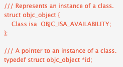
     
  * `id`其实就是一个指向`objc_object`结构体指针，它包含一个`Class isa`成员，根据`isa`指针就可以顺藤摸瓜找到**对象所属的类**
  * 注：根据`Apple`的官方文档[Key-Value Observing Implementation Details](https://developer.apple.com/library/archive/documentation/Cocoa/Conceptual/KeyValueObserving/Articles/KVOImplementation.html)提及，`key-value observing`是使用`isa-swizzling`的技术实现的，`isa`指针在运行时被修改，指向一个中间类而不是真正的类。所以，你不应该使用`isa`指针来确定类的关系，而是使用`class`方法来确定实例对象的类

* `Class`
  * `isa`指针的数据类型是`Class`，`Class`表示对象所属的类
  * `Class`的数据结构如下
    
    
    
  * `Class`是一个`objc_class`结构体指针
  * `objc_class`结构体定义如下

    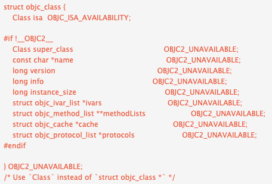
    
  * 注：`OBJC2_UNAVAILABLE`是一个`Apple`对`Objc`系统运行版本进行约束的宏定义，主要为了兼容非`Objective-C 2.0`的遗留版本
  * 重要成员变量的分析
     * `isa`表示一个`Class`对象的`Class`，也就是`Meta Class`。在面向对象设计中，一切都是对象，`Class`在设计中本身也是一个对象。`objc_class`定义如下：
     
     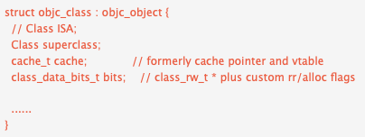
     
     * 由上图可见，结构体`objc_class`也是继承`objc_object`，说明`Class`在设计中本身也是一个对象
     * `Meta Class`也是一个`Class`，它也跟其他`Class`一样有自己的`isa`和`super_class`指针。关系图如下：

     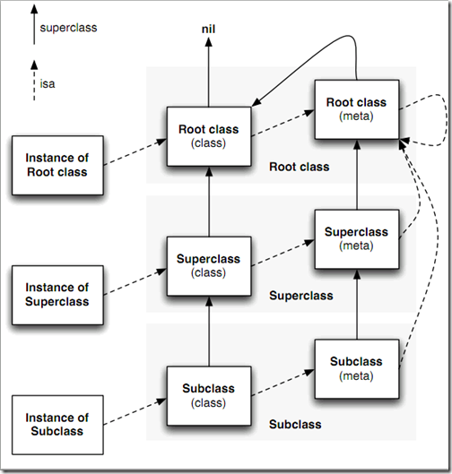
     
     * 上图中实线是`super_class`指针，虚线是`isa`指针，其中
         * `Root class`(`class`)其实就是`NSObject`，`NSObject`是没有超类的，所以`Root class`(`class`)的`superclass`指向`nil`
         * 每个`Class`都有一个`isa`指针指向唯一的`Meta class`(`isa`是对象指向自己所属类型的指针)
         * `Root class`(`meta`)的`superclass`指向`Root class`(`class`)，也就是`NSObject`，形成一个回路
         * 每个`Meta class`的`isa`指针都指向`Root class`(`meta`)
     * `ivars`表示多个成员变量，它指向`objc_ivar_list`结构体，结构体的定义如下
    
       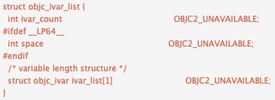
       
       * `objc_ivar_list`是一个链表，存储多个`objc_ivar`，而`objc_ivar`结构体存储类的单个成员变量信息
     * `methodLists`表示方法列表，它指向`objc_method_list`结构体的二级指针，可以动态修改`*methodLists`的值来添加成员方法，也是`Category`实现原理，同样也解释`Category`不能添加实例变量的原因。`objc_method_list`结构体的定义如下
       
       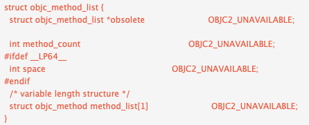
       
       * `objc_method_list`也是一个链表，存储多个`objc_method`，而`objc_method`结构体存储类的某个方法的信息
     * `cache`用来缓存经常访问的方法，它指向`objc_cache`结构体

* `Method`
  * `Method`表示类中的某个方法，其定义如下
    
    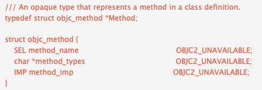
    
    * `Method`是一个指向`objc_method`结构体的指针，`objc_method`结构体存储了方法名(`method_name`)、方法类型(`method_types`)和方法实现(`method_imp`)等信息，`method_imp`的数据类型是`IMP`，它是一个函数指针

* `Ivar`
  * `Ivar`表示类中的实例变量
  * `Ivar`的结构定义如下

    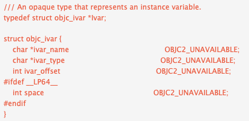
    
    * `Ivar`是一个指向`objc_ivar`结构体指针，它包含了变量名(`ivar_name`)、变量类型(`ivar_type`)等信息

* `IMP`
  * `IMP`本质上是一个函数指针，指向方法的实现
  * `IMP`的定义如下

    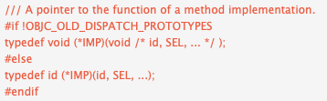
    
    * 当向某个对象发送一条信息，可以由这个函数指针(`IMP`)来指定方法的实现，它最终就会执行那段代码，这样可以绕开**消息传递**阶段而去执行另一个方法实现

* `Cache`
  * `Cache`用来缓存
  * `Cache`的定义如下
    
    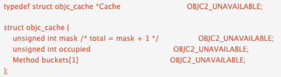
    
    * `Cache`其实就是一个存储`Method`的链表，主要是为了优化方法调用的性能
    * 不通过`Cache`进行方法调用的流程为，当对象`receiver`调用方法`message`时，首先根据对象`receiver`的`isa`指针查找到它对应的类，然后在类的`methodLists`中搜索方法，如果没有找到，就使用`super_class`指针到父类中的`methodLists`查找，一旦找到就调用方法。如果没有找到，有可能消息转发，也可能忽略它。但这样查找方式效率太低，因为往往一个类大概只有`20%`的方法经常被调用，占总调用次数的`80%`。所以使用`Cache`来缓存经常调用的方法，当调用方法时，优先在`Cache`查找，如果没有找到，再到`methodLists`查找，这样就可以大大提高函数查询的效率。这也就是`objc_class`中重要成员`objc_cache`做的事情，在找到`message`之后，把`message`的`method_name`作为`key`，`method_imp`作为`value`给存起来。当再次收到`message`消息的时候，可以直接在`cache`里找到，避免去遍历`objc_method_list`。`objc_cache`是存在`objc_class`结构体中的。

### 消息发送

##### `objc_msgSend`函数

当某个对象使用语法`[receiver message]`来调用某个方法时，其实`[receiver message]`被编译器转化为:`id objc_msgSend(id self, SEL op, ...);`

* `objc_msgSend`具体发送消息的流程如下
  1. 首先根据`receiver`对象的isa指针获取它对应的`class`(找到对象对应的类)
  2. 优先在`class`的`cache`查找`message`方法，如果找不到，再到`methodLists`查找
  3. 如果没有在`class`找到，再到`super_class`查找
  4. 一旦找到`message`这个方法，就执行它实现的`IMP`
  5. 消息发送流程图如下
     
     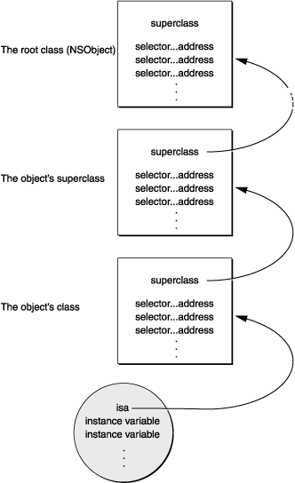
     
##### 方法解析与消息转发

### `OC`中基于`Runtime`特性的运用

##### 分类

分类中不能重写系统方法，因为会把系统的方法给覆盖掉，分类中不能调用`super`

运用`Runtime`在分类中添加自定义方法，涉及的点：`+load VS +initialize`、`method_exchangeImplementations(originalMethod, swizzledMethod);`

分类中添加自定义方法时在`load`中操作的原因：`+load`方法能够确保在类的初始化时候调用，这能够保证改变应用行为的一致性。(由于`load`类方法是程序运行时这个类被加载到内存中就调用的一个方法，执行比较早，并且不需要我们手动调用。而且这个方法具有唯一性，也就是只会被调用一次，不用担心资源抢夺的问题)

`class_addMethod`：当被添加的方法已经存在时，会返回`NO`