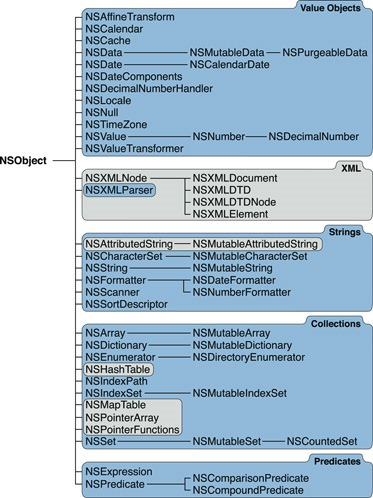

### `Cocoa`

**`Cocoa`**不是一种编程语言，也不是一个开发工具，它是创建`Mac OS X`和`iOS`程序的原生面向对象`API`，为这两者应用提供了**编程环境**。

`Cocoa`本身是一个**框架的集合**，它包含了众多子框架，其中最重要的要数`Foundation`和`UIKit`。`Foundation`是框架的基础，和界面无关，其中包含了大量常用的`API`；`UIKit`是基础的`UI`类库，在进行`iOS`应用程序开发的过程中会经常用到。

`Foundation`和`UIKit`这两个框架在系统中的位置如下图：

* 所有的`Mac OS X`和`iOS`程序都是由大量的对象构成，而这些对象的根对象都是`NSObject`，`NSObject`就处在`Foundation`框架之中，具体的类结构如下：
  
  
  
  
  
  
  
  * 通常会将它们分为以下几类
     * 操作系统服务：文件系统、`URL`、进程通讯
     * 归档和序列化
     * 表达式和条件判断
     * `Objective-C`语言服务

### `UIKit`框架

`UIKit`主要用于界面构架

* `UIKit`框架中类的结构如下

### `iOS`文件系统框架

* `iOS`文件系统框架图如下

### 常用知识点

##### 常用结构体

在`Foundation`中定义了很多常用结构体类型来简化我们的日常开发，这些结构体完全采用`Objective-C`定义，和我们自己定义的结构体没有任何区别，之所以由框架为我们提供，完全是为了简化我们的开发。常用的结构体有`NSRange`、`NSPoint`、`NSSize`、`NSRect`等。

* 在`OC`中多数时间单位都是秒。

* 系统静态方法一般都是自动释放。

##### 文件操作

在`OC`中路径、文件读写等操作是利用字符串来完成的。

读取文件内容还可以利用`URL`，它除了可以读取本地文件还可以读取网络文件。

是否是绝对路径，如是以`/`开头的则是绝对路径，反之不是。

`OC`中，获取扩展名不包括`.`；删除扩展名，包含`.`。

##### 数组

**对数组进行操作时，应关注所进行的操作，是否会对原数组有所修改。**

数组最后以`nil`结尾。

数组不能存放`C`语言的基础类型。

* 可变数组
  * 当把对象添加到数组中的时候，对象的计数器会`+1`，当把对象从数组中移除的时候，对象的计数器会`-1`
  * 当可变数组对象`release`的时候，会依次调用数组里面每个对象的`release`
  * 在不可变数组中无论对数组怎么排序，原来的数组顺序都不会改变，但是在可变数组中如果使用`sortUsingSelector:`排序原来的数组顺序就发生了变化

##### 字典

* 同数组一样，不管是可变字典还是不可变字典初始化元素后面必须加上`nil`以表示结束
* 对于字典遍历，`for`遍历循环的是`key`
* 一个字典的`key`或`value`添加到字典中时计数器`+1`；字典释放时调用`key`或`value`的`release`一次，计数器`-1`

##### 装箱和拆箱

* 装箱
  * 是为了将基本类型和结构体，封装成对象类型，以便于存放到数组和字典中
  * `OC`中装箱的过程必须手动实现，`OC`不支持自动装箱
  * 在`OC`中一般将基本数据类型装箱成`NSNumber`类型，`NSNumber`不能对结构体装箱
  * 对结构体的装箱和拆箱，需要使用`NSValue`类型
     * `NSNumber`是`NSValue`的子类
     * `NSValue`包装了一些基本数据类型的常用装箱、拆箱方法
     * `NSValue`可以对任何数据类型进行装箱、拆箱操作
     * 对于系统自带的结构体类型，系统提供了对应的装箱、拆箱方法
     * 对于自定义的结构体类型，需要使用NSValue中的如下方法进行处理
         * 使用`+(NSValue *)valueWithBytes:(const void *)value objCType:(const char *)type;`进行装箱
         * 使用`-(void)getValue:(void *)value;`进行拆箱

##### 扩展

`C`语言中定义字符串结尾必须加一个`\0`，表示字符串结束。

在数组和字典里使用`nil`，来表示数组或字典已经结束。如果想在数组或字典中存储空值，则需要使用`NSNull`。`NSNull`这个类是一个单例，只有一个`null`方法。

* `@`符号
  * 可表示关键字，如`@protocol`
  * 可表示字符串，如`@"xxx"`
  * 可表示输出一个对象，如`%@`
  * 可表示装箱，如`@3`

* `isKindOfClass`判断一个对象是否为某种类型；`isMemberOfClass`判断一个对象是否是某个类的实例化对象

* `OC`反射功能的实现，得益于`OC`动态运行时的支持
  * 反射，即是对正常操作的逆向实现。一般正常操作是根据类型生成实例对象，反射是先根据字符串，通过系统的`API`(如，`NSClassFromString`、`NSStringFromClass`、`NSSelectorFromString`、`NSStringFromSelector`等)得到对应的类，在得到类的基础上走正常操作流程

* `retain`、`copy`、`mutablecopy`的理解
  * `retain`：始终采取浅复制，引用计数器会加`1`，返回的对象和被复制对象是同一个对象`1`(也就是说这个对象的引用多了一个，或者说是指向这个对象的指针多了一个)
  * `copy`：对于不可变对象`copy`采用的是浅复制，引用计数器加`1`(其实这是编译器进行了优化，既然原来的对象不可变，复制之后的对象也不可变那么就没有必要再重新创建一个对象了)；对于可变对象`copy`采用的是深复制，引用计数器不变(原来的对象是可变，现在要产生一个不可变的当然得重新产生一个对象)
  * `mutablecopy`：无论是可变对象还是不可变对象采取的都是深复制，引用计数器不变(如果从一个不可变对象产生一个可变对象自然不用说两个对象绝对不一样肯定是深复制；如果从一个可变对象产生出另一个可变对象，那么当其中一个对象改变自然不希望另一个对象改变，当然也是深复制)

* 要想支持`copy`或者`mutablecopy`操作那么对象必须实现`NSCoping`协议并实现`-(id)copyWithZone:(NSZone*)zone`方法。在`Foundation`中常用的可复制对象有：`NSNumber`、`NSString`、`NSMutableString`、`NSArray`、`NSMutableArray`、`NSDictionary`、`NSMutableDictionary`
  * `zone`是系统已经分配好的用于存储当前对象的内存

* 字符串
  * 字符串常量，存储在常量区，系统不会对它进行引用计数
  * 通过`stringWithxxx`创建的字符串对象同一般对象类似，存储在堆中，系统会对其进行引用计数
  * 通过`stringWithString`生成的字符串，其引用计数的值，由后面参数对象的类型确定

* 文件操作
  * 细粒度的操作文件，需要通过文件操作柄(`NSFileHandle`)进行操作
  * 注，使用文件柄操作文件时，对于打开的文件要记得关闭
  * 文件的操作，可通过`NSURL`、`NSBundle`(程序包)
     * `NSBundle`，程序包，一般用于获取`Resource`中的资源。在`iOS`中经常用于读取应用程序中的资源文件，如图片、声音、视频等
     * `[NSBundle mainBundle];`//主要操作**程序包所在目录**

* 归档/解档
  * 归档，在其他语言中又叫“序列化”，就是将对象保存到硬盘；解档，在其他语言又叫“反序列化”就是将硬盘文件还原成对象。其实归档就是数据存储的过程，在`iOS`中数据的存储有五种方式：
     1. `xml`属性列表(`plist`归档)
     2. `NSUserDefaults`(偏好设置)
     3. `NSKeyedArchiver`归档(加密形式)
     4. `SQLite3`(嵌入式数据库)
     5. `Core Data`(面向对象方式的嵌入式数据库)
  * `xml`属性列表
     * 缺点：
         * 这种方式是明文保存的
         * 这种方式操作的对象有限，只有`NSArray`、`NSMutableArray`、`NSDictionary`、`NSMutableDictionary`支持
     * 归档时只要调用对应的`writeToFile`方法即可，解档调用`arrayWithContentsOfFile`或`dictionaryWithContentsOfFile`，注意像`NSString`、`NSNumber`、`NSData`即使有这个方法它存储的也不是`xml`格式
  * `NSKeyedArchiver`归档
     * 如果要针对更多对象归档或者需要归档时能够加密的话就需要使用`NSKeyedArchiver`进行归档和解档，使用这种方式归档的范围更广而且归档内容是密文存储
     * 从归档范围来讲`NSKeyedArchiver`适合所有`OC`对象，但是对于自定义对象我们需要实现`NSCoding`协议
     * 从归档方式来讲`NSKeyedArchiver`分为简单归档和复杂对象归档，简单归档就是针对单个对象可以直接将对象作为根对象(不用设置`key`)，复杂对象就是针对多个对象，存储时不同对象需要设置不同的`Key`
     * 自定义对象的归档
         * 对自定义对象进行归档那么这个对象必须实现`NSCoding`协议，在这个协议中有两个方法都必须实现：
             1. `-(void)encodeWithCoder:(NSCoder *)aCoder;`通过给定的`Archiver`对消息接收者进行编码 - 归档时调用
             2. `-(id)initWithCoder:(NSCoder *)aDecoder;`从一个给定的`Unarchiver`的数据返回一个初始化对象 - 解档时调用
