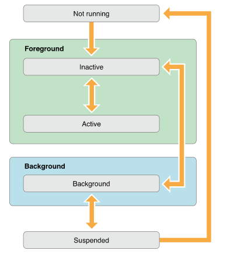
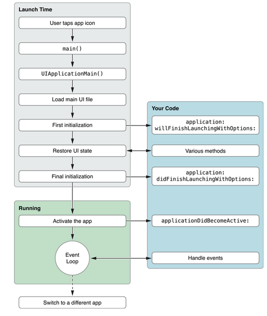
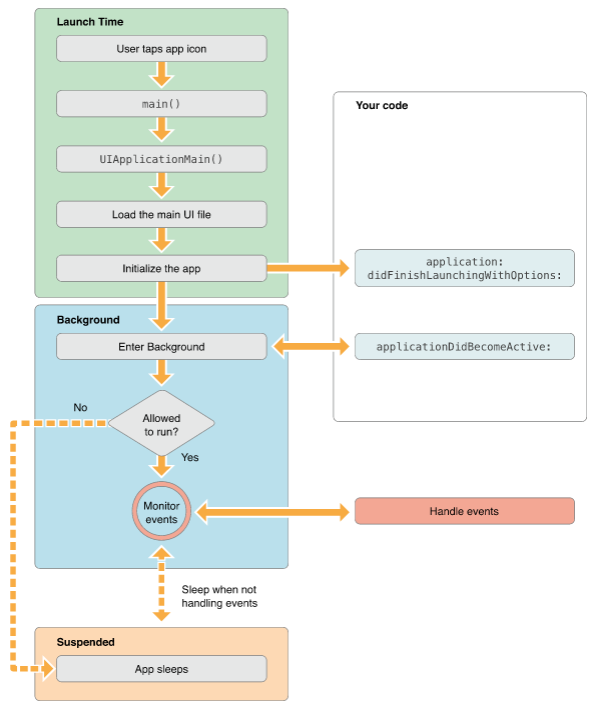
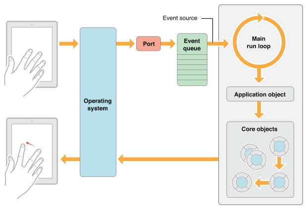

### 背景

`iOS`系统的资源是有限的，应用程序在前台和后台的状态是不一样的。在后台时，程序会受到系统的很多限制，这样可以提高电池的使用和用户体验。

### 应用程序生命周期

##### 应用程序的状态 

* `Not Running` -> 未运行，程序没有启动
* `Inactive` -> 未激活，程序在前台运行，不过没有接收到事件。在没有事件处理的情况下程序通常停留在这个状态
* `Active` -> 激活，程序在前台运行而且接收到了事件。
* `Background` -> 后台，程序在后台而且能执行代码。大多数程序进入这个状态后会在这个状态上停留一会，时间到之后进入挂起状态(`Suspended`)。
* `Suspened` -> 挂起，程序在后台不能执行代码。系统会自动把程序变成这个状态而且不会发出通知。挂起时，程序还是停留在内存中，当系统内存低时，系统就把挂起的程序清除掉，为前台程序提供更多的内存。
* 程序状态变化图如下



##### 程序状态对应的代理方法如下

* `willFinishLaunchingWithOptions` - 告诉代理进程启动但还没进入状态保存
* `didFinishLaunchingWithOptions` - 告诉代理启动基本完成程序准备开始运行
* `applicationWillResignActive` - 当应用程序将要进入非活动状态执行(在此期间，应用程序不接收消息或事件。如来电话了会进入这种状态)
* `applicationDidBecomeActive` - 当应用程序进入活动状态执行这个代理方法
* `applicationDidEnterBackground` - 当应用程序被推送到后台的时候调用(所以要设置后台继续运行，则在这个函数里面设置即可)
* `applicationWillEnterForeground` - 当应用程序从后台将要重新回到前台的时候调用
* `applicationWillTerminate` - 当应用程序将要退出时被调用(通常是用来保存数据和一些退出前的清理工作。需要设置`UIApplicationExitsOnSuspend`的键值)
* `applicationDidFinishLaunching` - 当应用程序载入后执行

##### 应用程序使用过程中，代理方法的执行顺序

* 启动程序时：
  * `willFinishLaunchingWithOptions`
  * `didFinishLaunchingWithOptions`
  * `applicationDidBecomeActive`
  
* 按下`home`键：
  * `applicationWillResignActive`
  * `applicationDidEnterBackground`
  
* 双击`home`键，再打开程序：
  * `applicationWillEnterForeground`
  * `applicationDidBecomeActive`

* 加载应用程序进入前台，所执行的代理方法如下图



* 加载应用程序进入后台，所执行的代理方法如下图



##### `main`函数

`main`函数是程序启动的入口，在`iOS app`中，`main`函数的功能被最小化，它的主要工作都交给了`UIKit framework`。`iOS`中`main`类中的内容如下：

```
int main(int argc, char * argv[]) {
    @autoreleasepool {
        return UIApplicationMain(argc, argv, nil, NSStringFromClass([AppDelegate class]));
    }
}
```

* `UIApplicationMain`函数有四个参数，不需要改变这些参数值。每个参数的意义和作用：
  1. `argc`和`argv`参数包含了系统带过来的启动时间；
  2. 第三个参数确定了主要应用程序类的名称，这个参数指定为`nil`，这样`UIKit`就会使用默认的程序类`UIApplication`；
  3. 第四个参数是程序自定义的代理类名，这个类负责系统和代码之间的交互。它一般在`Xcode`新建项目时会自动生成。

* `UIApplicationMain`函数加载了程序主界面的文件。虽然这个函数加载了界面文件，但是没有放到应用程序的`windows`上，需要在`Delegate`的`willFinishLaunchingWithOptions`方法中加载它。一个应用程序可以有一个主的`storyboard`文件或者有一个主的`nib`文件，但不能同时有两个存在。如果程序在启动时没有自动加载主要的故事板或`nib`文件，可以在`willFinishLaunchingWithOptions`方法里准备`windows`的展示。

##### 中断

当一个基于警告式的中断发生时，如有电话打进来时，这时程序会临时进入`inactive`状态，用户可选择如何处理这个中断，如下图：


除电话打进来时，应用程序会发生响应中断。还有以下情况发生时应用程序也会发生响应中断：

1. 在`iOS5`,通知不会把程序变成为激活状态，通知会显示在状态栏上，如果你；拉下状态栏，程序会变成`inactive`，把状态栏放回去，程序变回`active`；
2. 按锁屏键也是另外一种程序的中断，当你按下锁屏键，系统屏蔽了所有触摸事件，把`app`放到了后台，这时`app`状态是`inactive`，并进入后台。

当应用程序响应中断时，应在`applicationWillResignActive`代理方法中，进行以下操作：

- 停止`timer`和其他周期性的任务
- 停止任何正在运行的请求
- 暂停视频的播放
- 如果是游戏那就暂停它
- 减少`OpenGL ES`的帧率
- 挂起任何分发的队列和不重要的操作队列(你可以继续处理网络请求或其他时间敏感的后台任务)
当程序回到`active`状态时，根据情况，在`applicationDidBecomeActive`代理方法中恢复响应中断时暂停的任务。如重新开始`timer`，继续分发队列，提高`OpenGL ES`的帧率。不过游戏要回到暂停状态，不能自动开始。

* 应用程序转到后台运行，流程图如下


只有在`iOS4`以上系统或者支持多任务的设备，应用程序才能在后台运行，不然会直接结束状态。

应用程序进入后台时，应执行以下操作：

1. 保存用户数据或状态信息，所有没写到磁盘的文件或信息，在进入后台时，最后都写到磁盘去，因为程序可能在后台被杀死；
2. 释放尽可能释放的内存。
  
`applicationDidEnterBackgound: `方法有大概`5`秒的时间让你完成这些任务。如果超过时间还有未完成的任务，你的程序就会被终止而且从内存中清除。如果还需要长时间的运行任务，可以调用  `beginBackgroundTaskWithExpirationHandler`方法去请求后台运行时间和启动线程来运行长时间运行的任务。

在后台时，每个应用程序都应该释放最大的内存。系统努力的保持更多的应用程序在后台同时运行。不过当内存不足时，会终止一些挂起的程序来回收内存，那些内存最大的程序首先被终止。因此在程序进入后台时，像下面类型的对象应该去掉强引用：

1. 可以重新加载的 大的视频或数据文件；
2. 任何没用而且可以轻易创建的对象。

在后台时，为了减少程序占用的内存，系统会自动再回收一些系统帮助你开辟的内存。如：

1. 系统回收`Core Animation`的后备存储；
2. 去掉任何系统引用的缓存图片；
3. 去掉系统管理数据缓存强引用。

* 程序从后台返回前台的流程如下图：


当`app`处于挂起状态时，它是不能执行任何代码的。因此它不能处理在挂起期间发过来的通知，比如方向改变，时间改变，设置的改变还有其他影响程序展现或状态的通知。在程序进入后台或返回前台时，程序都要正确的处理这些通知。

`app`如果终止了，系统会调用`app`的代理的方法`applicationWillTerminate`这样可以让你做一些清理工作。你可以保存一些数据或`app`的状态。这个方法也有`5`秒钟的限制。

程序终止的情况：

1. 设备不支持多任务；
2. 在`Info.plist`文件中，程序包含了`UIApplicationExitsOnSuspend`键；
3. 用户手动关闭应用程序。

##### `Main Run Loop`

`Main Run Loop`负责处理用户相关的事件。`UIApplication`对象在程序启动时启动`main run Loop`，它处理事件和更新视图的界面。看`Main Run Loop`就知道，它是运行在程序的主线程上的。这样保证了接收到用户相关操作的事件是按顺序处理的。

* `Main Run Loop`处理事件的流程图如下



用户操作设备，相关的操作事件被系统生成并通过`UIKit`的指定端口进行分发。事件在内部排成队列，一个个的分发到`Main run loop`去做处理。`UIApplication`对象是第一个接收到事件的对象，它决定事件如何被处理。触摸事件分发到主窗口，窗口再分发到对应触发触摸事件的`View`。

### VC生命周期