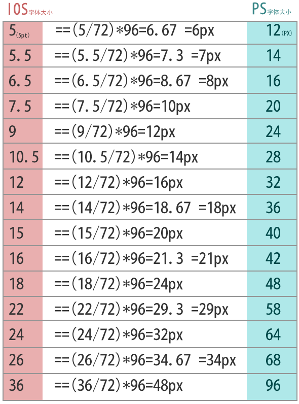

iOS开发过程中零散知识点整理

* `Xcode`中证书所在位置：`~/Library/MobileDevice`

* IMEI号查询：`拨号：*#06#`

* `Xcode`中的文件夹

```
Xcode中文件夹（物理文件夹、逻辑文件夹）的图标显示和逻辑控制受.DS_store文件的影响。
```

* `dSYM`

```
dSYM：
dSYM是在打包过程中生成的保存app函数地址映射信息的中转文件。
(对应的函数地址是16进制表示)
使用dSYM的场景：
通过出错的函数地址去查询dSYM文件中程序对应的函数名和文件名，从而得到错误详细信息。
```

* 开发中常用加密流程

```
加解密双方约定好“加盐”的字符串
iv = md5("")
key = md5("")

约定好参数的排序规则
//para->query-string->sorded
qureystring = "k1=v1&k2=v2" (sort by key)

使用加密算法对请求参数字符串进行加密
//encrpt
enc_value = BASE64_URLSAFE(AES128(key, iv, qureystring))

将加密后的请求字符串拼在接口IP后面生成最终的请求url
//final-url
http://xxxx.xxxx.aaa?sid=enc_value

示例一：
参数串= param1=value1&param2=value2...
加密串= BASE64(AES128(参数串, MD5(AES_KEY), MD5(AES_IV)), URL_SAFE)

示例二：
参数串= JSON 字符串
加密串= BASE64(AES128(参数串.utf8, MD5(AES_KEY), MD5(AES_IV)), URL_SAFE)
```

* `Watchdog Timer`

```
在Xcode中运行代码时，Watchdog Timer是禁用的，
以补偿OS X系统中的各种开支，如调试器等。意味着，
在Xcode模拟器中，可能注意不到Watchdog Timer。
因此最好在真实的设备中进行测试，检验代码长期运行时可能出现的问题。
```

* `fontSize`（字体大小）

