## UI视图

### UITableView

UITableView中数据源同步解决方案

* 并发访问、数据拷贝，因为拷贝，对内存会有大量开销
* 串行访问，删除时会可能有延迟

### 事件传递&视图响应

UIView和CALayer之间的关系：UIView的成员属性中有layer，layer是CALayer类型的，UIView的显示部分，是由CALayer的contents来决定的，contents对应的是backing store，backing store是bitmap类型的一个位图，最后显示到屏幕上的UI控件都是位图

总结：

* UIView为CALayer提供内容，以及负责处理触摸等事件，参与视图的事件响应链
* CALayer负责显示内容contents

UIView和CALayer功能不同，却又相互联系，体现了设计原则上的单一职责原则，从职责上进行分工

---

**事件传递**与**视图响应链**

与事件传递相关的两个主要方法：

* hitTest:withEvent:，返回响应事件的视图
* pointInside:withEvent:，判断点击的位置，是否在当前视图的范围内

* 事件传递流程：
  * 事件传递流程

  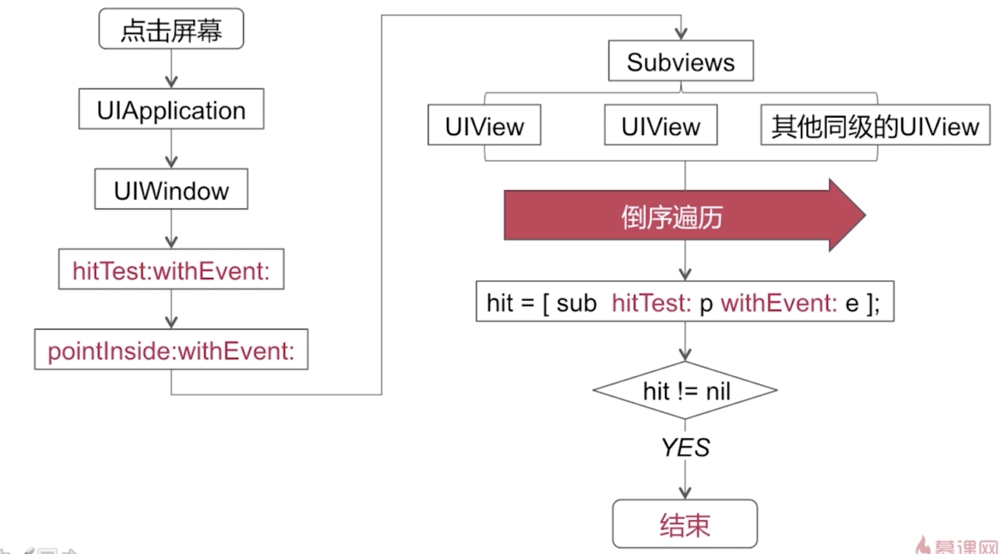
  
  倒序遍历，即最后添加到当前View上的视图，最优先得到遍历
  
  * hit系统实现

  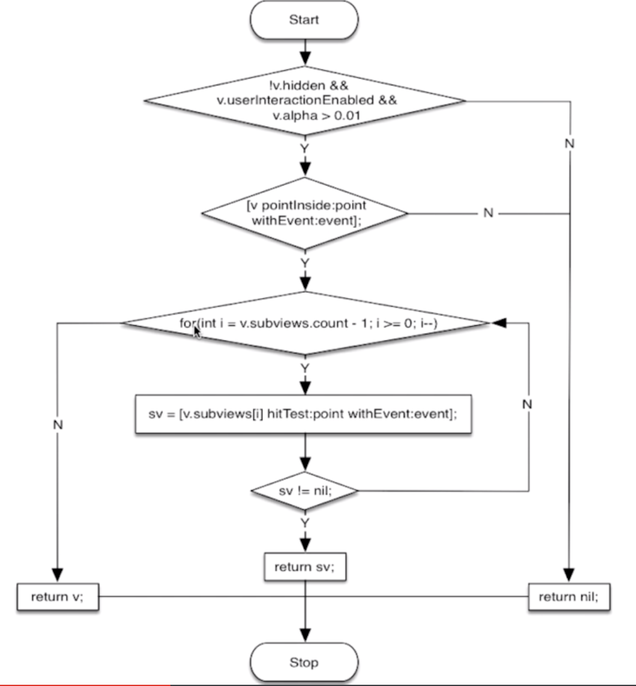

* 视图响应流程：(响应事件)
  * 视图响应流程

  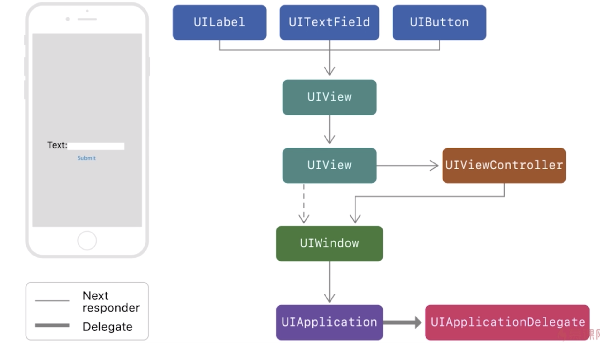

与视图事件响应相关的方法：

* touchesBegan:withEvent:
* touchesMoved:withEvent:
* touchesEnded:withEvent:

### 图像显示原理

* 硬件`CPU`和`GPU`的关系

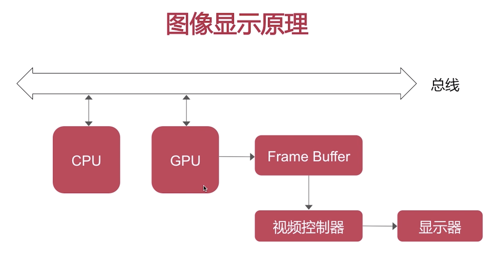

硬件`CPU`和`GPU`是通过总线连接起来的。`CPU`输出的结果通常是位图，在适当的时机，通过总线上传给`GPU`，`GPU`获得位图数据后进行纹理等渲染操作，将经渲染操作处理后的结果数据放在帧缓冲区内(Frame Buffer)，由视频控制器根据V-Sync信号，在指定时间之前去提取对应帧缓冲区内的屏幕显示内容，最终显示在手机屏幕上。

* `UI`视图最终显示到屏幕上面的大致过程
  * 图像显示原理

  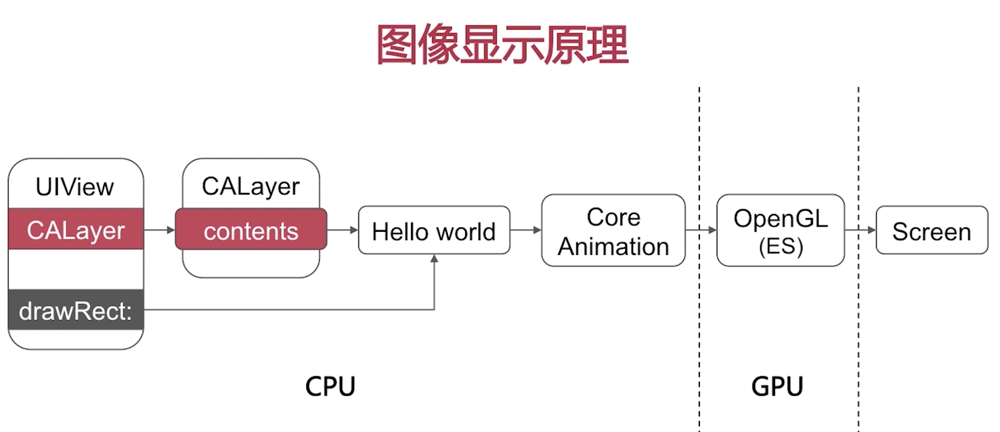

概述：

当创建一个`UIView`控件后，显示部分是由`CALayer`来负责的，`CALayer`中的`contents`属性负责存放要显示到屏幕上的内容的位图。系统在适当时机会回调给我们`drawRect`方法，在该方法内，我们可以做自定义的绘制，绘制好的位图，最终会经由`Core Animation`这个框架提交给`GPU`部分的`OpenGL(ES)`渲染管线，进行最终的位图渲染、纹理合成，最终显示到屏幕上面。

### 卡顿&掉帧

为保证界面流畅性，需要在1/60s内(即16.67ms)，由`CPU`和`GPU`共同协同完成产生一帧所需要的数据。

卡顿原因：

在规定的`16.67ms`之内，在下一个`V-Sync`信号到来之前，并没有`CPU`和`GPU`共同完成下一帧画面的合成，于是就会导致卡顿/掉帧。

滑动优化方案：

优化依据：视图显示过程中，在准备下一帧画面之前，CPU所做的工作非常多(layout、display、prepare、commit)。实际上是基于减轻CPU工作的时长、包括压力，来达到优化的效果。

* 针对CPU的优化方案
  * 对象创建、调整、销毁，可以放到子线程，以节省CPU的部分时间
  * 预排版(布局计算、文本计算)，可以放到子线程处理，这样主线程就有更多的时间能较快响应用户的交互
  * 预渲染(文本等异步绘制、图片编解码等)

* 针对GPU等优化方案
  * 基于纹理渲染，尽量避免离屏渲染。产生离屏渲染后，GPU的工作量会变大
  * 可以依托CPU的异步绘制机制，来减轻GPU的压力
  * 基于视图混合，减轻视图层级的复杂性

### 绘制原理&异步绘制

异步绘制是用来解决UI视图滑动性能方面的技术解决方案

* UIView视图绘制原理步骤
  * UIView绘制原理的流程图

  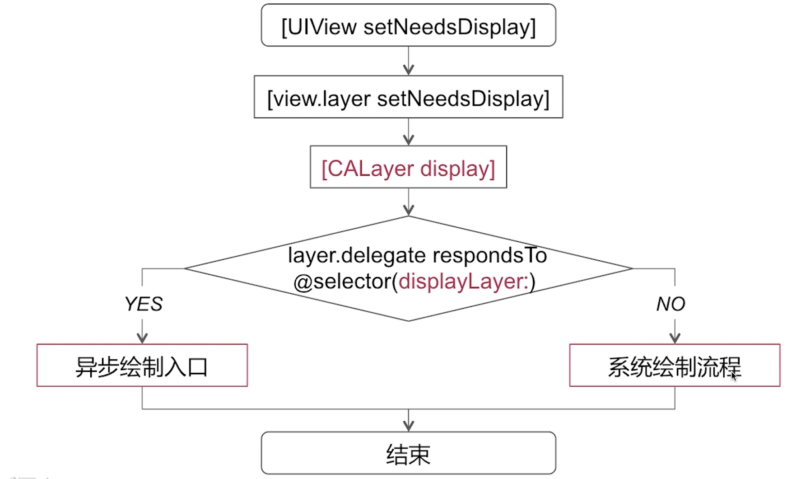

调用setNeedsDisplay不会立即进入到绘制流程，只有在当前RunLoop将要结束的时候，才会进入到当前视图的绘制流程

* 系统的绘制流程

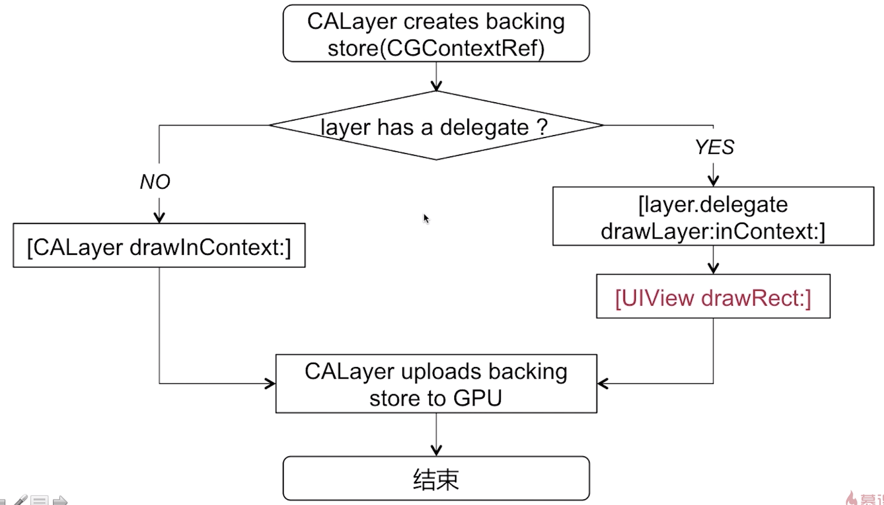

* UI异步绘制的过程
  * 实现系统提供的接口displayLayer:
  * 代理负责生成对应的bitmap
  * 设置该bitmap作为layer.contents属性的值

* 异步绘制时序流程图

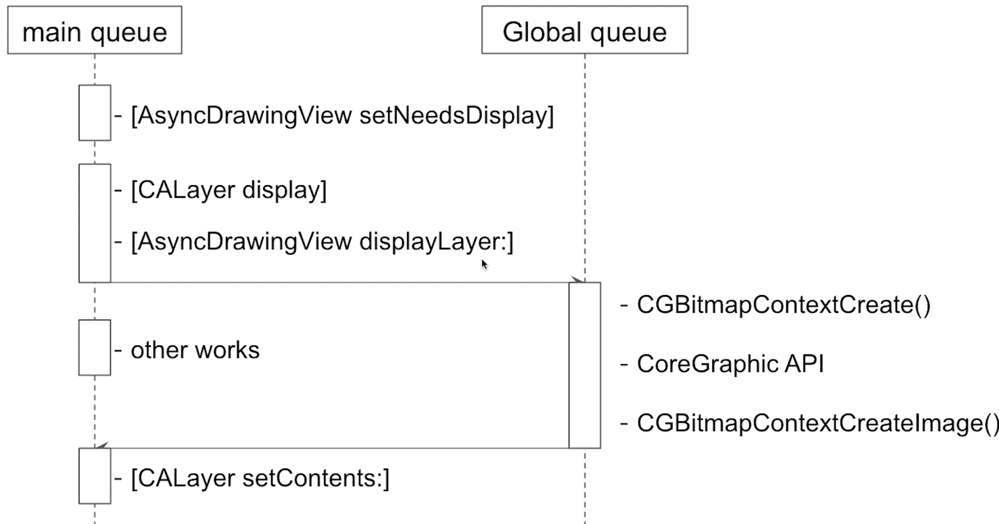

### 离屏渲染

什么是离屏渲染、对离屏渲染的理解

离屏渲染的概念起源于GPU层面

相对离屏渲染而言的是在屏渲染(即当前屏幕渲染)

在屏渲染指的是GPU层面的一个概念

* 何时触发离屏渲染
  * 圆角(同时要和maskToBounds一起使用时)，两个条件都满足时才能触发离屏渲染
  * 图层蒙版
  * 阴影
  * 光栅化

* 为何要避免离屏渲染
  * 因，离屏渲染发生在GPU层面，触发离屏渲染会增加GPU的工作量
  * 创建新的渲染缓冲区
  * 上下文切换

---

## OC语言特性

### 分类

* 分类的使用
  * 声明私有方法
  * 分解体积庞大的类文件
  * 把Framework的私有方法公开化

* 特点
  * 在运行时进行决议，只有在运行时，才将在分类中的方法添加到宿主类中(编译时/运行时)
  * 可以为系统类添加分类

* 分类中可添加的内容
  * 实例方法
  * 类方法
  * 协议
  * 属性(实际上只声明了对应的set/get方法，不能直接添加实例变量/成员变量)

多个分类中的同名方法哪个会生效，最后编译的分类中的同名方法会生效

**分类方法会“覆盖”宿主类的方法**，因在分类的源代码实现过程中，分类中的方法在方法列表中的位置处于原宿主方法的前面，当分类中的方法与宿主中的方法同名时，所要执行的方法命中方法列表中分类的方法(优先实现)，就不会再执行宿主中的同名方法，体现效果为分类中的方法“覆盖”了宿主中的同名方法

* 分类的总结
  * 分类添加的方法可以“覆盖”原类方法
  * 同名分类方法谁能生效取决于编译顺序(最后被编译的分类，会被优先生效)
  * 名字相同的分类会引起编译报错

### 关联对象

* 关联对象的本质
  * 关联对象由AssociationsManager管理并在AssociationsHashMap存储
  * 所有对象的关联内容都在同一个全局容器中
  * 具体过程，可见下图

  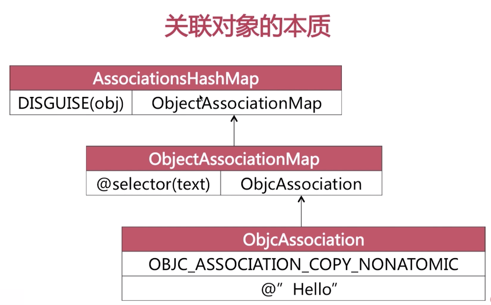

通过关联对象，可以给分类添加“成员变量”。添加的“成员变量”，没有添加到宿主类上，添加到一个全局容器中。可见下图

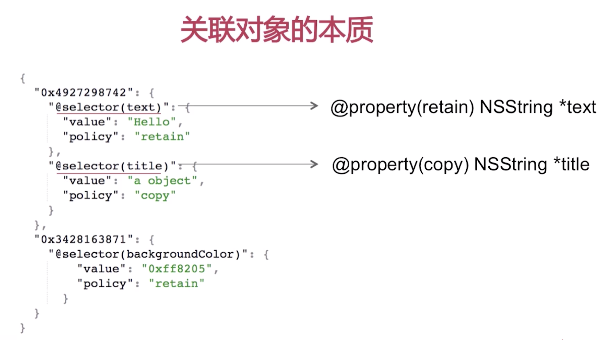

* 使用的关键方法
  * objc_getAssociatedObject
  * objc_setAssociatedObject
  * objc_removeAssociatedObjects

### 扩展

* 用扩展来做
  * 声明私有属性
  * 声明私有方法
  * 声明私有成员变量

* 特点
  * 编译时决议
  * 只以声明的形式存在，多数情况下寄生于宿主类的.m中(分类有声明.h和实现.m)
  * 不能为系统类添加扩展(可以为系统类添加分类)

### 代理

* 准确的说是一种软件设计模式(代理模式)
* iOS当中以@protocol形式体现
* 传递方式是一对一
* 涉及协议(方法、属性)、委托方、代理方

### 通知

* 特点
  * 是使用**观察者模式**(特点)来实现的用于**跨层传递消息**(作用)的机制
  * 传递方式为一对多

  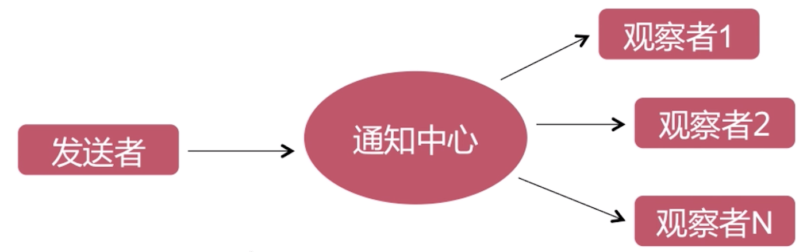

* 如何实现通知的机制

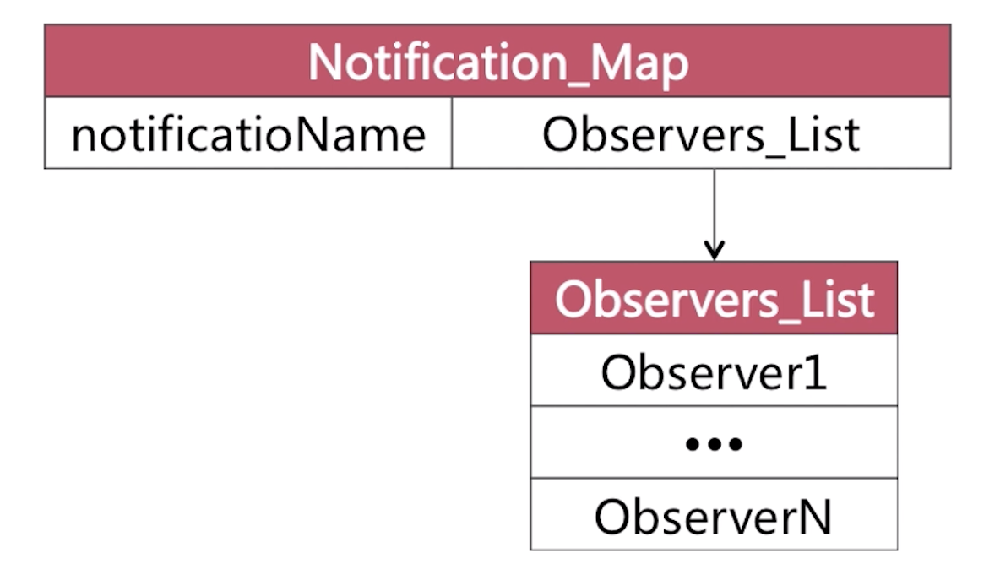

### KVO

* 什么是KVO
  * KVO是Key-value observing的缩写
  * KVO是OC对**观察者设计模式**的又一实现
  * Apple使用了isa混写(**isa-swizzling**)来实现KVO(如何实现混写，涉及KVO的实现机制)
  
* KVO的实现机制

isa混写技术的实现(系统在运行时动态创建了一个子类，改写了isa的指向，同时重写了setter方法，来实现kvo的机制的)(调用addObserverForKeyPath之后系统底层的实现)

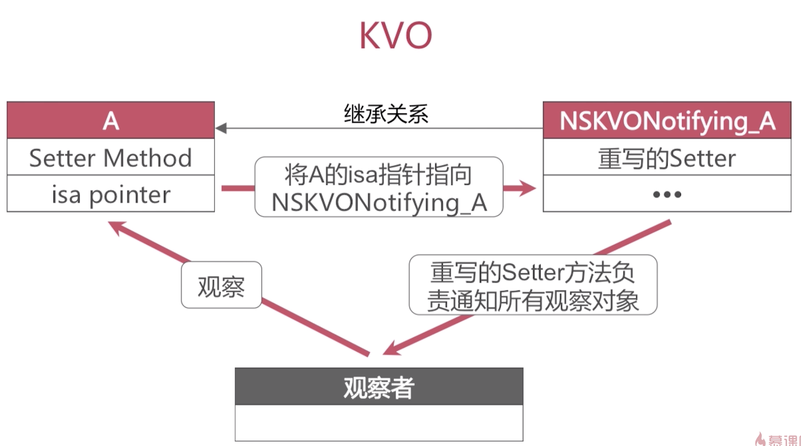

重写setter方法的过程中，调用了如下两个方法

* willChangeValueForKey:
* didChangeValueForKey:

* 面试点
  * 通过kvc设置value能使kvo生效，因为通过kvc设置value的过程中，触发了目标对象对应的setter方法
  * 通过成员变量的直接赋值，是不会触发系统的kvo
  * 手动kvo方式，即对相应属性手动重写willChangeValueForKey和didChangeValueForKey(will、did成对出现)

* 总结
  * 使用setter方法改变值kvo才会生效
  * 使用setValue:forKey:改变值kvo才会生效
  * 成员变量直接修改需**手动添加**kvo才会生效

### KVC

* 键值编码技术，与键值编码技术相关的两个方法
  * -valueForKey:
  * -setValue:forKey:

 KVC这种键值编码技术，是会破坏面向对象编程思想
 
 * valueForKey的调用流程

 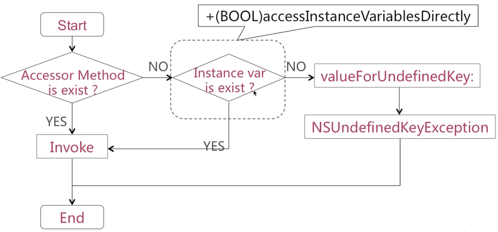
 
 关键点是访问器、实例变量

 * 访问器的说明

 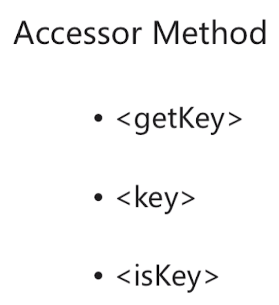
 
 * 实例变量的说明

 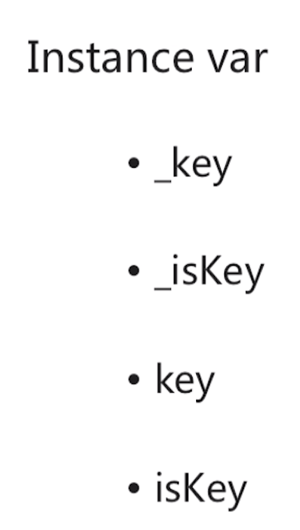
 
 * setValue:forKey:的调用流程

 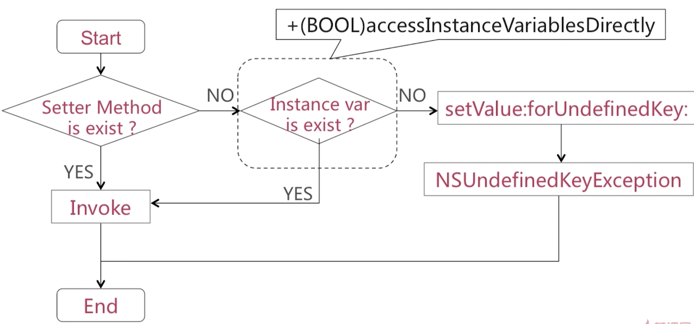

### 属性关键字

* 属性关键字的类型
  * 读写权限
      * readonly
      * readwrite(默认)
  * 原子性
      * atomic(默认)，指明赋值或获取是线程安全的
      * nonatomic(常声明的类型)
  * 引用计数
      * retain(MRC)/strong(ARC)
      * assign(修饰基本数据类型、对象类型)/unsafe_unretained(MRC)
      * weak
      * copy
      
* assign/weak
  * assign
     * 修饰基本数据类型，如int、BOOL等
     * 修饰对象类型时，不改变其引用计数
     * 会产生悬垂指针
  * weak
     * 不改变被修饰对象的引用计数
     * 所指对象在被释放之后会自动置为nil

  * copy关键字

  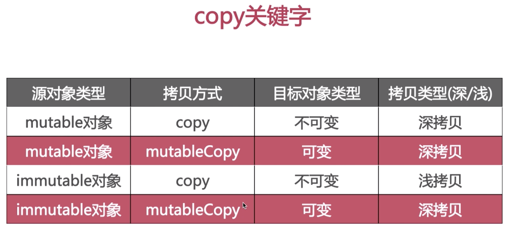

---

## RunTime

### 面试点

* 编译时语言与动态运行时语言的区别
* 消息传递与函数调用的区别
* 消息传递
* 消息转发
* Method-Swizzling(方法混淆)(运行时替换方法的实现)
* 不能向编译后的类中增加实例变量，因此时已经完成了实例变量的内存布局，所以编译后是无法修改的

### 数据结构

* objc_object
     * OC中常用的id类型，对应到Runtime中就是objc\_object这个结构体
     * objc_object结构体中的主要成员如下图

     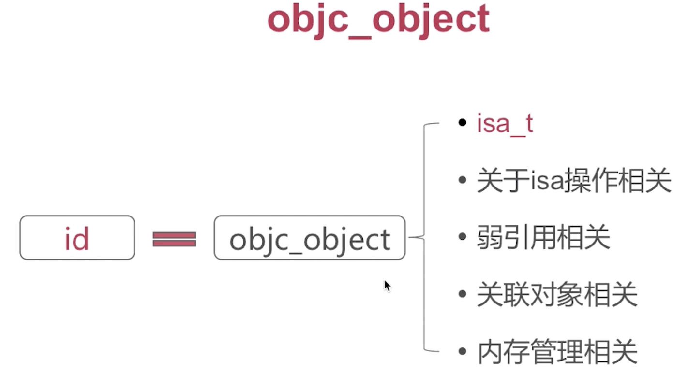
  
  * objc_class
     * OC中使用的Class类型，对应到Runtime中就是objc\_class这个结构体
     * objc_class结构体的构成如下图

     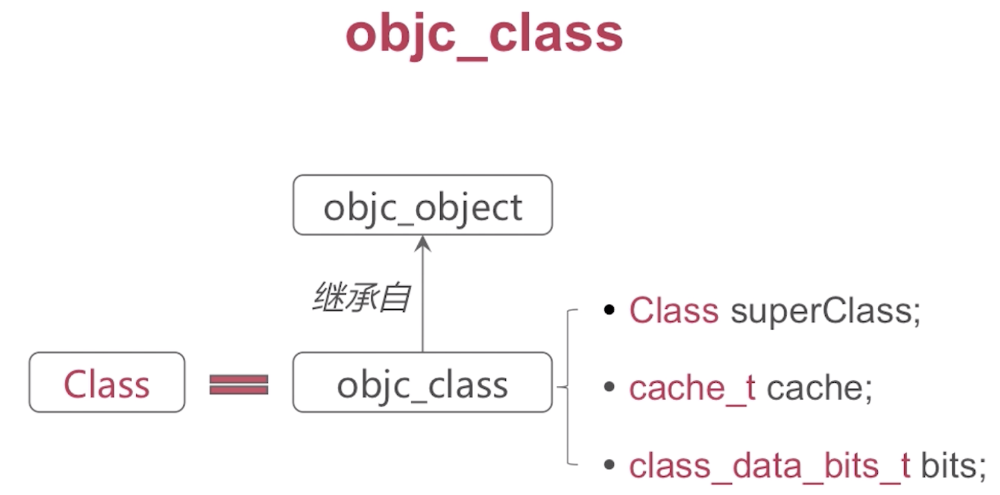
  
  * isa指针
     * 是共用体isa_t类型
     * 以64位架构为例，isa指针类型如下图

     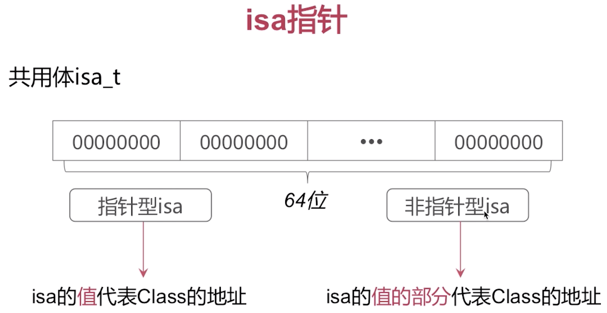
      
     * isa指向

     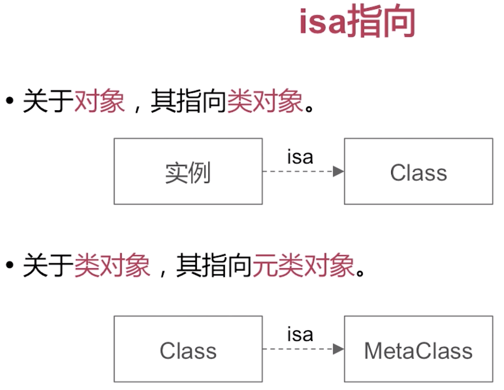
      
  * cache_t
     * 用于快速查找方法执行函数
     * 是可增量扩展的哈希表结构
     * 是**局部性原理**的最佳应用(常被调用的方法，放到方法缓冲区中，提高调用方法时被调用方法的命中率)
     * cache_t结构说明如下图

     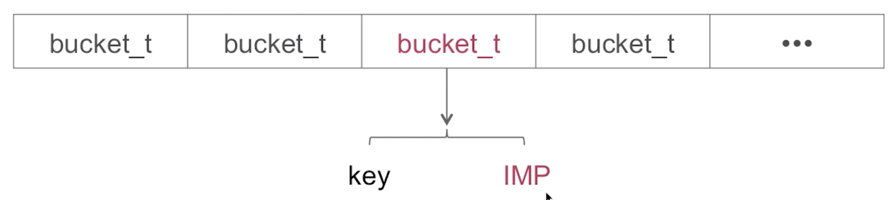
    
     key是方法选择器名称
     
  * class\_data\_bits\_t
     * class\_data\_bits\_t主要是对class\_rw\_t的封装
     * class\_rw\_t代表了类相关的读写信息、对class\_ro\_t的封装
     * class\_ro\_t代表了类相关的只读信息
     * class\_rw\_t结构如下

     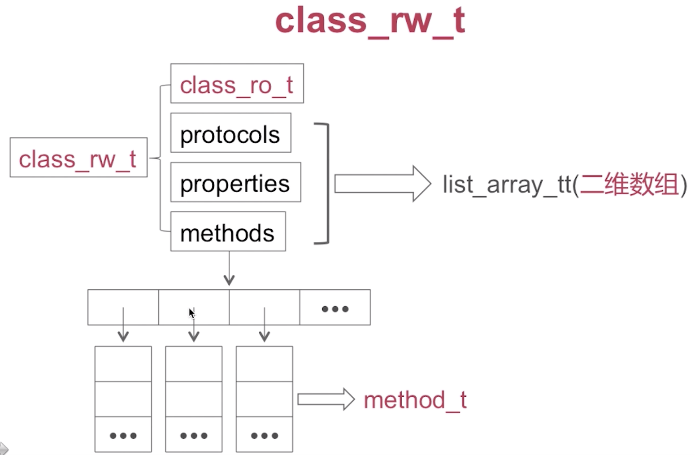

     * class\_ro\_t结构如下

     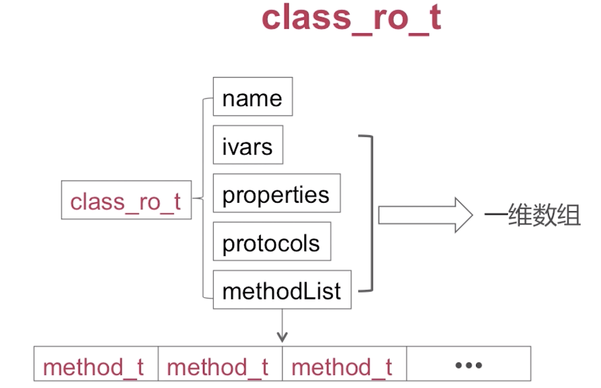
     
     * method_t
         * method_t是对函数四要素的封装和抽象
         * method_t结构如下

         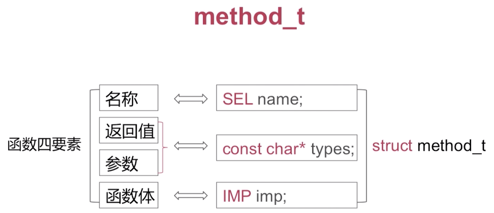
         
         * method_t中的types结构，使用了Type Encodings技术
         * types结构如下

         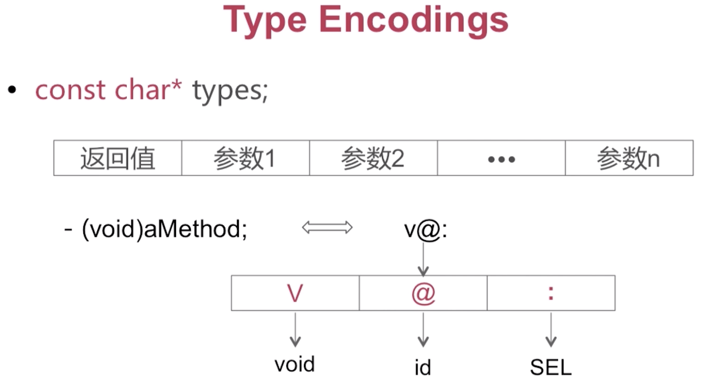
         
         图中的v@:就是method_t中types所存储的内容。图中体现了调用函数时，函数中所隐藏的固有参数self(消息接收者)，即函数的调用者，对应到types中的@来体现
         
         调用方法(消息传递)，到达Runtime层面都会转换成objc\_msgSend()这样的函数调用，objc\_msgSend()的第一个参数和第二个参数都是固定不变的，第一个参数需是id类型(是消息的接收者)，第二个参数是SEL(选择器)
         
  * Runtime整体数据结构

  
  
  基于上图可作为回答**消息传递机制**、**转发流程**、**编译时语言和动态运行时语言的区别**的依据
 
### 类对象、元类对象&消息传递

* 什么是类对象、元类对象
  * 类对象
  * 元类对象

* 实例对象可以通过isa指针找到对应的类对象
* **类对象**存储**实例方法**列表等信息
* **元类对象**存储**类方法**列表等信息
* 调用的类方法，是从元类的类方法列表中查找获取的
* 类对象和元类对象关系图如下

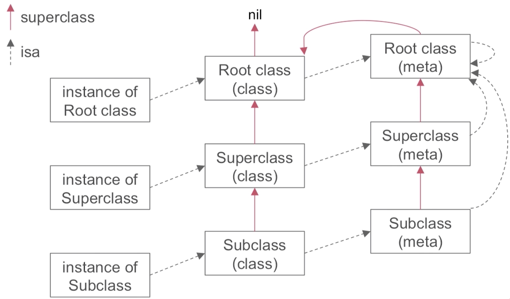

从给定的实例对象，依据上图进行分析、论述类对象与元类对象间的关系

**重听5-3**

* id类型对应是objc_object数据结构类型，objc_object中有isa成员变量
* **isa是指针指向**
* 类对象和元类对象都是objc_class数据结构的，objc_class继承于objc_object，所以类对象和元类对象都有isa指针

* 消息传递转化成了函数调用，是发生在**编译器**层面的

* 消息传递

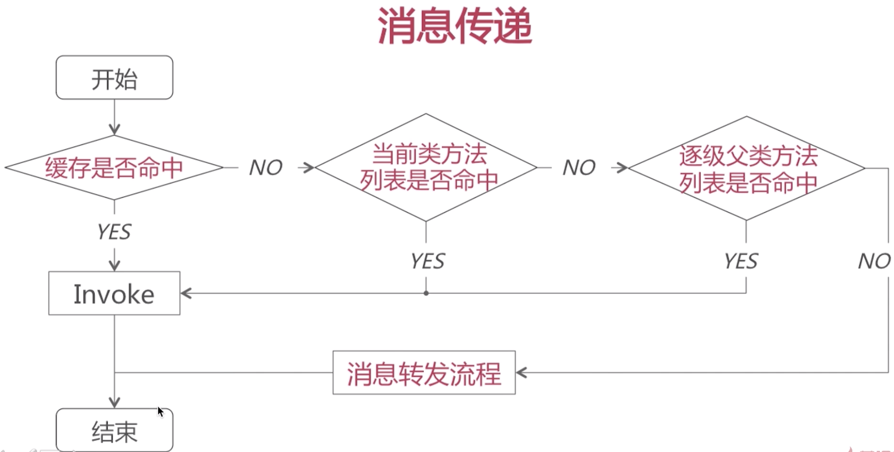

* 消息传递流程中的关键环节
  * 缓存查找
      * 缓存查找，实际上就是根据给定的方法选择器(SEL)，来查找方法的对应实现(IMP)

      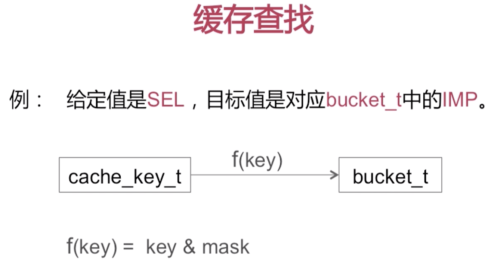
      
      * hash查找
      
  * 当前类中查找
    * 对于已排好序的方法列表，采用二分查找
    * 对于未排序的方法列表，采用一般遍历查找
      
  * 父类逐级查找

  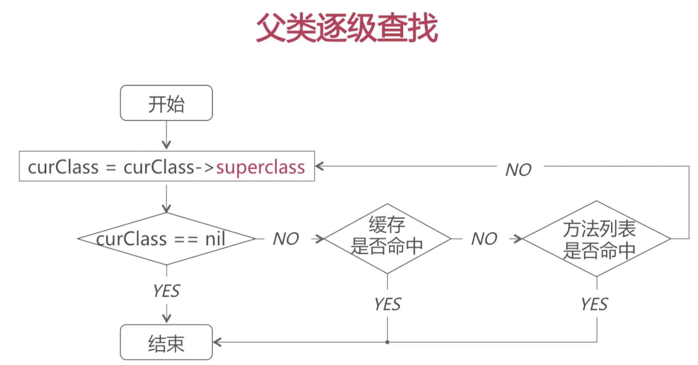

### 方法缓存

### 消息转发

* 实例方法的消息转发流程

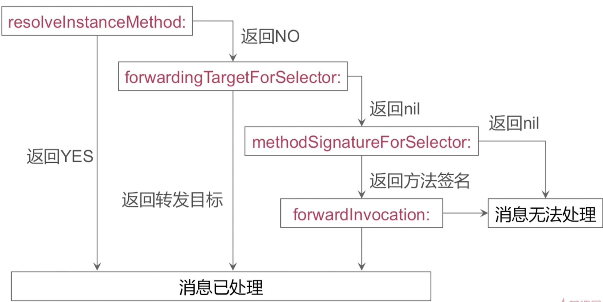

* 方法签名
  * 根据method_t中的types来理解，方法签名的格式如'v@:'

### Method-Swizzling

* 用于页面统计等场景

### 动态添加方法

* 为类动态添加方法
  * 使用接口class_addMethod()

### 动态方法解析

* dynamic
  * 指明属性的setter和getter方法是在运行时添加，不是在编译时实现

* 用dynamic做引子，作如下回答
  * 动态运行时语言将函数决议推迟到运行时
  * 编译时语言在编译期进行函数决议

---

## 内存管理

### 内存布局

* 内存布局

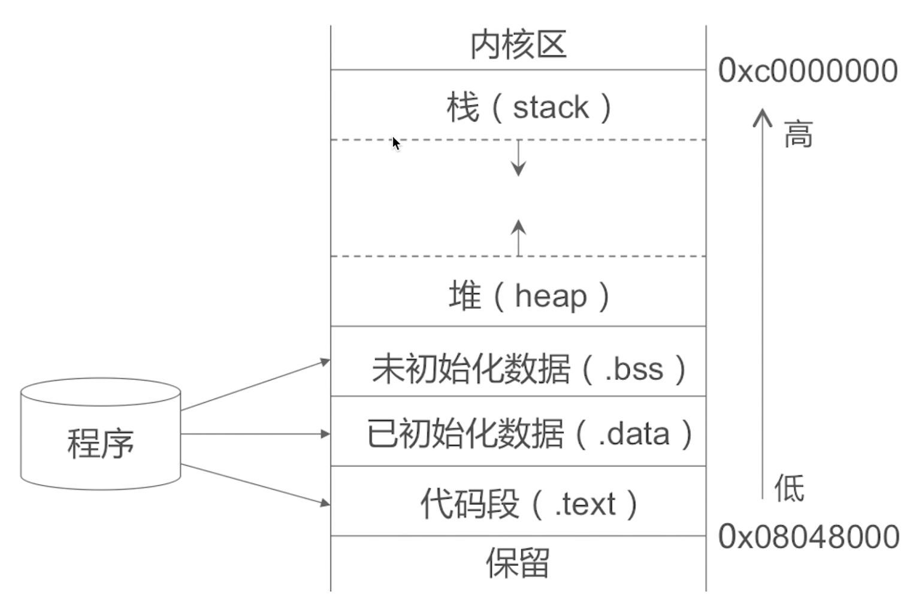

* stack，栈区，方法调用，在该内存区进行展开
* heap，堆区，通过alloc等分配的对象
* bss，未初始化的全局变量等
* data，已初始化的全局变量等
* text，程序的代码段，加载到内存中，就存放在该区域中

### 内存管理方案

* iOS系统针对不同的场景，会有不同的内存管理方案
  * 针对小对象，如NSNumber这样的，采用的是TaggedPointer内存管理方案
  * 对于64位架构下的应用程序，采用的是NONPOINTER_ISA方案
      * 非指针型的isa，bit位除存储实际的isa指针信息外，剩余未使用的bit位用于存放内存管理相关的信息
  * 散列表，复杂的数据结构，包括
    * 引用计数表
    * 弱引用表

#### NONPOINTER_ISA

* 非指针型的isa

* 在arm64架构下，对NONPOINTER_ISA进行分析
  * 这种情况下isa的指针是64个bit位
  * bit结构如下

  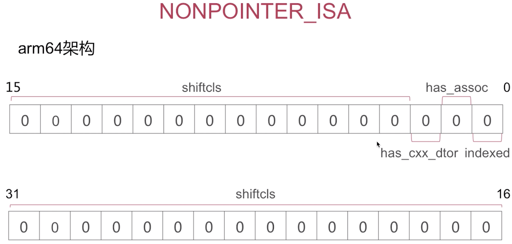
  
  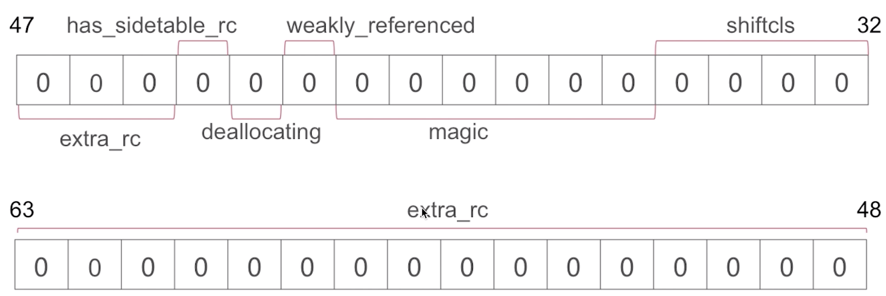
  
  * 第一位indexed，如为0的情况下，表示指针型的isa，即整体的bit数值表示的是实际的地址指针信息；如为1的情况下，表示非指针型的isa，即bit位除存储实际的isa指针信息外，剩余未使用的bit位用于存放内存管理相关的信息
  * shiftcls，是用于存储类地址值信息的

#### 散列表方式

* 通过SideTables()这样的结构来实现
  * SideTables()实际上是一个hash表
* SideTables()的结构如下

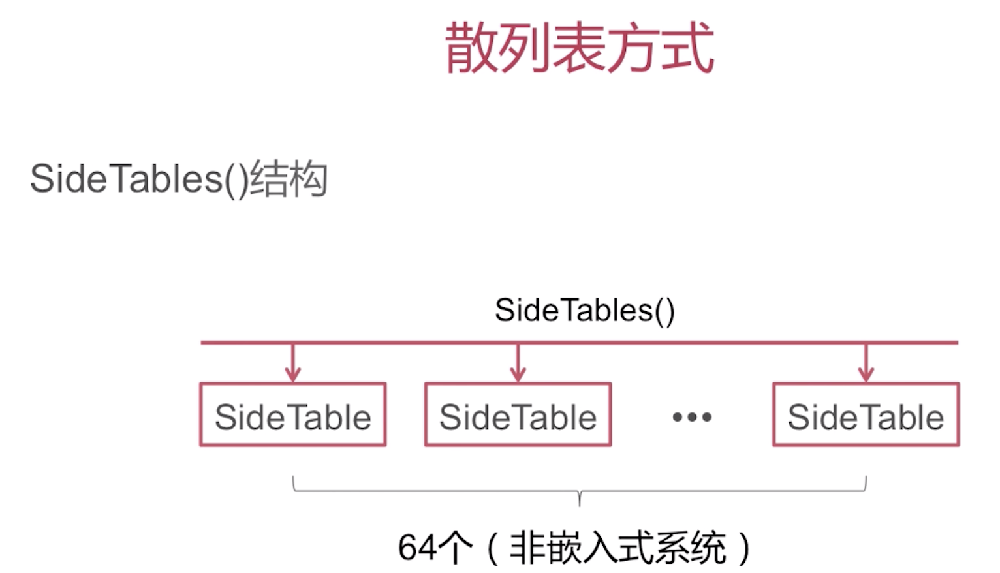

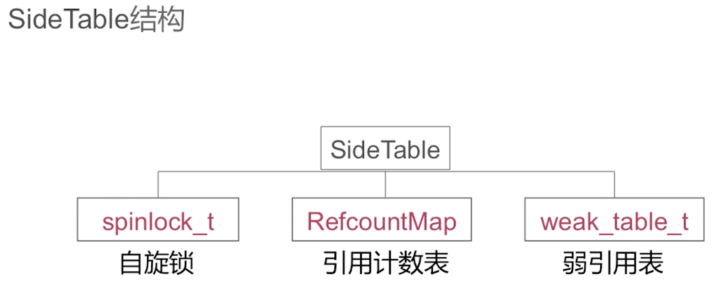

### 数据结构

内存管理方案**散列表**涉及的数据结构

* 散列表的成员结构
  * Spinlock_t(自旋锁)
     * 是“忙等”的锁
     * 适用于轻量访问，如SideTable中对某个对象进行引用计数加一减一的操作(该操作非常快)
  * RefcountMap(引用计数表)
    * 实际上是一个hash表
    * 通过指针找到对应对象的引用计数
    * size_t(表示对应对象的引用计数值)(考虑引用计数存储是用64位的bit来表示的环境下的情况)

    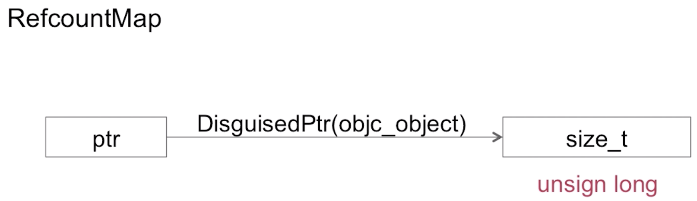
    
    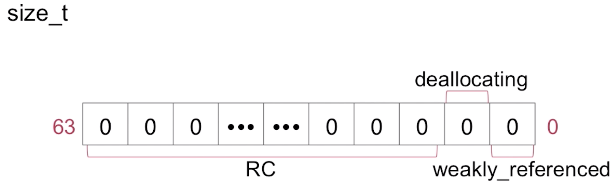
  * weak\_table\_t(弱引用表)
    * 实际上是一张hash表

    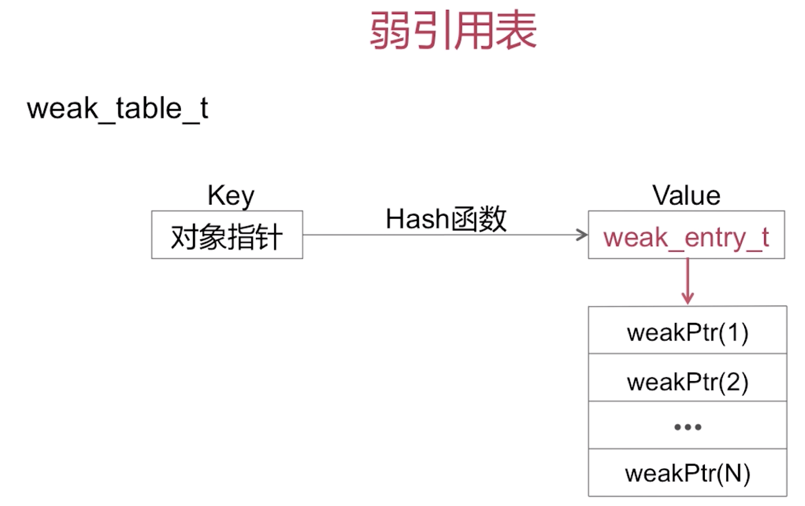

Tips:

hash查找可以提高效率的原因，因插入和获取都是通过同一个hash函数进行的，所以在根据给定值去hash列表中查找某个值时，会避免一般查找时所采取的循环遍历，进而提高了查找效率

### MRC&ARC

#### MRC环境下

* 关于引用计数，涉及如下方法
  * alloc、retain、release、retainCount、autorelease、dealloc

#### ARC

* ARC是LLVM和Runtime协作的结果
* ARC中禁止手动调用retain/release/retainCount/dealloc
* ARC中新增weak、strong属性关键字

### 引用计数管理

* 通过分析alloc、retain、release、retainCount、dealloc等系统方法的内部实现来理解引用计数管理的实现流程

* alloc的实现
  * 经过一系列调用，最终调用了C函数calloc
  * 此时并没有设置引用计数为1。但调用retainCount查看引用计数值时，引用计数值为1，具体原因看retainCount的实现

* retain实现

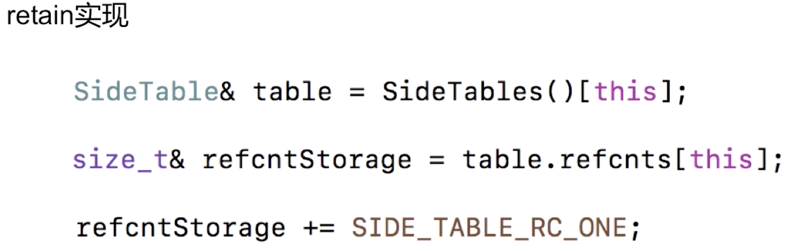

加一操作不是真实的加上数字1，而是加上了一个偏移量，这个偏移量是4，反映出来的结果就是加一操作

* release实现

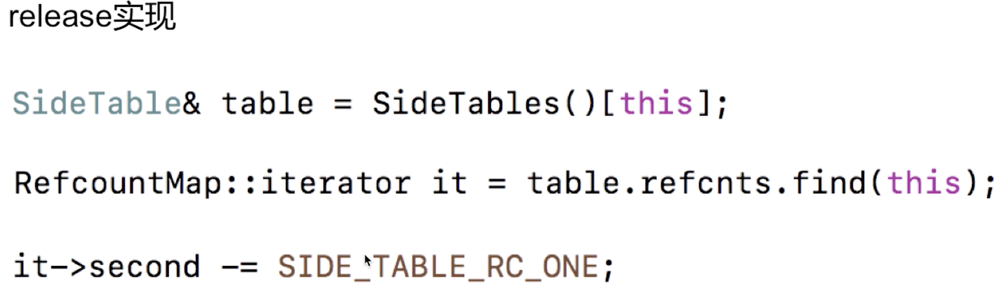

* retainCount实现

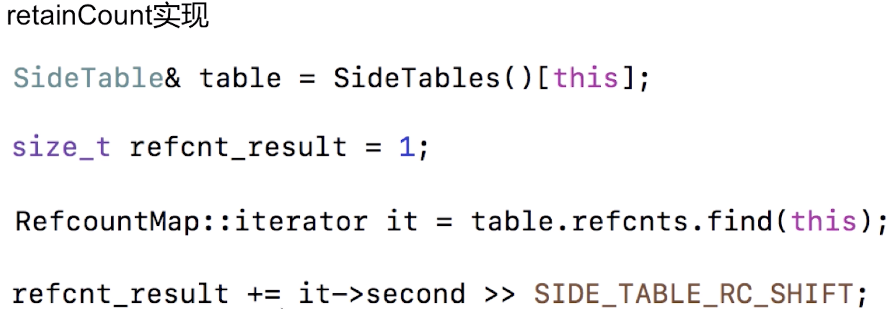

刚新alloc出来的一个对象，在引用计数表中，实际上是没有这个对象相关联的一个key-value的一个映射的，因此此时table.refcnts.find(this)->second读出来的值是0

* dealloc实现

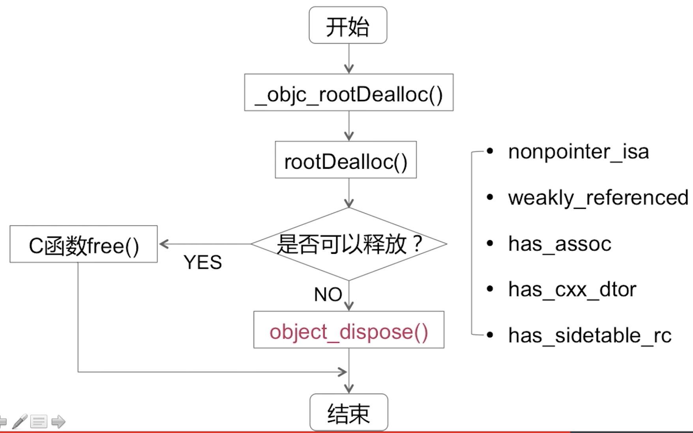

**是否可以释放**的判断环节，依据右边的五个标准进行判断，当五个标准都不满足时走YES流程。五个标准中的has_cxx_dtor会判断是否进行了c++操作、是否有ARC操作

* object_dispose()实现

实现.png)

* objc_destructInstance()实现

实现.png)

* clearDeallocating()实现

实现.png)

weak修饰的属性在所指向的对象被释放后，相应属性被置为nil的原因，因系统底层在执行dealloc的时候，若对象有被weak修饰的属性所指向时，会执行weak_clear_no_lock()操作

### 弱引用管理

**重听6-6、6-7、6-8**

* weak变量，是怎样添加到弱引用表当中的，通过weak_register_no_lock()实现的

* 添加weak变量，发生的函数调用栈如下图

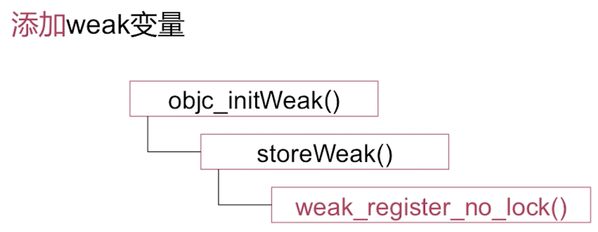

### 自动释放池

* 自动释放池的实现原理
  * 是以栈为结点通过双向链表的形式组合而成
  * 是和线程一一对应的

* autorelease流程

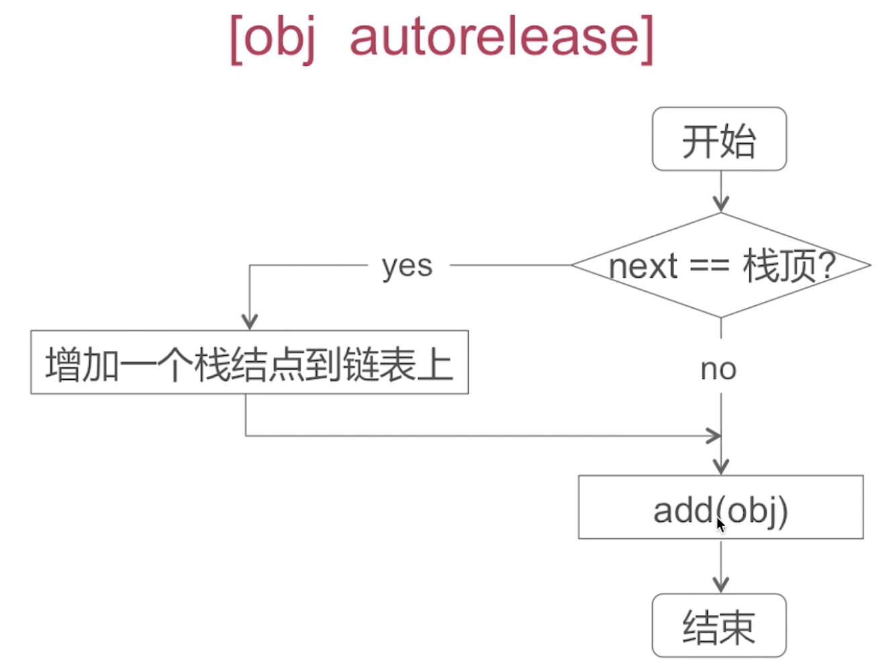

### 循环引用

* 类型
  * 自循环引用
  * 相互循环引用
  * 多循环引用

* 产生循环引用的情况
  * 代理（相互循环引用）
  * Block
  * NSTimer
  * 大环引用
* 如何破除循环引用
  * 避免产生循环引用
  * 在合适的时机手动断环

* 破除循环引用的解决方案
  * __weak
  * __block
    * MRC下，__block修饰对象不会增加其引用计数，避免了循环引用
    * ARC下，__block修饰对象会被强引用，无法避免循环引用，需要手动解环
  * \_\_unsafe\_unretained，所修饰的对象，引用计数器不改变，等效于\__weak
    * 修饰对象不会增加其引用计数，避免了循环引用
    * 如果被修饰对象在某一时机被释放，会产生**悬垂指针**

---

## Block

### 本质(什么是block)

* Block是将**函数**及其**执行上下文**封装起来的**对象**
* 理解Block是一个对象，是因其成员结构中有isa指针(Block是对象的标志)
* Block的调用
  * Block调用即是函数的调用

### 截获变量

**重点看**

针对不同类型的变量，block对变量的截获特点是不同的

* 被截获变量的类型
  * 局部变量
     * 基本数据类型
         * 对于基本数据类型的局部变量截获其值
     * 对象类型
         * 对于对象类型的局部变量**连同所有权修饰符**一起截获
  * 静态局部变量
    * 以指针形式截获局部静态变量
   
  * 全局变量
  * 静态全局变量
    * 不截获全局变量、静态全局变量

### __block修饰符

* MRC下，__block修饰对象不会增加其引用计数，避免了循环引用
* ARC下，__block修饰对象会被强引用，无法避免循环引用，需要手动解环

* 使用场景
  * 一般情况下，对被截获变量进行**赋值**操作需添加__block修饰符
  * 使用 != 赋值，如对可变数组的使用

* 对变量进行赋值时
  * 需要__block修饰符
     * 局部变量
         * 基本数据类型
         * 对象类型
  * 不需要__block修饰符
     * 静态局部变量
     * 全局变量
     * 静态全局变量

* __block修饰的变量变成了对象

* **栈上的__block**的__forwarding指针是指向__block自身的

* __forwarding指针与Block的内存管理有关

### Block的内存管理

* block的类型，三种
  * _NSConcreteGlobalBlock(全局)
  * _NSConcreteStackBlock(栈)
  * _NSConcreteMallocBlock(堆)

* 不同类型的block在内存中的布局，如下图

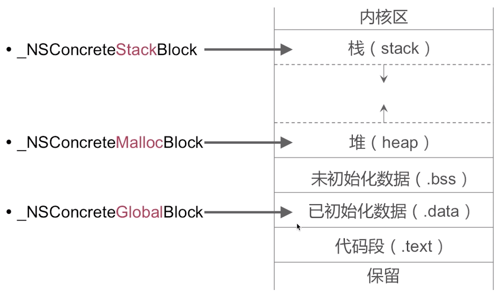

* 对block进行copy的效果

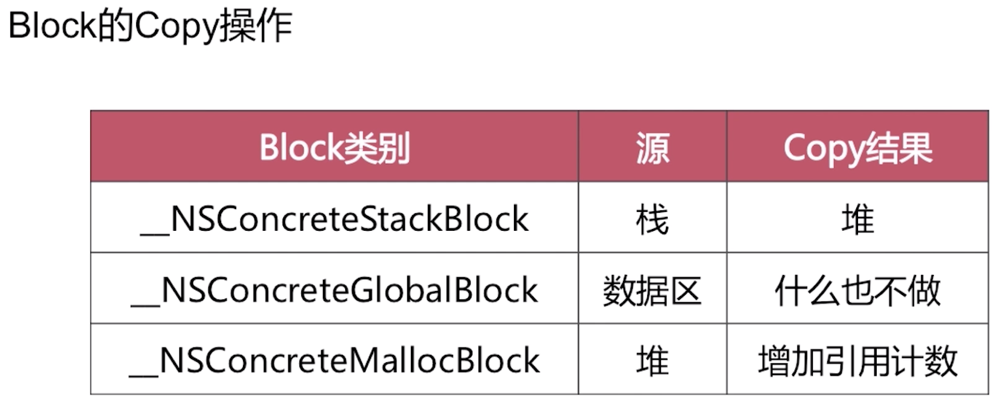

* 栈上block的销毁

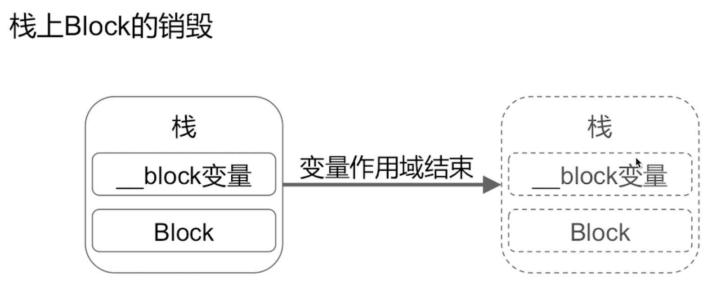

* 栈上block的copy

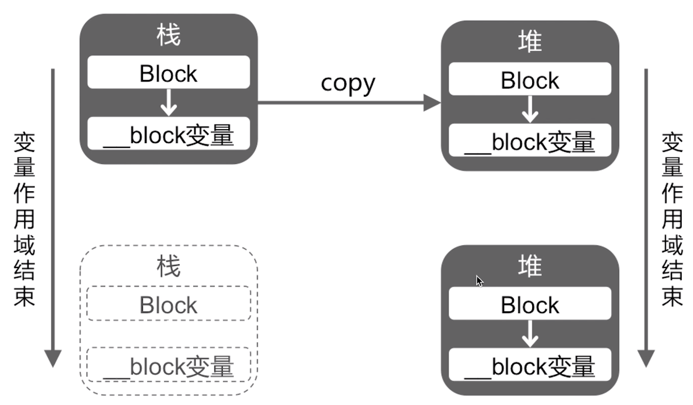

* 栈上__block的copy操作


注：前提是经过了copy操作

* __forwarding存在的意义
  * 不论在任何内存位置，都可以顺利访问同一个__block变量

### 循环引用

**重看7-5** 

---

## 多线程

* iOS系统中提供的多线程技术方案
  * GCD
  * NSOperation(AFN)
  * NSThread(常驻线程)

### GCD

* 主队列当中所提交的任务，不论通过同步方式，还是异步方式，最终都要在主线程中进行处理和执行
* 通过同步方式提交任务，不论是提交到并行队列，还是串行队列，最终都是在当前线程上进行执行
* GCD底层所分派的线程，默认情况下，是没有开启对应的RunLoop的，此时在线程中想要执行的方法，需要提交到线程对应的RunLoop中，并且RunLoop启动了，这时想要执行的方法才会执行生效(涉及线程和RunLoop的关系)

### dispatch_barrier_async()

* 利用GCD实现多读单写

### dispatch_group_async()

**重听8-3**

* 使用GCD实现：A、B、C三个任务并发，完成后执行任务D

### NSOperation

* 使用NSOperation实现多线程编程，需要和NSOperationQueue配合使用来实现多线程方案

* 实现多线程方案的优势和特点
  * 可以添加任务依赖，通过addDependency以及removeDependency方法为任务添加依赖或移除依赖，这种特点是GCD和NSThead所不具备的
  * 任务执行状态的控制
    * isReady
    * isExecuting
    * isFinished
    * isCancelled
    * 状态控制
       * 如果只重写main方法，底层控制变更任务执行完成状态，以及任务退出
       * 如果重写了start方法，自行控制任务状态
  * 可以控制最大并发量，通过设置max这个属性来控制最大并发量

* 系统**通过KVO**移除一个isFinished=YES的NSOperation的

### NSThread

* 面试中关于NSThread的面试问题，通常是结合RunLoop来考察的

* 启动流程


* NSThead的执行原理
  * 内部创建了一个pthread线程，当main函数或指定的target的selector方法执行结束之后，系统会进行线程的退出管理操作，如要维护一个常驻线程，需要在NSThead所对应的selector方法中去维护一个RunLoop事件循环

### 多线程与锁

* iOS当中都有哪些锁
  * @synchronized
     * 一般在创建单例对象的时候使用
  * atomic
     * 修饰属性的关键字
     * 对被修饰对象进行原子操作(不负责使用，即赋值时保证线程安全，使用时不保证线程安全，如，可变数组的使用)
  * OSSpinLock
     * 自旋锁
     * **循环等待询问**，不释放当前资源
     * 用于轻量级数据访问，简单的int值 +1/-1 操作
  * NSRecursiveLock
     * 递归锁
     * 可以重入(递归锁的特点)
  * NSLock
     * 开发中常使用的锁
     * 保证线程互斥进入临界区
  * dispatch_semaphore_t
     * 信号量
     * 相关操作方法
         * dispatch\_semaphore\_create()
         * dispatch\_semaphore\_wait()(阻塞行为是主动行为)
         * dispatch\_semaphore\_signal()(唤醒是被动行为)
  * 不同锁对应不同的使用场景

---

## RunLoop

### 概念

* RunLoop是通过内部维护的**事件循环**来对**事件/消息进行管理**的一个对象
  * 状态的切换(用户态<-->内核态)是解释什么是RunLoop的关键点

* 事件循环
  * 没有消息需要处理时，休眠以避免资源占用
     * 线程的状态切换：当没有消息要处理时，线程由**用户态**通过系统调用进入**内核态**
  * 有消息需要处理时，立刻被唤醒
     * 线程的状态切换：由**内核态**转变为**用户态**

  * 用户态、内核态
     * 应用程序通常运行在用户态，用户态面向用户的操作交互；相对于用户态而言是内核态，内核态是针对系统级别的操作

* main函数为什么一直保持运行的状态而不会终止退出
  * 因为在main函数体内会调用UIApplicationMain()这个函数，在这个函数内部会启动一个主线程的运行循环(RunLoop)
  * RunLoop是对事件循环的一种维护机制
  * RunLoop的特点
     * 接收消息
     * 处理
     * 等待(不等于死循环)(线程休眠)
     * 期间会发生用户态到内核态的相互切换

### 数据结构

NSRunLoop是CFRunLoop的封装，提供了面向对象的API

* RunLoop涉及的三个主要数据结构
  * CFRunLoop
     * pthread(可知，线程与RunLoop是一一对应的关系)
     * currentMode
     * modes
     * commonModes
     * commonModeItems
  * CFRunLoopMode
     * name
     * sources0
     * sources1
     * observers
     * timers
  * Source/Timer/Observer
     * CFRunLoopSource
         * source0
             * 需要手动唤醒线程
         * source1
             * 具备唤醒线程的能力
     * CFRunLoopTimer
         * 基于事件的定时器，和NSTimer是toll-free bridged(免费桥转换)的
     * CFRunLoopObserver
         * 观测时间点
             * kCFRunLoopEntry
             * kCFRunLoopBeforeTimers
             * kCFRunLoopBeforeSources
             * kCFRunLoopBeforeWaiting(RunLoop将从用户态切到内核态)
             * kCFRunLoopAfterWaiting
             * kCFRunLoopExit
  * 各数据结构之间的关系

  
  
* RunLoop的Mode


* CommonMode的特殊性
  * NS中对应的是NSRunLoopCommonModes
  * CommonMode不是实际存在的一种Mode
  * 是同步Source/Timer/Observer到多个Mode中的一种技术方案

### 事件循环机制

**重听9-3**

* RunLoop事件循环机制流程


* RunLoop的核心


### RunLoop与NSTimer

* 如何把一个timer同步到多个mode上面
  * 通过CFRunLoopAddTimer函数，给timer打上commonMode标签，将Timer添加到多个mode中

### RunLoop与多线程

* 线程是和RunLoop一一对应的
* 自己创建的线程默认是没有RunLoop的，需要自己手动创建RunLoop
  * 使用场景(怎样实现一个常驻线程)，过程如下
     * 为当前线程开启一个RunLoop(调用currentRunLoop，该函数会去当前线程查找RunLoop，如果没有RunLoop，会为当前线程创建一个RunLoop)
     * 向该RunLoop中添加一个Port/Source等维持RunLoop的事件循环
     * 启动该RunLoop(调用run方法)

---

## 网络

### HTTP协议

* 超文本传输协议

* 从以下方面理解HTTP
  * 请求/响应报文
    * 请求报文

    
    
    * 响应报文

    
    
    * 请求方式
       * get、post、head、put、delete、options

    * get和post的区别
    
    
    
       * 安全性：不应该引起Server端的任何状态变化(get/head/options)
       * 幂等性：同一个请求方法执行多次和执行一次的效果完全相同(get/put/delete)
       * 可缓存性：请求是否可以被缓存(get/head)

    * 状态码
       * 1xx、2xx、3xx、4xx、5xx
    
  * 连接建立流程
     * HTTP的连接建立，涉及TCP的三次握手(三次握手中，通过第三次的ACK报文来确立是否建立连接，用于回答为何不采用两次握手)，四次挥手
  * HTTP的特点
     * 无连接
         * 可以通过HTTP的**持久连接**方案来补偿无连接的问题
     * 无状态
         * 可以通过**Cookie/Session**来补偿无状态的问题

* 持久连接
  * 涉及的头部字段
     * Connection: keep-alive(指明是否持久连接)
     * time: 20(指定持续有效的时间段)
     * max: 10(指定可发送HTTP请求和响应的最大量)
  * 如何判断一个请求是否结束的方案
     * Content-length: 1024(依据服务端返回的该字段值，对客户端所接收的数据进行判断，如客户端所接收的数据大小等于服务端返回的该字段值的大小，则本次请求结束)
     * chunked，最后会有一个空的chunked(post请求情况下，当服务端返回的报文中，chunked为空，则本次请求结束)

* Charles抓包原理：中间人攻击


### HTTPS协议与网络安全

* HTTP与HTTPS的区别
  * HTTPS = HTTP + SSL/TLS
  * 协议栈

  
  
* HTTPS建立连接流程


* HTTPS采用的加密手段
  * 连接建立过程使用非对称加密，非对称加密很耗时
  * 后续通信过程使用对称加密
  * 非对称加密(安全性高)

  
  
  * 对称加密

  
 
### TCP与UDP

**重听10-4、10-5**

* UDP特点
  * 无连接
  * 尽最大努力交付
  * 面向报文
      * 既不合并，也不拆分
* UDP功能
  * 复用
  * 分用
  * 差错检测

* TCP特点
  * 面向连接
     * 三次握手
     * 四次挥手
  * 可靠传输
     * 无差错
     * 不丢失
     * 不重复
     * 按序到达
     * 使用停止等待协议：无差错情况、超时重传、确认丢失、确认迟到
  * 面向字节流
     * TCP连接是一个逻辑通道
  * 流量控制
     * 基于滑动窗口协议来实现的(按序到达)

     
     
  * 拥塞控制
     * 慢开始、拥塞避免
     * 快恢复、快重传

### DNS

* 对DNS的了解
  * 域名到IP地址的映射，DNS解析请求采用UDP数据报，且明文

* DNS查询方式
  * 递归查询

  
  
  * 迭代查询

  
  
* DNS解析存在的问题
  * DNS劫持问题

  
  
  * DNS解析转发问题

* DNS劫持与HTTP的关系是怎样的
  * DNS劫持与HTTP没有关系，因DNS解析发生在HTTP建立连接之前
  * DNS解析请求使用UDP数据报，端口号53

* 怎样解决DNS劫持
  * httpDNS方案

  
  
  * 长连接方案

  

### Session与Cookie

* 是对HTTP协议无状态特点的补偿

* Cookie主要用来记录用户状态，区分用户；状态保存在客户端


客户端发送的cookie在http请求报文的Cookie首部字段中

服务器端设置http响应报文的Set-Cookie首部字段

* 怎样修改Cookie
  * 新cookie覆盖旧cookie
  * 覆盖规则：name、path、domain等需要与原cookie一致

* 怎样删除Cookie
  * 新cookie覆盖旧cookie
  * 覆盖规则：name、path、domain等需要与原cookie一致
  * 设置cookie的expires=过去的一个时间点，或者maxAge=0(设置cookie失效)

* Session也是用来记录用户状态，区分用户；状态存放在服务器端

* Session和Cookie的关系是怎样的
  * Session需要依赖于Cookie机制
  * Session工作流程

  
---

## 设计模式

### 六大设计原则


* 单一职责原则
  * 一个类只负责一件事，如CALayer和UIView
* 开闭原则
  * 对修改关闭，对扩展开放
* 接口隔离原则
  * 使用多个专门的协议，而不是一个庞大臃肿的协议，如UITableView
  * 协议中的方法也尽量少
* 依赖倒置原则
  * 抽象不应该依赖于具体实现，具体实现可以依赖于抽象
* 里氏替换原则
  * 父类可以被子类无缝替换，且原有功能不受任何影响，如KVO
* 迪米特法则
  * 一个对象应当对其他对象有尽可能少的了解
  * 高内聚、低耦合

### 责任链模式

* 类构成


### 桥接模式

* 类构成


### 适配器模式

* 对象适配器
  * 类构成

  
  
  
  
* 类适配器

### 单例模式

单例实现代码


* 注意super的调用
* 要重写allocWithZone:和copyWithZone:

### 命令模式

* 对行为进行参数化的设计模式，如微博。以降低代码重合度

**重听11-6**
---

## 架构/框架

* 引入架构&框架，主要实现模块化，将各个功能按模块划分，作一个相应的分层，目的是为了解耦，最终实现降低代码重合度的效果

### 图片缓存框架

* 怎样设计一个图片缓存框架


* 图片通过什么方式进行读写
  * 以图片URL的单向Hash值作为Key
  * 读取的过程如下

  
  
  引入内存模块，是从多级缓存角度考虑的
  
* 内存的设计上需要考虑的问题
  * 存储的Size(从内存资源稀缺性的角度出发)
      * 存储的数据结构(从大小、使用频度上考虑)，队列方式存储(FIFO)

      
      
  * 淘汰的策略
     * 淘汰，因为内存Size大小有限
     * 淘汰的策略依托于存储Size的设计方案的
     * 方案
         * 以队列先进先出的方式淘汰
         * LRU算法(最近最久未使用算法)(如30分钟之内是否使用过)。可以通过**定时检查(损耗性能)**方式(思路，落地性不强)，也可通过**提高检查触发频率(即每次触发时，对所有图片的未使用时长进行检查)(触发方式：每次进行读写时、前后台切换时)**的方式。使用LRU算法时，注意开销问题

* 磁盘设计需要考虑的问题
  * 需要考虑磁盘空间大，但读取效率低的特点
  * 存储方式的选择
  * 大小限制(如100MB)
  * 淘汰策略(如某一图片存储时间距今已超过7天)

* 网络部分的设计需要考虑的问题
  * 图片请求的最大并发量
  * 请求的超时策略(重试，如最多重试两次)
  * 请求优先级

* 图片解码
  * 对不同格式的图片，解码采用的方式
      * 应用策略模式对不同图片格式进行解码
  * 在哪个阶段做图片解码处理
      * 磁盘读取之后(从磁盘读取未解码，解码后再放入内存，以此减轻视图渲染时因图片解码所带来的压力)
      * 网络请求返回后

* 线程处理
  * 图片缓存框架整体流程中，线程的处理过程如下时序图

  

### 阅读时长统计

* 时长统计的框架


页面式：push开始、pop结束
自定义式：体现在设计框架时，对扩展性的考虑
磁盘存储：防止异常情况下(程序杀死、设备断电)记录数据的丢失

* 记录器
  * 为何有不同的记录器
      * 基于不同分类场景提供的关于记录的封装、适配

* 如何降低记录数据的丢失率
  * 定时写磁盘(如每隔一段时间就做磁盘的写入)
  * 限定内存缓存的条数(如10条)，超过该条数，即写磁盘

* 延时上传的场景
  * 从节约客户端流量和提高性能的角度考虑，不是每产生一条记录就上传
  * 采用延时上传的策略来进行批量上传(如，产生一定量(每50条)或过一定时间(每隔10分钟)进行上传)
  * 触发延时上传的场景
     * 前后台切换
     * 从无网到有网的变化
     * 通用轻量接口捎带

* 上传时机的把控
  * 立刻上传
  * 延时上传
  * 定时上传

### 复杂页面架构

以微博APP正文页为例

* 整体架构


* 数据流


* 反向更新


* 总结
  * 涉及的思想

  
  
  * MVVM结构图

  
  
  * RN数据流思想

  
  
  任何一个子节点，是没有权利做自己的变化更新的，它必须要把这种变化更新的消息传递给根节点，然后由根节点自顶向下的方式去询问需要更新的节点(从一个主动行为变成一个被动行为)
  
### 客户端整体架构

* 客户端整体架构结构图


独立的通用层构成有：时长统计框架、崩溃统计框架、网络第三方框架
通用业务层：如控件的封装
中间层：用于协调各业务的交互，及处理各业务的解耦

* 业务之间的解耦通信方式
  * OpenURL(Router方式)
  * 依赖注入(TOONRouter???)

  
  
整体架构设计的原则：上层可以依赖下层，下层不可以依赖上层

---

## 算法

### 字符串反转算法

* 字符串反转


### 链表反转算法

* 链表反转
  * 头插法，关键点是哨兵指针先移动，再执行节点的赋值移除操作

  

### 有序数组合并算法


### Hash算法

13-4

* 示例：用hash算法实现，找出给定字符串中第一个只出现一次的字符


### 查找两个子视图的共同父视图算法

13-5

### 求无序数组当中的中位数的算法

---

## 第三方库

### AFN

14-1

* 框架图


* 主要类关系图


* AFURLSessionManager主要功能
  * 创建和管理NSURLSession、NSURLSessionTask
  * 实现NSURLSessionDelegate等协议的代理方法
  * 引入AFSecurityPolicy保证请求安全
  * 引入AFNetworkReachabilityManager监控网络状态

### SDWeb

* 框架图


* 加载图片的流程


### ReactiveCocoa

* 是函数响应式的编程框架

* 重要概念
  * 信号
  * 订阅(订阅一个信号)

* 信号
  * ReactiveCocoa中的核心类RACSignal
  * RACSignal结构图

  
  
  * 信号是代表一连串的状态。在状态改变时，对应的订阅者RACSubscriber就会收到通知执行相应的指令

* 订阅
  * 订阅信号的工作逻辑

  
  
  * 订阅内部原理

  

### AsyncDisplayKit

* 是一个提升iOS界面渲染性能的一个框架
* 主要用来减轻主线程的压力，能在子线程执行的操作就在子线程中执行

* 主要处理的问题


* 基本原理


  * 封装了一个ASNode
  * 针对ASNode的修改和提交，会对其进行封装并提交到一个全局容器当中
  * ASDK也在RunLoop中注册了一个Observer
  * 当RunLoop进入休眠前，ASDK执行该loop内提交的所有任务

---

### iOS中使用的多线程

##### GCD

  * 同步/异步、串行/并发
      * 死锁原因：队列引起的循环等待。例子：viewDidLoad和Block。在主队列(串行队列)中分派viewDidLoad到主线程去执行，viewDidLoad在执行的过程中会调用Block去执行任务，viewDidLoad继续执行的前提条件是Block执行完毕后继续执行viewDidLoad，Block上的任务要想执行，依赖主队列(串行队列)的性质(先进先出FIFO)，此时Block想要执行，依赖viewDidLoad的完成，这种情况下就产生了viewDidLoad和Block的相互等待，造成了队列的循环等待，产生死锁。
      * 主队列当中提交的任务(无论是同步或是异步)，最终都要在主线程中进行处理和执行
      * 同步提交意味着在当前线程执行
      * 任务添加到队列中，分析任务的执行顺序时，要考虑队列的性质，如FIFO
      * 只要是以同步方式去提交任务，无论是提交到并发队列还是串行队列，最终都是在当前线程去执行
      * 全局队列(global_queue)，是并发队列
  * dispatch_barrier_async，用于解决多读单写，系统层方面的一个解决方案
  * dispatch_group，
  
##### NSOperation

NSOperation常用于第三方库的对线程编程，如AFNetwork

##### NSThread

实现常驻线程的时候，会用到NSThread

---

线程同步，资源共享，会涉及到多线程与锁

##### 笔记

KVO：isa 混写技术的实现
MVVM + RAC
RN