### 背景

当微信中的`WebView`逐渐成为移动`Web`的一个重要入口时，微信就有相关的`JS API`了。为了使在微信中对网页的开发简洁、高效，微信在`2015`年发布了一整套**网页开发工具包`JS-SDK`**，让开发者可以使用到微信的原生能力。

`JS-SDK`解决了**移动网页**能力不足的问题，通过暴露微信的接口使得`Web`开发者能够拥有更多的能力，然而在更多的能力之外，`JS-SDK`的模式并没有解决使用移动网页遇到的体验不良的问题。

使用移动网页遇到的体验不良问题，有：

1. 白屏过程(在移动端，受限于设备性能和网络速度，白屏会更加明显。有微信`Web`资源离线存储的解决方案)
   * 微信`Web`资源离线存储是面向`Web`开发者提供的基于微信内的`Web`加速方案：通过使用微信离线存储，`Web`开发者可借助微信提供的资源存储能力，直接从微信本地加载`Web`资源而不需要再从服务端拉取，从而减少网页加载时间，为微信用户提供更优质的网页浏览体验。每个公众号下所有`Web App`累计最多可缓存`5M`的资源
   * 简单的页面通过**离线存储**能够解决白屏问题，但对于复杂页面(如页面加载了大量的`CSS`或是`JavaScript`文件)，依然会有白屏问题，因为构建复杂页面的文件的执行时间占用了大量的`UI`线程
2. 缺少操作的反馈，主要表现在：
   * 页面切换的生硬
   * 点击的迟滞感

为解决上述的用户体验问题，使开发者对移动网页的开发简洁、高效，全新的系统小程序应运而生。小程序具有以下特点：

* 快速的加载
* 更强大的能力
* 原生的体验
* 易用且安全的微信数据开放
* 高效和简单的开发

### 小程序与普通网页开发的区别

小程序的主要开发语言是`JavaScript`

网页开发**渲染线程**和**脚本线程**是互斥的，这也是为什么长时间的脚本运行可能会导致页面失去响应，而在小程序中，二者是分开的，分别运行在不同的线程中。网页开发者可以使用到各种**浏览器暴露出来的`DOM API`**，进行`DOM`选中和操作。小程序的**逻辑层**和**渲染层**是分开的，逻辑层运行在`JSCore`中，并没有一个完整**浏览器对象**，因而缺少相关的`DOM API`和`BOM API`。这一区别导致了前端开发非常熟悉的一些库，例如`jQuery`、`Zepto`等，在小程序中是无法运行的。同时`JSCore`的环境同`NodeJS`环境也是不尽相同，所以一些`NPM`的包在小程序中也是无法运行的。

**网页开发**者需要面对的环境是各式各样的**浏览器**，`PC`端需要面对`IE`、`Chrome`、`QQ`浏览器等，在移动端需要面对`Safari`、`Chrome`以及`iOS`、`Android`系统中的各式`WebView`。而小程序开发过程中需要面对的是两大操作系统`iOS`和`Android`的微信客户端，以及用于辅助开发的小程序开发者工具，小程序中三大运行环境也是有所区别的，区别如下：

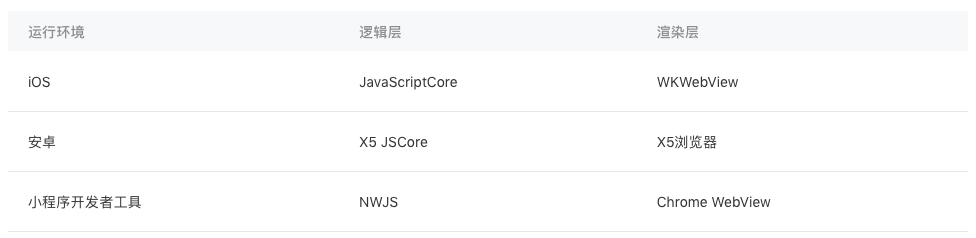

### 小程序代码组成

小程序由配置代码`JSON`文件、模板代码`WXML`文件、样式代码`WXSS`文件以及**逻辑代码**`JavaScript`文件组成。

##### `JSON`配置

`JSON`是一种数据格式，并不是编程语言。在小程序中`.json`为后缀的`JSON`文件是配置文件。

`JSON`文件在小程序代码中扮演静态配置的作用，在小程序运行之前就决定了小程序一些表现，需要注意的是小程序是无法在运行过程中去动态更新`JSON`配置文件从而发生对应变化的。

* `JSON`语法

通过`key-value`的方式来表达数据，`JSON`中键和值都用双引号包裹。`JSON`文件中无法使用注释，添加注释将会引发报错。

* `JSON`的值只能是以下几种数据格式
  1. 数字，包含浮点数和整数
  2. 字符串，需要包裹在双引号中
  3. `Bool`值，`true`或者`false`
  4. 数组，需要包裹在方括号中`[]`
  5. 对象，需要包裹在大括号中`{}`
  6. `Null`

**小程序配置 app.json**

`app.json` 是当前小程序的**全局配置**，包括了小程序的：

```
所有页面路径、
界面表现、
网络超时时间、
底部 tab 等。
```

主要配置项的含义：

```
pages - 用于指定小程序由哪些页面组成，每一项都对应一个页面的 路径+文件名 信息。
文件名不需要写文件后缀，框架会自动去寻找对应位置的 .json, .js, .wxml, .wxss 四个文件进行处理。

pages配置项的值是数组，数组的第一项代表小程序的初始页面（首页）。小程序中新增/减少页面，都需要对 pages 数组进行修改。

tabBar - 指定 tab 栏的表现，以及 tab 切换时显示的对应页面。
其中 tabBar 的 list 属性接受一个数组，只能配置最少 2 个、最多 5 个 tab。tab 按数组的顺序排序，每个项都是一个对象。
```

配置项细节可参考[小程序的配置 app.json](https://developers.weixin.qq.com/miniprogram/dev/framework/config.html)

**工具配置 project.config.json**

使用场景：开发者在小程序开发者工具上做的任何配置都会写入到这个文件，当重新安装工具或换电脑时，只要载入同一个项目的代码包，开发者工具就自动会帮你恢复到之前开发项目时的个性化配置。

配置项细节可参考[开发者工具的配置](https://developers.weixin.qq.com/miniprogram/dev/devtools/projectconfig.html)

**页面配置 page.json**

这类配置是`pages/xxx`目录下和小程序页面相关的配置。让开发者可以独立定义每个页面的属性，如顶部颜色、是否允许下拉刷新。

页面的配置只能设置`app.json`中部分`window`配置项的内容，页面中配置项会覆盖`app.json`的`window`中相同的配置项。

配置项细节可参考[页面配置](https://developers.weixin.qq.com/miniprogram/dev/framework/config.html#页面配置)

##### `.wxml`后缀的`WXML`模板文件

`WXML`全称是`WeiXin Markup Language`，是小程序框架设计的一套标签语言，结合小程序的基础组件、事件系统，可以构建出页面的结构。`WXML`要求标签必须是严格闭合的，没有闭合将会导致编译错误。

**标签**可以拥有**属性**，属性提供了有关的**`WXML`元素**更多信息。**属性总是定义在开始标签中**，除了一些特殊的属性外，其余**属性的格式都是key="value"的方式成对出现**。需要注意的是，`WXML`中的**属性是大小写敏感的**，也就是说`class`和`Class`在`WXML`中是不同的属性。

网页编程采用的是`HTML + CSS + JS`这样的组合，其中：

```
HTML： 是用来描述当前这个页面的结构；
CSS： 用来描述页面的样子；
JS： 通常是用来处理这个页面和用户的交互。
```

和`HTML`相似，`WXML`由标签、属性等构成。也有很多不一样的地方，区别如下：

1. 标签名字不一样：

```
写 HTML 的时候，经常会用到的标签是 div，p，span，在写一个页面的
时候可以根据这些基础的标签组合出不一样的组件，如日历、弹窗等。基于
此小程序把常用的组件包装起来，用指定的标签表示包装起来的组件，同时
被包装起来的组件拥有对应的基本能力。如小程序的 WXML 用的标签是 
view，button，text等，这些标签就是小程序给开发者包装好的基本组件
能力，除此之外微信还提供了地图、视频、音频等组件能力。
```

更多组件能力的详细信息可参考[小程序的能力](https://developers.weixin.qq.com/miniprogram/dev/quickstart/basic/framework.html)、[小程序的组件](https://developers.weixin.qq.com/miniprogram/dev/component/)

2. 多了一些`wx:if`这样的属性

```
多了一些 wx:if 这样的属性以及 {{}} 这样的表达式。

小程序中，wx:if 这样的属性和 {{}} 这样的表达式引入的背景：

在网页的一般开发流程中，通常会通过 JS 操作 DOM（对应 HTML 的描述
产生的树），以引起界面的一些变化响应用户的行为。如，用户点击某个按
钮的时候，JS 会记录一些状态到 JS 变量里边，同时通过 DOM API 操
控 DOM 的属性或者行为，进而引起界面一些变化。当项目越来越大的时
候，代码会充斥着非常多的界面交互逻辑和程序的各种状态变量，显然这不
是一个很好的开发模式，因此就有了 MVVM 的开发模式（如React，
Vue），提倡把渲染和逻辑分离。
```

**小程序框架的思路：**简单来说就是不要再让 `JS` 直接操控 `DOM`，`JS` 只需要管理状态即可，然后再通过一种**模板语法**来描述状态和界面结构的关系即可。

* 数据绑定

```
数据绑定实现程序运行的过程中，可以动态的去改变渲染界面。在Web开发中，开发者使用JavaScript
通过Dom接口来完成界面的实时更新。在小程序中，使用WXML语言所提供的数据绑定功能，来完成
此项功能。

WXML通过{{变量名}}来绑定WXML文件和对应的JavaScript文件中的data对象属性。

属性值也可以动态的去改变，有所不同的是，属性值必须被包裹在双引号中。需要注意的是变量名是大小写敏
感的，也就是说{{name}}和{{Name}}是两个不同的变量。没有被定义的变量或者是被设置为
undefined的变量不会被同步到wxml中。
```

* 逻辑语法

```
通过{{变量名}}语法可以使得WXML拥有动态渲染的能力，除此外还可以在{{ }}内进行简单的逻辑运算。

{{}}内支持的逻辑运算：
  * 三元运算
  * 算数运算(类似于算数运算，支持字符串的拼接)
  * {{}}中可以直接放置数字、字符串或者是数组
```

* 条件逻辑

`WXML`中，使用`wx:if="{{condition}}"`来判断是否需要**渲染**该代码块。使用`wx:elif`和`wx:else`来添加一个`else`块。

因为`wx:if`是一个**控制属性**，需要将它添加到一个标签上。如果要一次性判断多个组件标签，可以使用一个`<block/>`标签将多个组件包装起来，并在上边使用`wx:if`控制属性。

* 列表渲染

在组件上使用`wx:for`控制属性绑定一个数组，即可使用数组中各项的数据重复渲染该组件。默认数组的当前项的下标变量名默认为`index`，数组当前项的变量名默认为`item`。使用`wx:for-item`指定数组当前元素的变量名，使用`wx:for-index`指定数组当前下标的变量名(相当于命名别名)。

如果需要保持列表项目的特征和状态时(如：`<input/>`中的输入内容，`<switch/>`的选中状态)，需要使用`wx:key`来指定列表中项目的唯一标识符。基于在渲染时，带有`key`的组件，框架会确保他们被重新排序，而不是重新创建，以确保使组件保持自身的状态，并且提高列表渲染时的效率。

`wx:key`的值以两种形式提供：

1. **字符串**，代表在`for`循环的`array`中`item`的某个`property`，该`property`的值需要是列表中**唯一的字符串或数字，且不能动态改变**
2. 保留关键字`this`代表在`for`循环中的`item`本身，这种表示需要`item`本身是一个唯一的字符串或者数字

* 模版

`WXML`提供模板(`template`)，可以在模板中定义代码片段，然后在不同的地方调用。使用`name`属性，作为模板的名字。然后在`<template/>`内定义代码片段。

定义模版：

```
<template name="msgItem">
  <view>
    <text> {{index}}: {{msg}} </text>
    <text> Time: {{time}} </text>
  </view>
</template>
```

使用`is`属性，声明需要使用的模板，然后将模板所需要的`data`传入。`is`可以动态决定具体需要渲染哪个模板。

* 引用

`WXML`提供两种文件引用方式`import`和`include`。

1. `import`可以在该文件中使用目标文件定义的`template`。需要注意的是`import`有作用域的概念，即只会`import`目标文件中定义的`template`，而不会`import`目标文件中`import`的`template`，简言之就是`import`不具有递归的特性
2. `include`可以将目标文件中除了`<template/>``<wxs/>`外的整个代码引入，相当于是拷贝到`include`位置

##### `.wxss`后缀的`WXSS`样式文件

`WXSS`(`WeiXin Style Sheets`)是一套用于小程序的**样式语言**，用于描述`WXML`的**组件样式**，也就是视觉上的效果。`WXSS`与`Web`开发中的`CSS`类似。

`app.wxss`为项目的公共样式，它会被注入到小程序的每个页面。页面样式，是与`app.json`注册过的页面同名且位置同级的`.wxss`文件。其他样式，可以被项目公共样式和页面样式引用。

在小程序开发中，开发者不需要像`Web`开发那样去优化样式文件的请求数量，只需要考虑**代码的组织**即可，样式文件最终会被编译优化。

在`WXSS`中，引入了`rpx`(`responsive pixel`)尺寸单位，以适配不同宽度的屏幕。小程序编译后，`rpx`会做一次`px`换算。换算是以`375`个物理像素为基准，也就是在一个宽度为`375`物理像素的屏幕下，`1rpx = 1px`。

常用机型`rpx`尺寸换算表：


由于`WXSS`最终会被**编译打包**到目标文件中，用户只需要下载一次，在使用过程中不会因为样式的引用而产生多余的文件请求。小程序中样式文件的引用格式为：`@import '.wxss文件路径'`。

小程序中`WXSS`内联样式与`Web`一样。即通过样式属性`style`进行设置。小程序支持动态更新内联样式。

小程序`WXSS`现阶段支持的选择器：

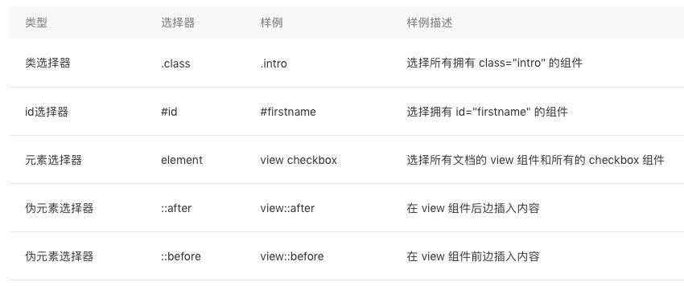

`WXSS`选择器优先级：

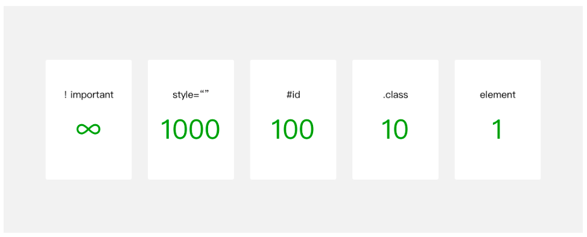

**权重越高越优先。在优先级相同的情况下，后设置的样式优先级高于先设置的样式。**

##### `.js`后缀的`JS`脚本逻辑文件

小程序的主要开发语言是`JavaScript`，开发者使用`JavaScript`来**开发业务逻辑**以及调用小程序的`API`来完成业务需求。

小程序中的`JavaScript`与浏览器中的`JavaScript`和`NodeJS`中的`JavaScript`的区别：

* 浏览器中的`JavaScript`
  * 浏览器中的`JavaScript`是由**`ECMAScript`**和**`BOM`(浏览器对象模型)**以及**`DOM`(文档对象模型)**组成的，`Web`前端开发者会很熟悉这两个对象模型，它使得开发者可以去操作浏览器的一些表现，比如修改`URL`、修改页面呈现、记录数据等等。

* `NodeJS`中`JavaScript`
  * `NodeJS`中的`JavaScript`是由**`ECMAScript`**和**`NPM`**以及**`Native`模块**组成，`NodeJS`的开发者会非常熟悉`NPM`的包管理系统，通过各种拓展包来快速的实现一些功能，同时通过使用一些原生的模块例如`FS`、`HTTP`、`OS`等等来拥有一些语言本身所不具有的能力。

* 小程序中的`JavaScript`
  * 小程序中的`JavaScript`是由**`ECMAScript`**以及**小程序框架**和**小程序`API`**来实现的。同浏览器中的`JavaScript`相比没有`BOM`以及`DOM`对象，所以类似`JQuery`、`Zepto`这种浏览器类库是无法在小程序中运行起来的，同样的缺少`Native`模块和`NPM`包管理的机制，小程序中无法加载原生库，也无法直接使用大部分的`NPM`包。

除`JavaScript`不同外，不同的平台的小程序的脚本执行环境也是有所区别的。目前小程序可以运行在三大平台，`iOS平台`、`Android平台`、`小程序IDE`，这种区别主要是体现三大平台实现的`ECMAScript`的标准有所不同。

浏览器中，所有`JavaScript`是运行在同一个作用域下的，定义的参数或者方法可以被后续加载的脚本访问或者改写。与浏览器不同，小程序中可以将任何一个`JavaScript`文件作为一个模块，通过`module.exports`或者`exports`对外暴露接口。

使用`require(path)`将模块引入。

* 脚本的执行顺序

浏览器中，脚本严格按照加载的顺序执行。在小程序中脚本的执行顺序与浏览器中的有所不同，小程序的执行入口文件是`app.js`，会根据其中`require`的模块顺序决定文件的运行顺序。当`app.js`执行结束后，小程序会按照开发者在`app.json`中定义的`pages`的顺序，逐一执行。

* 作用域

小程序脚本的作用域，在文件中声明的变量和函数只在该文件中有效，不同的文件中可以声明相同名字的变量和函数，不会互相影响。

当需要使用全局变量的时候，通过使用全局函数`getApp()`获取全局的实例，并设置相关属性值，来达到设置全局变量的目的。

注，脚本中全局变量的访问，对全局变量声明所在的脚本和变量所使用的脚本有顺序上的依赖关系，只有变量声明所在的脚本先执行了，变量使用的脚本才能有效的使用变量。

当需要保证全局的数据可以在任何文件中安全的被使用到，那么可以在`App()`中进行设置(即在`app.js`中的`App()`中进行设置)。

### 小程序的宿主环境

微信客户端给小程序提供了宿主环境，小程序可以调用宿主环境提供的微信客户端的能力，这使得小程序比普通网页拥有更多的能力。

小程序的运行环境分成**渲染层**和**逻辑层**。`WXML`模板和`WXSS`样式工作在渲染层，`JS`脚本工作在逻辑层。在小程序中渲染层和逻辑层是分离的。

* 通信模型

小程序的渲染层和逻辑层分别由`2`个线程管理：渲染层的界面使用了`WebView`进行渲染；逻辑层采用`JsCore`线程运行`JS`脚本。一个小程序存在多个界面，所以渲染层存在多个`WebView`线程，这两个线程的通信会经由微信客户端(可用`Native`来代指微信客户端)做中转，逻辑层发送网络请求也经由`Native`转发。

* 数据驱动

通常界面视图和变量状态是相关联的，通过**数据驱动**可省去手动修改视图的工作。

小程序数据驱动的基本原理：`WXML`结构实际上等价于一棵`Dom`树，通过一个`JS`对象也可以来表达`Dom`树的结构。`WXML`可以先转成`JS`对象，然后再渲染出真正的`Dom`树。数据状态变化后，产生的`JS`对象对应的节点就会发生变化，此时可以对比前后两个`JS`对象得到变化的部分，然后把这个差异应用到原来的`Dom`树上，从而达到更新`UI`的目的。(即：状态更新的时候，通过对比前后`JS`对象变化，进而改变视图层的`Dom`树)

* 双线程下的界面渲染

小程序的逻辑层和渲染层是分开的两个线程。在渲染层，宿主环境会把`WXML`转化成对应的`JS`对象，在逻辑层发生数据变更的时候，通过宿主环境提供的`setData`方法把数据从逻辑层传递到渲染层，再经过对比前后差异，把差异应用在原来的`Dom`树上，渲染出正确的`UI`界面。

大致流程如下：

1. 描述界面
2. 传递页面数据
3. 对比应用差异重新渲染界面

* 小程序界面渲染的基本原理
  * 小程序的页面结构由`WXML`进行描述，`WXML`可以通过**数据绑定**的语法绑定从逻辑层传递过来的数据字段，这里所说的数据其实就是来自于页面`Page`构造器的`data`字段，`data`参数是页面第一次渲染时从逻辑层传递到渲染层的数据

##### 程序与页面

从逻辑组成来说，一个小程序是由多个“页面”组成的“程序”。

小程序与程序的区别：**小程序**指的是产品层面的程序；**程序**指的是代码层面的程序实例。

* 程序构造器`App()`

宿主环境提供了`App()`构造器用来注册一个程序`App`，需要留意的是`App()`构造器必须写在项目根目录的`app.js`里，**`App`实例是单例对象**，在其他`JS`脚本中可以使用宿主环境提供的`getApp()`来获取**程序实例**。

`App`构造器接受一个`Object`参数，其中`onLaunch`/`onShow`/`onHide`三个回调是`App`实例的生命周期函数。

`App`构造器的参数

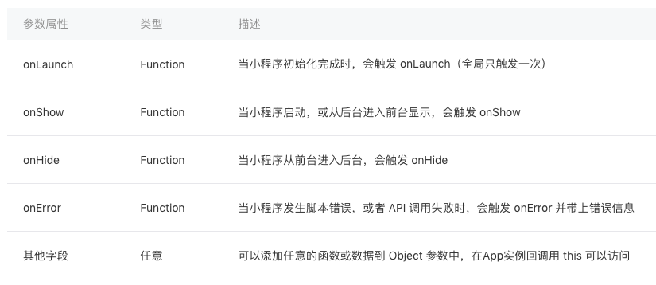

* 程序的生命周期和打开场景
  * 程序生命周期
     * 初次进入小程序的时候，微信客户端初始化好宿主环境，同时从网络下载或者从本地缓存中拿到小程序的代码包，把它注入到宿主环境，初始化完毕后，微信客户端就会给`App`实例派发`onLaunch`事件，`App`构造器参数所定义的`onLaunch`方法会被调用
     * 进入小程序之后，用户可以点击右上角的关闭，或者按手机设备的`Home`键离开小程序，此时小程序并没有被直接销毁，把这种情况称为“小程序进入后台状态”，App构造器参数所定义的`onHide`方法会被调用
     * 当再次回到微信或者再次打开小程序时，微信客户端会把“后台”的小程序唤醒，把这种情况称为“小程序进入前台状态”，`App`构造器参数所定义的`onShow`方法会被调用
  * `App`的生命周期是由微信客户端根据用户操作主动触发的。为了避免程序上的混乱，不应该从其他代码里主动调用`App`实例的生命周期函数
  * 在微信客户端中打开小程序的途径
     * 从群聊会话里打开
     * 从小程序列表中打开
     * 通过微信扫一扫二维码打开
     * 从另外一个小程序打开当前小程序
     * 针对不同途径的打开方式，小程序有时需要做不同的业务处理，所以微信客户端会把打开方式带给`onLaunch`和`onShow`的调用参数`options`

     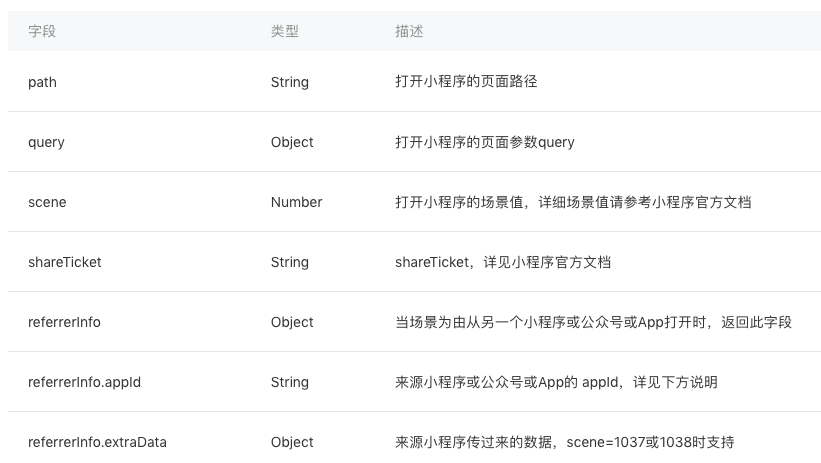

* 小程序全局数据

小程序的`JS`脚本是运行在`JsCore`的线程里，小程序的每个页面各自有一个`WebView`线程进行渲染，所以小程序切换页面时，小程序逻辑层的`JS`脚本运行上下文依旧在同一个`JsCore`线程中。`App`实例是单例的，因此不同页面直接可以通过`App`实例下的属性来共享数据，`App`构造器可以传递其他参数作为全局属性以达到全局共享数据的目的。

要特别留意一点，所有页面的脚本逻辑都跑在同一个`JsCore`线程，页面使用`setTimeout`或者`setInterval`的定时器，然后跳转到其他页面时，这些定时器并没有被清除，需要开发者自己在页面离开的时候进行清理。

* 页面

一个页面是分三部分组成：界面、配置和逻辑。**界面**由`WXML`文件和`WXSS`文件来负责描述，**配置**由`JSON`文件进行描述，**页面逻辑**则是由`JS`脚本文件负责。

一个页面的文件需要放置在同一个目录下，其中`WXML`文件和`JS`文件是必须存在的，`JSON`和`WXSS`文件是可选的。

页面路径需要在小程序代码根目录`app.json`中的`pages`字段声明，否则这个页面不会被注册到宿主环境中。

默认`pages`字段的第一个页面路径为小程序的首页。

* 页面构造器`Page()`

宿主环境提供了`Page()`构造器用来注册一个小程序页面，`Page()`在页面对应的脚本`.js`中调用。`Page()`构造器接受一个`Object`参数，其中`data`属性是当前页面`WXML`模板中可以用来做数据绑定的初始数据。

`Page`实例的生命周期函数：`onLoad`/`onReady`/`onShow`/`onHide`/`onUnload`

页面的用户行为：`onPullDownRefresh`/`onReachBottom`/`onShareAppMessage`/`onPageScroll`

`Page`构造器的参数

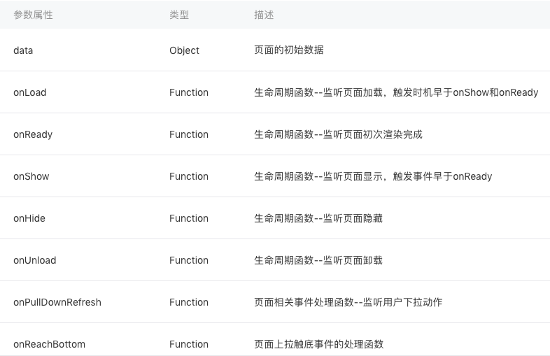
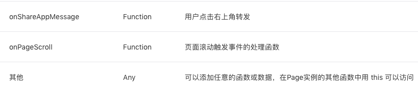

* 页面的生命周期和打开参数
  * 页面初次加载的时候，微信客户端就会给`Page`实例派发`onLoad`事件，`Page`构造器参数所定义的`onLoad`方法会被调用，`onLoad`在页面没被销毁之前只会触发`1`次，在`onLoad`的回调中，可以获取当前页面所调用的打开参数`option`
  * 页面显示之后，`Page`构造器参数所定义的`onShow`方法会被调用，一般从别的页面返回到当前页面时，当前页的`onShow`方法都会被调用
  * 在页面初次渲染完成时，`Page`构造器参数所定义的`onReady`方法会被调用，`onReady`在页面没被销毁前只会触发`1`次，`onReady`触发时，表示页面已经准备妥当，在逻辑层就可以和视图层进行交互了
  * 事件触发的时机是`onLoad`早于`onShow`，`onShow`早于`onReady`
  * 页面不可见时，`Page`构造器参数所定义的`onHide`方法会被调用，这种情况会在使用`wx.navigateTo`切换到其他页面、底部`tab`切换时触发
  * 当前页面使用`wx.redirectTo`或`wx.navigateBack`返回到其他页时，当前页面会被微信客户端销毁回收，此时`Page`构造器参数所定义的`onUnload`方法会被调用
  * `Page`的生命周期是由微信客户端根据用户操作主动触发的。为了避免程序上的混乱，我们不应该在其他代码中主动调用`Page`实例的生命周期函数
  * 打开参数
     * 小程序把页面的**打开路径**定义成**页面`URL`**，其组成格式和网页的`URL`类似，在页面路径后使用英文`?`分隔`path`和`query`部分，`query`部分的多个参数使用`&`进行分隔，参数的名字和值使用`key=value`的形式声明
     * 在页面`Page`构造器里`onLoad`的`option`可以拿到当前页面的**打开参数**，其类型是一个`Object`，其键值对与页面`URL`上`query`键值对一一对应
     * 和网页`URL`一样，页面`URL`上的`value`如果涉及特殊字符（例如：`&`字符、`?`字符、中文字符等，详情参考`URI`的`RFC3986`说明 ），需要采用`UrlEncode`后再拼接到页面`URL`上

* 页面的数据

宿主环境所提供的`Page`实例的原型中有`setData`函数，可以在`Page`实例下的方法调用`this.setData`把数据传递给渲染层，从而达到更新界面的目的。

由于小程序的渲染层和逻辑层分别在两个线程中运行，所以`setData`传递数据实际是一个异步的过程。`setData`的第二个参数是一个`callback`回调，在这次`setData`对界面渲染完毕后触发。

`setData`其一般调用格式是`setData(data, callback)`，其中`data`是由多个`key: value`构成的`Object`对象。`data`中的`key`还可以非常灵活，以数据路径的形式给出。

设置修改页面数据时需要注意的点：

1. 直接修改`Page`实例的`this.data`而不调用`this.setData`是无法改变页面的状态的，还会造成数据不一致
2. 由于`setData`是需要两个线程的一些通信消耗，**为了提高性能，每次设置的数据不应超过`1024kB`**
3. 不要把`data`中的任意一项的`value`设为`undefined`，否则可能会引起一些不可预料的`bug`

**提高小程序渲染性能遵循的原则：每次只设置需要改变的最小单位数据。**

* 页面的用户行为

小程序宿主环境提供了四个和页面相关的用户行为回调：

1. 下拉刷新`onPullDownRefresh`
   * 监听用户下拉刷新事件，需要在`app.json`的`window`选项中或页面配置`page.json`中设置`enablePullDownRefresh`为`true`。当处理完数据刷新后，`wx.stopPullDownRefresh`可以停止当前页面的下拉刷新
2. 上拉触底`onReachBottom`
   * 监听用户上拉触底事件。可以在`app.json`的`window`选项中或页面配置`page.json`中设置触发距离`onReachBottomDistance`。在触发距离内滑动期间，本事件只会被触发一次
3. 页面滚动`onPageScroll`
   * 监听用户滑动页面事件，参数为`Object`，包含`scrollTop`字段，表示页面在垂直方向已滚动的距离(单位`px`)
4. 用户转发`onShareAppMessage`
   * 只有定义了此事件处理函数，右上角菜单才会显示“转发”按钮，在用户点击转发按钮的时候会调用，此事件需要`return`一个`Object`，包含`title`和`path`两个字段，用于自定义转发内容

* 页面跳转和路由

小程序通过**页面栈**来管理页面。(页面栈即是页面层级)

一个小程序拥有多个页面，可以通过`wx.navigateTo`推入一个新的页面，新的页面会进入页面栈内。

小程序宿主环境限制了页面栈的最大层级为`10`层，也就是当页面栈到达`10`层之后就没有办法再推入新的页面了。

和导航相关的`API`：(基于已有的页面栈`[pageA,pageB,pageC]`进行描述)

1. 使用`wx.navigateTo({url: 'pageD'})`可以往当前页面栈多推入一个`pageD`，此时页面栈变成`[pageA, pageB, pageC, pageD]`
2. 使用`wx.navigateBack()`可以退出当前页面栈的最顶上页面，此时页面栈变成`[pageA, pageB, pageC]`
3. 使用`wx.redirectTo({url: 'pageE'})`是替换当前页变成`pageE`，此时页面栈变成`[pageA, pageB, pageE]`，当页面栈到达`10`层没法再新增的时候，往往就是使用`redirectTo`这个`API`进行页面跳转
4. 小程序提供了原生的`Tabbar`支持，我们可以在`app.json`声明`tabBar`字段来定义`Tabbar`页
   * 可以在有`Tabbar`页的页面栈中，使用`wx.switchTab({url: 'pageF'})`，此时原来的页面栈会被清空(除了已经声明为`Tabbar`页`pageA`外其他页面会被销毁)，然后会切到`pageF`所在的`tab`页面，页面栈变成`[pageF]`，此时点击`Tab_PageA`切回到`pageA`时，`pageA`不会再触发`onLoad`，因为`pageA`没有被销毁
   * `Tabbar`页面初始化之后不会被销毁
5. 可以使用`wx.reLaunch({url: 'pageH'})`重启小程序，并且打开`pageH`，此时页面栈为`[pageH]`

**注：`wx.navigateTo`和`wx.redirectTo`只能打开非`TabBar`页面，`wx.switchTab`只能打开`Tabbar`页面**

[页面路由及对应的页面生命周期函数详情](https://developers.weixin.qq.com/ebook?action=get_post_info&docid=0004eec99acc808b00861a5bd5280a)见文档底部

##### 组件

组件是小程序页面的基本组成单元。组件是在`WXML`模板文件声明中使用的。小程序使用标签名来引用一个组件，通常包含开始标签和结束标签，该标签的属性用来描述该组件。组件由小程序的宿主环境提供。

所有组件名和属性都是小写，多个单词会以英文横杠`-`进行连接。

组件共有属性(主要涉及样式和事件绑定)

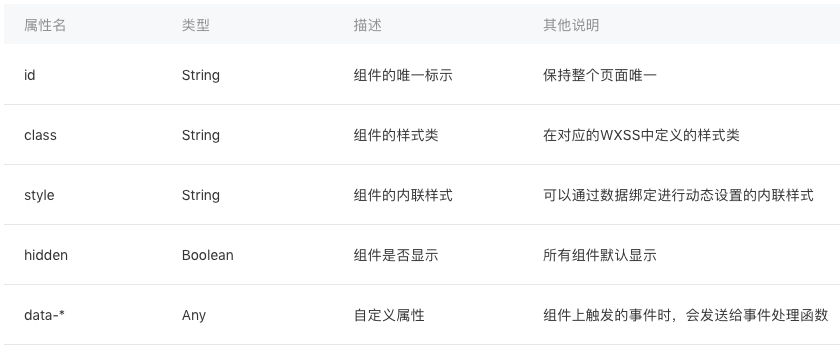

事件绑定(`bind/catch`)详情，见下文**事件**。

各组件详细属性[见文档](https://developers.weixin.qq.com/miniprogram/dev/component/)

##### API

宿主环境提供了丰富的`API`，可以很方便调起微信提供的能力。调用宿主环境`API`的`wx`对象是小程序的宿主环境所提供的全局对象。几乎所有小程序的`API`都挂载在`wx`对象底下。

* `API`调用的一般约定
  1. `wx.on*`开头的`API`是监听某个事件发生的`API`接口，接受一个`Callback`函数作为参数。当该事件触发时，会调用`Callback`函数
  2. 如未特殊约定，多数`API`接口为异步接口，都接受一个`Object`(通常是`{}`)作为参数
  3. `API`的`Object`参数一般由`success`、`fail`、`complete`三个回调来接收接口调用结果
  4. `wx.get*`开头的`API`是获取宿主环境数据的接口
  5. `wx.set*`开头的`API`是写入数据到宿主环境的接口

各`API`详情[见文档](https://developers.weixin.qq.com/miniprogram/dev/api/)

##### 事件

事件的定义：在小程序里，把“用户在渲染层(`UI`界面)的行为反馈”以及“组件的部分状态反馈”抽象为渲染层传递给逻辑层的“事件”。

* 事件绑定及对应处理函数的调用流程
  * 事件一般是通过`bindtap`这个属性绑定在组件上的，同时在当前页面的`Page`构造器中定义对应的事件处理函数`tapHandleFunction`，当用户点击已绑定事件处理的区域时，达到触发条件生成事件`tap`，该事件处理函数`tapHandleFunction`会被执行，同时还会收到一个事件对象`event`

* 事件类型和事件对象

当事件回调触发的时候，会收到一个事件对象。

常见事件类型和事件对象[见文档](https://developers.weixin.qq.com/ebook?action=get_post_info&docid=000846df9a03909b0086a50025180a)

* 事件绑定与冒泡捕获

事件绑定的写法和组件属性一致，以`key="value"`的形式，其中：

1. `key`以`bind`或者`catch`开头，然后跟上事件的类型，如`bindtap`、`catchtouchstart`。`bind`和`catch`后可以紧跟一个冒号，其含义不变，如`bind:tap`、`catch:touchstart`。同时`bind`和`catch`前还可以加上`capture-`来表示捕获阶段
2. `value`是一个字符串，需要在对应的页面`Page`构造器中定义同名的函数，否则触发事件时在控制台会有报错信息

`bind`和`capture-bind`的含义分别代表事件的**冒泡阶段**和**捕获阶段**。先是事件捕获，再是事件冒泡阶段。

`bind`事件绑定不会阻止冒泡事件向上冒泡，`catch`事件绑定可以阻止冒泡事件向上冒泡。`capture-catch`将中断捕获阶段和取消冒泡阶段。可以使用`catch`阻止事件的传递。

* 兼容

可以使用`wx.getSystemInfo`或者`wx.getSystemInfoSync`来获取手机品牌、操作系统版本号、微信版本号以及小程序基础库版本号等，通过这些信息，可以针对不同平台做差异化的服务，进而实现兼容。

随着宿主环境的更新，新版本的宿主环境会提供一些新的`API`，你可以通过判断此`API`是否存在来做程序上的兼容。

小程序还提供了`wx.canIUse`这个`API`，用于判断接口或者组件在当前宿主环境是否可用，其参数格式为: `${API}.${method}.${param}.${options}`或者`${component}.${attribute}.${option}`。

### 场景应用

##### 基本的布局方法 -- `Flex`布局

`Flex`布局中约定的术语：采用`flex`布局的元素，简称为“容器”，以`container`表示容器的类名。容器内的元素简称为“项目”，以`item`表示项目的类名。

`Flex`，目的是提供一种更加灵活的布局模型，使容器能通过改变里面项目的高宽、顺序，来对可用空间实现最佳的填充，方便适配不同大小的内容区域。

`Flex`不单是一个属性，它包含了一套新的属性集。属性集包括用于设置容器，和用于设置项目两部分。

属性集中设置容器的属性：

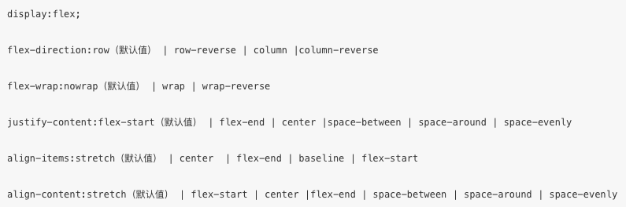

属性集中设置项目的属性：

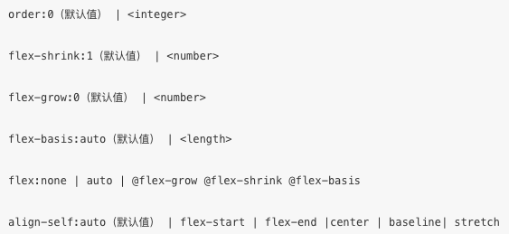

坐标轴：默认的情况下，水平方向的是**主轴(`main axis`)**，垂直方向的是**交叉轴(`cross axis`)**。项目是在主轴上排列，排满后在交叉轴方向换行。需要注意的是，交叉轴垂直于主轴，它的方向取决于主轴方向。

##### 常见的交互反馈

`Toast`提示默认`1.5`秒后自动消失。

需注意，不应该把`Toast`用于错误提示，因为错误提示需要明确告知用户具体原因，因此不适合用这种一闪而过的`Toast`弹出式提示。一般需要用户明确知晓操作结果状态的话，会使用模态对话框来提示，同时附带下一步操作的指引。

##### 发起HTTPS网络通信

小程序宿主环境要求`request`发起的网络请求必须是`https`协议请求，因此开发者服务器必须提供`HTTPS`服务的接口，同时为了保证小程序不乱用任意域名的服务，`wx.request`请求的域名需要在小程序管理平台进行配置，如果小程序正式版使用`wx.request`请求未配置的域名，在控制台会有相应的报错。

`wx.request`的`method`参数需大写，有效值有：`OPTIONS`,`GET`,`HEAD`,`POST`,`PUT`,`DELETE`,`TRACE`,`CONNECT`

接口的兼容：要兼容旧版本接口的数据格式，对于新版本的接口所提供的新特性，是在旧版本接口的基础上进行新特性字段的添加。

通过`wx.request`这个`API`，有两种方法把数据传递到服务器：通过`url`上的参数以及通过`data`参数。注，`url`是有长度限制的，其最大长度是`1024`字节，同时`url`上的参数需要拼接到字符串里，参数的值还需要做一次`urlEncode`。向服务端发送的数据超过`1024`字节时，就要采用`HTTP POST`的形式，此时传递的数据就必须要使用`data`参数。因此，需要传递数据时，使用`data`参数来传递。

`success`回调的参数`data`字段类型是根据`header['content-type']`决定的，默认`header['content-type']`是`application/json`，在触发`success`回调前，小程序宿主环境会对`data`字段的值做`JSON`解析，如果解析成功，那么`data`字段的值会被设置成解析后的`Object`对象，其他情况`data`字段都是`String`类型，其值为`HTTP`回包包体。

小程序`request`默认的请求超时时间是`60`秒。通常的交互体验下，请求等待超过`3`秒，就需要给用户明确的服务不可用提示。小程序中的时间单位是毫秒。

##### 本地数据缓存

* 缓存限制和隔离

小程序宿主环境会管理不同小程序的数据缓存，不同小程序的本地缓存空间是分开的，每个小程序的缓存空间上限为`10MB`，如果当前缓存已经达到`10MB`，再通过`wx.setStorage`写入缓存会触发`fail`回调。

由于本地缓存是存放在当前设备，用户换设备之后无法从另一个设备读取到当前设备数据，因此用户的关键信息不建议只存在本地缓存，应该把数据放到服务器端进行持久化存储。

### 小程序的发布

对用户体验进行评估，可依据以下`9`点基础设计原则进行参考：

1. 导航清晰
   * 导航是确保用户在网页中浏览跳转时不迷路的最关键因素
   * 导航需要告诉用户，当前在哪，可以去哪，如何回去等问题
2. 流程明确
   * 当前页面只设置了单一任务，且不出现目标流程之外的内容
   * 完成任务的操作简单
3. 重点突出
   * 页面有明确的重点，便于用户进入页面时能快速理解页面的内容
4. 符合预期
   * 在产品设计阶段便将自身信息架构和模型与用户的心理模型匹配
   * 便于用户能够依据以往的使用经验或其他生活经验，降低使用的理解和学习成本
5. 等待与反馈
   * 因页面过长时间的等待会引起不良情绪，在需要加载等待时，需要用明确的等待状态告知用户，以舒缓用户在等待时期的不良情绪
6. 异常处理
   * 在出现异常的时候需要给予用户清晰的状态提示，并告知解决方案，使其有路可退
7. 内容和文案准确友好
   * 使用的语言应当简洁，礼貌并容易被用户理解
8. 和谐统一
   * 设计风格应该是统一、和谐且具有延续性的
9. 平台适配

* 发布

发布有两种模式：全量发布和分阶段发布。全量发布是指当点击发布之后，所有用户访问小程序时都会使用当前最新的发布版本。分阶段发布是指分不同时间段来控制部分用户使用最新的发布版本，分阶段发布我们也称为灰度发布。由于微信客户端存有旧版本小程序包缓存，微信客户端会在某些特定的时机异步去更新最新的小程序包，所以一般是全量发布的`24`小时后，所有用户才会真正使用到最新版的小程序。

### 底层框架

小程序界面主要由成熟的`Web`技术渲染，辅之以大量的接口提供丰富的客户端原生能力。每个小程序页面都是用不同的`WebView`去渲染，这样可以提供更好的交互体验，更贴近原生体验，也避免了单个`WebView`的任务过于繁重。

* 管控与安全

基于`Web`技术来渲染小程序是存在一些不可控因素和安全风险的。这是因为`Web`技术是非常开放灵活的，可以利用`JavaScript`脚本随意地跳转网页或者改变界面上的任意内容。

```
小程序是一个多WebView的架构，每一个小程序页面都是不同的WebView渲染后显示的。
```

* 天生的延时

由于小程序是基于双线程模型的，意味着任何数据传递都是线程间的通信，因此会有一定的延时。在小程序架构里，逻辑层和渲染层间数据传递的通信是异步的。异步会使得各部分的运行时序变得复杂一些，小程序框架中已处理好，开发者只需要理解生命周期，以及控制合适的时机更新`UI`即可。

除了逻辑层与渲染层之间的通信有延时，各层(逻辑层、渲染层)与客户端原生交互同样是有延时的。以逻辑层为例，开发者的代码是跑在逻辑层这个线程之上，而客户端原生是跑在微信主线程之上，所以注册给逻辑层有关客户端能力的接口，实际上也是跟微信主线程之间的通信，同样意味着有延时。这也是大部分提供的接口都是异步的原因。

##### 组件系统

* `Exparser`框架
  * `Exparser`是微信小程序的组件组织框架，内置在小程序基础库中，为小程序的各种组件提供基础的支持。小程序内的所有组件，包括内置组件和自定义组件，都由`Exparser`组织管理
  * `Exparser`会维护整个页面的**节点树**相关信息，包括节点的属性、事件绑定等
  * 小程序中，所有节点树相关的操作都依赖于`Exparser`，包括`WXML`到页面最终节点树的构建、`createSelectorQuery`调用和自定义组件特性等

各个组件也将具有各自独立的逻辑空间。每个组件都分别拥有自己的独立的数据、`setData`调用，`createSelectorQuery`也将运行在`ShadowTree`(组件节点树)的层面上。

小程序中组件的使用，需要经过注册和实例化。

* 组件间通信

不同组件实例间的通信有`WXML`属性值传递、事件系统、`selectComponent`和`relations`等方式。其中，**`WXML`属性值传递**是从**父组件向子组件**的基本通信方式，而**事件系统**是从**子组件向父组件**的基本通信方式。(`WXML`属性值传递是父到子；事件系统是子到父)。事件可以分为冒泡事件和非冒泡事件。冒泡事件还可以划分为在`ShadowTree`(组件节点树)上冒泡的事件和在`ComposedTree`(页面节点数)上冒泡的事件。如果在`ShadowTree`上冒泡，则冒泡只会经过这个组件`ShadowTree`上的节点，这样可以有效控制事件冒泡经过的范围。

在自定义组件中使用`triggerEvent`触发事件时，可以指定事件的`bubbles`、`composed`和`capturePhase`属性，用于标注事件的冒泡性质。

* 原生组件

在内置组件中，有一些组件较为特殊，它们并不完全在`Exparser`的渲染体系下，而是由客户端原生参与组件的渲染，这类组件我们称为“原生组件”,这也是小程序`Hybrid`技术的一个应用。

原生组件的层级会比所有在`WebView`层渲染的普通组件要高，原生组件之间的层级就可以按照一定的规则控制。

原生组件渲染限制：原生组件脱离在`WebView`渲染流程外，这带来了一些限制。最主要的限制是一些`CSS`样式无法应用于原生组件，例如，不能在父级节点使用`overflow:hidden`来裁剪原生组件的显示区域；不能使用`transformrotate`让原生组件产生旋转等。

### 性能优化

小程序的启动流程如下

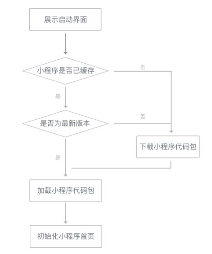

在小程序启动时，微信会为小程序展示一个固定的启动界面，界面内包含小程序的图标、名称和加载提示图标。此时，微信会在背后完成几项工作：下载小程序代码包、加载小程序代码包、初始化小程序首页。

* 下载到的小程序代码包不是小程序的源代码，而是编译、压缩、打包之后的代码包
  * 从开发者的角度看，控制代码包大小有助于减少小程序的启动时间
  * 常规控制代码包大小的方法有以下几种
     * 精简代码，去掉不必要的`WXML`结构和未使用的`WXSS`定义
     * 减少在代码包中直接嵌入的资源文件
     * 压缩图片，使用适当的图片格式
     * 如果小程序比较复杂，优化后的代码总量可能仍然比较大，此时可以采用**分包加载**的方式进行优化

* 页面层级准备

在视图层内，小程序的每一个页面都独立运行在一个页面层级上。小程序启动时仅有一个页面层级，每次调用`wx.navigateTo`都会创建一个新的页面层级；相对地，`wx.navigateBack`会销毁一个页面层级。对于`wx.redirectTo`，这个调用不会打开一个新的页面层级，而是将当前页面层级重新初始化：重新传入页面的初始数据、路径等，视图层清空当前页面层级的渲染结果然后重新渲染页面。

页面层级的准备工作分为三个阶段：第一阶段是启动一个`WebView`，在`iOS`和`Android`系统上，操作系统启动`WebView`都需要一小段时间；第二阶段是在`WebView`中初始化基础库，此时还会进行一些基础库内部优化，以提升页面渲染性能；第三阶段是注入小程序`WXML`结构和`WXSS`样式，使小程序能在接收到页面初始数据之后马上开始渲染页面(这一阶段无法在小程序启动前执行)。

页面层级准备过程如下图：

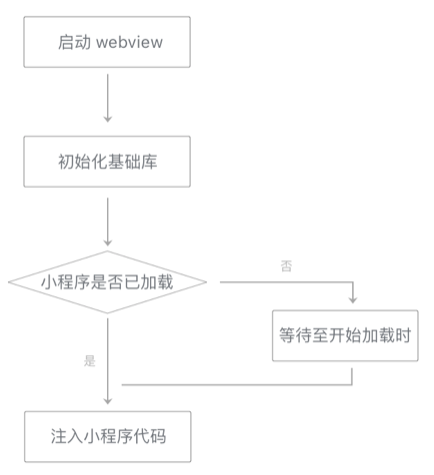

* 数据通信

小程序中，页面的数据通信，体现在逻辑层向视图层发送页面数据(`data`和`setData`的内容)，视图层向逻辑层反馈用户事件。

页面初始数据通信时序图：

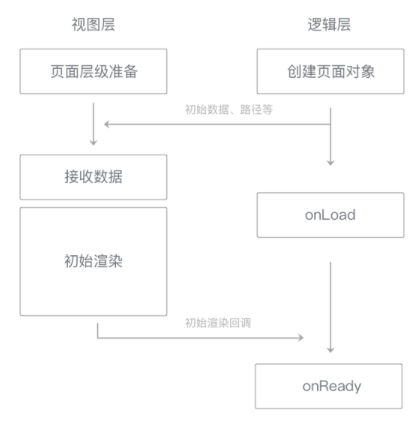

页面初始化的时间大致由**页面初始数据通信时间**和**初始渲染时间**两部分构成。传输时间与数据量大体上呈现正相关关系，传输过大的数据将使这一时间显著增加。因而减少传输数据量是降低数据传输时间的有效方式。

为了提升数据更新的性能，开发者在执行`setData`调用时，最好遵循以下原则：

1. 不要过于频繁调用`setData`，应考虑将多次`setData`合并成一次`setData`调用
2. 数据通信的性能与数据量正相关，因而如果有一些数据字段不在界面中展示且数据结构比较复杂或包含长字符串，则不应使用`setData`来设置这些数据
3. 与界面渲染无关的数据最好不要设置在`data`中，可以考虑设置在`page`对象的其他字段下

事件通信有延迟，降低延迟时间的方法主要有以下两个：

1. 去掉不必要的事件绑定(`WXML`中的`bind`和`catch`)，从而减少通信的数据量和次数
2. 事件绑定时需要传输`target`和`currentTarget`的`dataset`，因而不要在节点的`data`前缀属性中放置过大的数据

* 视图层渲染

视图层在接收到初始数据(`data`)和更新数据(`setData`数据)时，需要进行视图层渲染。在一个页面的生命周期中，视图层会收到一份初始数据和多份更新数据。收到初始数据时需要执行初始渲染，每次收到更新数据时需要执行重渲染。

渲染流程中，时间开销大体上与节点树中节点的总量成正比例关系。因而减少`WXML`中节点的数量可以有效降低初始渲染和重渲染的时间开销，提升渲染性能。

重渲染的机制：初始渲染中得到的`data`和当前节点树会保留下来用于重渲染。每次重渲染时，将`data`和`setData`数据套用在`WXML`片段上，得到一个新节点树。然后将新节点树与当前节点树进行比较，这样可以得到哪些节点的哪些属性需要更新、哪些节点需要添加或移除。最后，将`setData`数据合并到`data`中，并用新节点树替换旧节点树，用于下一次重渲染。

重渲染流程图如下：

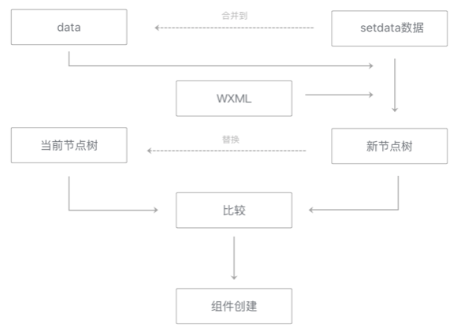

小程序优化策略可分为以下三点：

1. 精简代码，降低`WXML`结构和`JS`代码的复杂性
2. 合理使用`setData`调用，减少`setData`次数和数据量
3. 必要时使用分包优化

### 小程序基础库

由于小程序的渲染层和逻辑层是两个线程管理，渲染层`WebView`层注入的称为`WebView`基础库，逻辑层注入的称为`AppService`基础库。

小程序基础库分为：`WebView`基础库、`AppService`基础库

小程序的基础库，会被提前内置在微信客户端。这样做有以下两点好处：

1. 降低业务小程序的代码包大小
2. 可以单独修复基础库中的`Bug`，无需修改到业务小程序的代码包

* 异常

小程序基础库在`WebView`侧使用`window.onerror`方案进行捕捉异常，在逻辑层`AppService`侧通过把`App`实例和`Page`实例的各个生命周期等方法包裹在`try-catch`里进行捕捉异常。同时在`App`构造器里提供了`onError`的回调，当业务代码运行产生异常时，这个回调被触发，同时能够拿到异常的具体信息，开发者自己根据业务情况处理对应的容错逻辑。

### 微信开发者工具

微信开发者工具和微信客户端都无法直接运行小程序的源码，因此我们需要对小程序的源码进行编译。**代码编译过程包括本地预处理、本地编译和服务器编译。**为了快速预览，微信开发者工具模拟器运行的代码只经过本地预处理、本地编译，没有服务器编译过程，而微信客户端运行的代码是额外经过服务器编译的。

* 编译`WXML`

小程序的渲染层的运行环境是一个`WebView`，而`WebView`无法直接理解`WXML`标签，所以需要经过编译。微信开发者工具内置了一个二进制的`WXML`编译器，这个编译器接受**`WXML`代码文件列表**，处理完成之后输出`JavaScript`代码，这段代码是各个页面的结构生成函数。

### 拾遗

* `wxs`
  * `wxs`是对`JavaScript`做了一些封装和限制
  * `wxs`修饰的变量对外是不可见的，可以通过`exports`对外暴露对应的变量
  * `wxs`的注释
     * 单行注释 - `//`
     * 多行注释 - `/**/`
     * 结尾注释 - `/*`

* 小程序的开发框架，称为`MINA`框架
  * 有三层：`View`(视图层)、`App Service`(逻辑层)、`Native`(系统层)

* 小程序的启动
  * 冷启动
     * 小程序首次被打开
     * 打开后长期置于后台状态(该时间一般维持`5`分钟)被系统给销毁后再次被打开
     * 短时间内连续收到系统的两次告警(这个时间间隔是`5`秒)微信就会主动销毁小程序
  * 热启动，小程序已经被打开过，从后台状态切换到前台状态的启动

* 小程序的加载
  * `CDN`
     * 内容分发网络
     * 作用：把请求的内容，分发到距离用户最近的网路节点服务器，提高用户访问的响应速度以及成功率，解决带宽及服务器带来的一些延迟问题