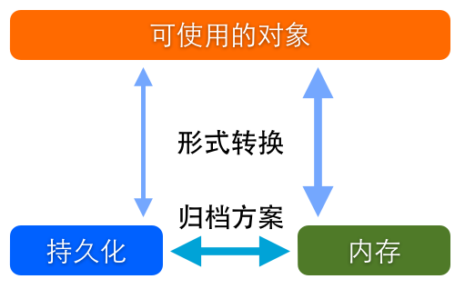
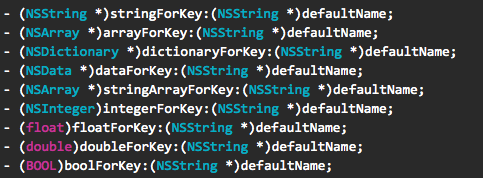
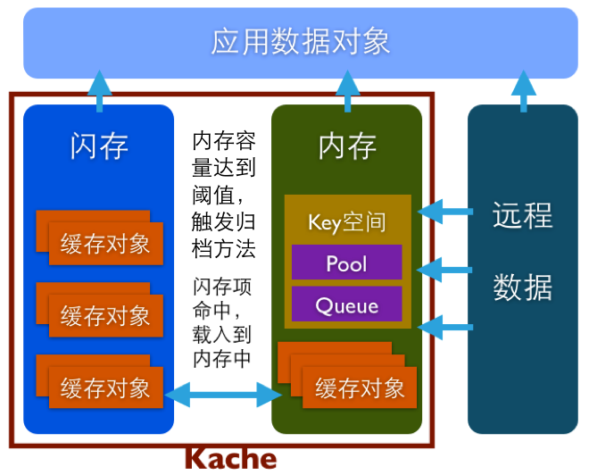

### 概念

谈到数据存储，首先要明确区分两个概念，**数据结构**和**存储方式**。

   * 数据结构，就是数据存在的形式。除了基本的`NSDictionary`、`NSArray`和`NSSet`这些对象，还有更复杂的如：关系模型、对象图和属性列表多种结构。

   * 存储方式，则简单的分为两种：内存与闪存。内存存储是临时的，运行时有效的，但效率高，而闪存则是一种持久化存储，但产生`I/O`消耗，效率相对低。把内存数据转移到闪存中进行持久化的操作称为归档。

数据结构和存储方式，二者结合起来才是完整的数据存储方案。如常说的`SQLite`、`CoreData`、`NSUserDefaults`等都是数据存储方案。这些存储方案侧重不同，支持的形式和方式也各不相同，在不同的使用场景下表现也是各有优劣。

Tips:

```
缓存按照保存位置可以分为两类：内存缓存、硬盘缓存
硬盘缓存，即常说的把数据保存在本地，如：FMDB、CoreData、归档、NSUserDefaults、NSFileManager
```

### 本质

万变不离其宗，无论什么数据存储方案都可以用下图来解释



### 常用数据存储方案的介绍

#### `NSUserDefaults`

* `NSUserDefaults`是一个单例，在整个程序中只有一个实例对象，可用于数据的永久保存，这是它可以让数据自由传递的一个前提。因此常用它保存简单数据。
* `NSUserDefaults`支持的数据类型有：`NSNumber`（`NSInteger、float、double`），`NSString`，`NSDate`，`NSData`，`NSArray`，`NSDictionary`，`BOOL`
* 使用`NSUserDefaults`进行数据存储操作时，对相同的`Key`赋值约等于一次覆盖，所以要保证每一个`Key`的唯一性
* `NSUserDefaults`存储的对象全是不可变的，取出的对象也是不可变的
* 使用`NSUserDefaults`存储自定义对象
   * 将自定义类型转换为`NSData`类型
       * `NSUserDefaults`本身不支持自定义对象的存储，不过它支持`NSData`的类型
       * 场景：当数据重复且多的时候，不想使用`SQLite`，不想使用`NSFileManage`的时候，可以通过将数据转换为`NSData`类型，使用`NSUserDefaults`存储
       * 但大量重复数据的操作，最好还是使用`SQLite`存储
       * `NSFileManage`的使用是，先使用归档，再将文件写入本地
       * 将自定义类型对象转换为`NSData`类型时，自定义类型需要遵循并实现`NSCoding`协议中的`encodeWithCoder`和`initWithCoder`方法，通过这种方式就可以将自定义类型转换为`NSData`类型了。将自定义类型的对象转换为`NSData`类型时，会用到`NSKeyedArchiver`类进行操作；将`NSData`转换为自定义类型的对象时，会用到`NSKeyedUnarchiver`类进行操作。
* `NSUserDefaults`，用于存储配置信息
   * `NSUserDefaults`被设计用来存储设备和应用的配置信息
   * 它通过一个工厂方法返回默认的、也是最常用到的实例对象
   * 这个对象中储存了系统中用户的配置信息
   * 开发者可以通过这个实例对象对这些已有的信息进行修改，也可以按照自己的需求创建新的配置项
   * `NSUserDefaults`数据组织形式
      * `NSUserDefaults`把配置信息以字典的形式组织起来
      * 支持字典的项包括：字符串或者是数组，除此之外还支持数字等基本格式
      * `NSUserDefaults`是基础类型的小数据的字典
      * 可以通过指定返回类型的方法获取到指定类型的返回值。如下图

      
      
   * `NSUserDefaults`的所有数据都放在内存里，因此操作速度很快
   * `NSUserDefaults`提供了一个归档方法：`+ (void)synchronize`。开发者自定义的配置项，会以`plist`格式的文件归档在相应应用目录`/Library/Preferences/[App_Bundle_Identifier].plist`的下面。

#### `SQLite`

* `SQLite`，用于存储查询需求较多的数据
   * `iOS`的`SDK`里预置了`SQLite`的库，开发者可以自建`SQLite`数据库
   * `SQLite`每次写入数据都会产生`IO`消耗，把数据归档到相应的文件
   * 一般来说应用中格式化的文本类数据可以存放在数据库中，尤其是类似聊天记录、`Timeline`等这些具有条件查询和排序需求的数据
   * 每一个数据库的句柄都会在内存中被分配一段缓存，用于提高查询效率
   * 由于查询缓存，当产生大量句柄或数据量较大时，会出现缓存过大，造成内存浪费
   * 对复杂的`SQLite`操作进行封装，可参考[SQLight](https://github.com/gaosboy/SQLight)

#### `CoreData`

* `CoreData`，用于规划应用中的对象
   * 官方给出的定义是，一个支持持久化的，对象图和生命周期的自动化管理方案
   * 严格意义上说`CoreData`是一个管理方案，它的持久化可以通过`SQLite`、`XML`或二进制文件储存
   * 如官方定义所说，`CoreData`的作用远远不止储存数据这么简单，它可以把整个应用中的对象建模并进行自动化的管理
   * 从归档文件还原模型时`CoreData`并不是一次性把整个模型中的所有数据都载入内存，而是根据运行时状态，把被调用到的对象实例载入内存。框架会自动控制这个过程，从而达到控制内存消耗，避免浪费
   * `CoreData`的使用场景在于：整个应用使用`CoreData`规划，把应用内的数据通过`CoreData`建模，完全基于`CoreData`架构应用

#### 定制化方案

* 使用基本对象类型定制的个性化缓存方案
   * 案例分析 - `Kache`
   * 这个定制方案适用于互联网应用中对远程数据的缓存，几个限制条件缺一不可
   * 从需求出发分析缓存数据有以下要求：按`Key`查找，快速读取，写入不影响正常操作，不浪费内存，支持归档。这些都是基本需求，那么再进一步或许还需要固定缓存项数量，支持队列缓存，缓存过期等
   * `Kache`架构分析
       * `Kache`扮演的是一个典型缓存角色。应用加载远程数据生成应用数据对象的同时，通过`Kache`把数据缓存起来，再次请求则直接通过`Kache`获取数据
       * 缓存对象可以是`NSDictionary`、`NSArray`、`NSSet`或`NSData`这些可直接归档的类型，每个缓存对象对应一个`Key`。缓存对象包括数据和过期时间，内存中存放在一个单例字典中，闪存中每个对象存为一个文件。`Key`空间按照各种顺序存放缓存对象的`Key`集合，`Pool`为固定大小的数组，当数量达到上限，最早过期的一个`Key`将被删除，对应的缓存对象也被清除。`Queue`也是固定大小的数组，以先进先出的规则管理`Key`的增删。每一次有新的缓存对象存入，自动检测`Key`空间中过期的集合并清除
       * 框架提供`save`和`load`方法支持持久化和重新载入
       * 框架由于使用了过期和归档相结合的逻辑，可以保证大部分命中的缓存对象都在内存中，从而获取了较高的效率
       * [Kache框架源码](https://github.com/gaosboy/kache)
       * `Kache`结构图

       
     
### 知识点补充

##### 值类型和引用类型的区别

* 给一个变量赋值后在内存里的表示
  * 如果是**值类型**则直接在`stack`(堆栈)中分配一块空间。`stack`的内存区域是由操作系统去管理的
  * 如果是**引用类型**的话会保存成两部分，在`heap`(**托管堆**)分配一块内存保存**变量的实际值**，再在`stack`中分配一块内存保存`heap`中分配的那块内存的地址
  * 基于上述区别，引用类型赋值为`null`，表示还没在`heap`中分配内存，只是在`stack`中分配一块内存，但里面的内容为空，没有保存哪块`heap`的地址。基于此引用类型可以给赋值为`null`，而值类型不能赋值为`null`
* `stack`中的内存块有多大
  * 所有引用类型在`stack`中内存块的大小都一样。具体大小要看操作系统，`32`位的系统是`4`个字节，`64`位系统是`8`个字节
