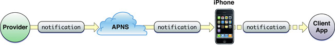
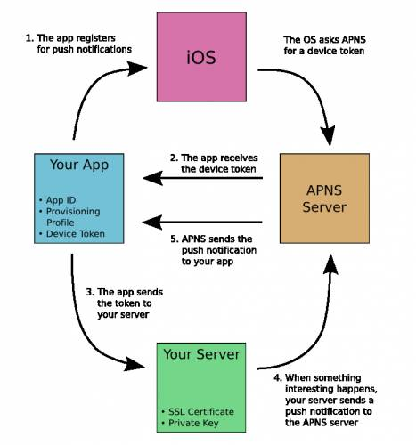
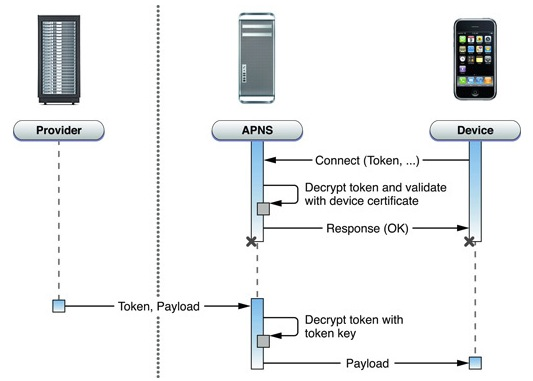
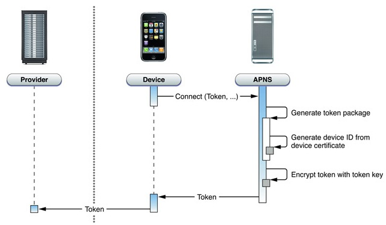
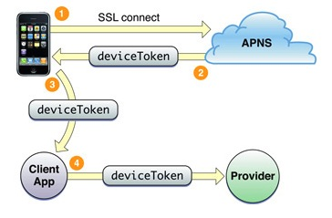
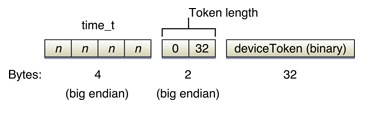
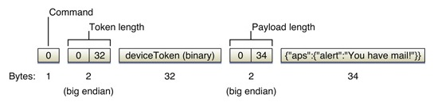

`Notification`是移动端应用编程中非常常用的一种传递信息的机制，而且可以非常好的节省资源，不用消耗资源来不停地检查信息状态(`Poolin`g)，在`iOS`下应用分为两种不同的`Notification`种类，本地和远程。

### 本地消息推送

本地通知(`LocalNotification`)，实际上是由`iOS`系统管理的一个功能

应用程序的本地通知是由用户的`iOS`设备生成并发布的，无论这个应用程序是否运行在前台。就像一个日历应用，或者是一个`to-do list`应用，可以发出一条本地通知提醒用户计划的日常事务要开始了。

对本地通知的数量限制，`iOS`最多允许最近本地通知数量是`64`个，超过限制的本地通知将被`iOS`忽略。

想让我们的`APP`实现本地通知功能，必须得到用户的授权。

* 本地的`Notification`由`iOS`下`NotificationManager`统一管理，只需要将封装好的本地`Notification`对象加入到系统`Notification`管理机制队列中，系统会在指定的时间激发本地`Notification`，应用程序中只需设计好处理`Notification`的方法就完成了整个`Notification`的流程了。

* 本地`Notification`所使用的对象是`UILocalNotification`。`UILocalNotification`的属性涵盖了所有处理`Notification`需要的内容

* `UILocalNotification`的属性有`fireDate`、`timeZone`、`repeatInterval`、`repeatCalendar`、`alertBody`、 `alertAction`、`hasAction`、`alertLaunchImage`、`applicationIconBadgeNumber`、`soundName和userInfo`
  * 其中`fireDate`、`timeZone`、`repeatInterval`和`repeatCalendar`是用于`UILocalNotification`的调度
     * `fireDate`是`UILocalNotification`激发的确切时间
     * `timeZone`是`UILocalNotification`激发时间是否根据时区改变而改变，如果设置为`nil`的话，那么`UILocalNotification`将在一段时间后被激发，而不是某一个确切时间被激发。
     * `repeatInterval`是`UILocalNotification`被重复激发之间的时间差，不过时间差是完全根据日历单位(`NSCalendarUnit`)的，例如每周激发的单位`NSWeekCalendarUnit`，如果不设置的话，将不会重复激发
     * `repeatCalendar`是`UILocalNotification`重复激发所使用的日历单位需要参考的日历，如果不设置的话，系统默认的日历将被作为参考日历
  * `UILocalNotification`的提醒内容
     * `alertBody`、`alertAction`、`hasAction`和`alertLaunchImage`是当应用不在运行时，系统处理

* 如果已经注册了本地通知，当客户端响应通知时：
  * `APP`在前台或者后台收到通知进入前台时会调用`didReceiveLocalNotification`方法。应用程序正在运行中，设备不会收到提醒
  * 如`APP`在关闭状态，本地通知会给设备送达一个和远程通知一样的提醒。只能从函数`didFinishLaunchingWithOptions`的`launchOptions`中取到我们想要的参数

**'UILocalNotification' is deprecated: first deprecated in iOS 10.0 - Use UserNotifications Framework's UNNotificationRequest**

### 远程消息推送 - `APNs`

`Apple Push Notification service(APNs)`，即苹果推送通知服务，是苹果为`APP`开发商提供「间接的」推送通知到指定设备的一种服务。官方介绍可见[APNs Overview](https://developer.apple.com/library/archive/documentation/NetworkingInternet/Conceptual/RemoteNotificationsPG/APNSOverview.html)

##### 原理流程

通过`APNs`实现消息推送的过程如下图：



上图可以分为三个阶段：

* 第一阶段：`Push`服务器应用程序把要发送的消息、目的`iPhone`的标识打包，发给`APNs`
* 第二阶段：`APNs`在自身的已注册`Push`服务的`iPhone`列表中，查找有相应标识的`iPhone`，并把消息发到`iPhone`
* 第三阶段：`iPhone`把发来的消息传递给相应的应用程序， 并且按照设定弹出`Push`通知
* `Provider`是指某个`iPhone`软件的`Push`服务器

`APNs`实现流程如下图：



1. 首先是应用程序注册消息推送
2. `iOS`跟`APNs Server`要`deviceToken`，应用程序接受`deviceToken`
3. 应用程序将`deviceToken`发送给`PUSH`服务端程序
4. 服务端程序向`APNs`服务发送消息
5. `APNs`服务将消息发送给`iPhone`应用程序

上述流程如下图形象所示：



1. 首先，安装了具有推送功能的应用，我们的设备在有网络的情况下会连接苹果推送服务器，连接过程中，`APNs`会验证`device_token`，连接成功后维持一个长连接
2. `Provider`(我们自己的服务器)收到需要被推送的消息并结合被推送设备的`device_token`一起打包发送给`APNs`服务器
3. `APNs`服务器将推送信息推送给指定`device_token`的设备
4. 设备收到推送消息后通知我们的应用程序并显示和提示用户(声音、弹出框)

推送的前提是装有我们应用的设备需要向`APNs`服务器注册，注册成功后`APNs`服务器会返给我们一个`device_token`，拿到这个`token`后我们将这个`token`发给我们自己的应用服务器，当有需要被推送的消息时，我们的应用服务器会将消息按指定的格式打包，然后结合设备的`device_token`一并发给`APNs`服务器，由于我们的应用和`APNs`维持一个基于`TCP`的长连接，`APNs`将新消息推送到我们设备上，然后在屏幕上显示出新消息来。

* 设备注册`APNs`的流程如下图



* 注册`APNs`的执行顺序如下图



1. `Device`连接`APNs`服务器并携带设备序列号
2. 连接成功，`APNs`经过打包和处理产生`device_token`并返回给注册的`Device`
3. `Device`携带获取的`device_token`向我们自己的应用服务器注册

经过上述流程，完成需要被推送的`Device`在`APNs`服务器和我们自己的应用服务器注册。

我们的设备和`APNs`服务器之间的通讯是基于`SSL`协议的`TCP`流通讯，二者之间维持一个长连接，当从`APNs`服务器注册成功后，一定要将`device_token`发送给我们的应用服务器。

Tips:

```
使deviceToken值不一样的情况：重装iOS或更换设备

无论是iPhone客户端跟APNs，还是Provider和APNs都需要通过证书进行连接

如何维护消息队列和如何保证消息能被推送到指定的设备上，这些都由苹果APNs给我们做完了

与用户的交互是弹框提示是否允许推送通知，用户点击“好”iOS操作系统会继续往下走与APNs服务的流程，用户点击“不允许”iOS操作系统不会走与APNs交流的流程
```

##### 准备工作

###### 证书

实现`APNs`过程中，所需的证书有4个：

1. `.certSigningRequest`(`CSR`文件)
2. `.cer`(`SSL certificate`文件)
3. `.mobileprovision`(`profile`证书)(因为推送消息只能在真机上测试)
4. `.p12`(`p12`证书)(`Provider`(`JAVA`)后台用于连接`APNs`的证书)

上述证书的制作过程如下：

* `CSR`文件(`Certificate Signing Request`)
  * 通过**钥匙串**在本地制作
     * 钥匙串访问 - 证书助理 - 从证书颁发机构请求证书
     * 邮箱&常用名称 - 存储到磁盘 - 存储到桌面
     * 执行完上述操作后，本地桌面上就生成了一个`xxx.certSigningRequest`文件

* `SSL Certificate`文件
  * 通过付费账号登录[苹果开发者平台](https://developer.apple.com)
     * 创建`Certificate`，会需要前面生成的`CSR`文件，`Submit`后，创建`Certificate`完成
     * 新建一个`App ID`，输入`Description`、`Bundle Identifier`，`Submit`后，新建`App ID`完成
         * 新建`App ID`完成后，对应的`App ID`下会有相应的`SSL Certificate`文件，对`SSL Certificate`进行`Configure`
         * 进行`Configure`时，需要用到前面生成的`CSR`文件
         * `Configure`完成后，`SSL Certificate`文件就能`Download`了
         * `Download``SSL`证书，命名为`xxx.cer`(双击`.cer`文件将其安装到钥匙串中)
         * 执行完上述操作后，`App ID`下对应的`SSL`证书状态会变成`Enabled`

* 准备`profile`证书，因为推送消息只能在真机上测试，所以要建一个`profile`证书
  * 在之前创建`SSL`证书的账号下，创建`Provisioning Profile`证书
  * 选择之前的`App ID`，并添加测试设备的`ID`
  * `Submit`后，创建`xxx.mobileprovision`完成
  * `Download``.mobileprovision`证书，双击将其加入到`Xcode`的`Provisioning Profiles`中

* 生成后台用于连接`APNs`的证书
  * 打开钥匙串，找到之前安装的`.cer`证书文件，右键将其导出
  * 导出存储为用于`JAVA`后台连接`APNs`的`.p12`证书。导出存储时输入`.p12`证书的密码，这个密码`JAVA`后台使用`.p12`证书的时候要用到
  * 进行上述操作后，导出`xxx.p12`证书完成

Tips：

```
App ID下不同SSL证书的区别：
Development Push SSL Certificate ，与Production Push SSL Certificate
区别在于一个是用于开发的推送证书，一个是用于发布产品的推送证书。
两个证书获取到的终端deviceToken是不一样的。因Development是develop的mobileprovision下获取的；Production是production的mobileprovision获取的。

Development Push SSL Certificate和Production Push SSL Certificate是有有效时间的：
Development Push SSL Certificate有效期是四个月
Production Push SSL Certificate有效期是一年

用两个证书生成的P12证书用于JAVA后台连接APNS的服务器地址也是不同的，
Development Push SSL Certificate 对应连接的服务器地址是：gateway.sandbox.push.apple.com。
Production Push SSL Certificate  对应连接的服务器地址是：gateway.push.apple.com。
```

##### 客户端操作

* 涉及的操作方法

```
//注册远程通知，在didFinishLaunchingWithOptions中添加下面代码
//通过registerForRemoteNotifications方法，告诉APNs，应用程序能接受push来的通知
[[UIApplication sharedApplication] registerForRemoteNotifications];

/**
当客户端注册远程通知时，会回调下面两个方法：
如果成功，则回调第一个，客户端把deviceToken取出来发给服务端，push消息的时候要用，发送通知的后台应用程序除了需要知道deviceToken之外，还需要一个与APNs连接的证书；
如果失败，则回调第二个，可以从error参数中看一下失败原因。
**/
- (void)application:(UIApplication *)application didRegisterForRemoteNotificationsWithDeviceToken:(NSData *)deviceToken {}
- (void)application:(UIApplication *)application didFailToRegisterForRemoteNotificationsWithError:(NSError *)error {}

//处理收到的消息推送
- (void)application:(UIApplication *)application didReceiveRemoteNotification:(NSDictionary *)userInfo {}
```

* 应每次程序启动的时候都调用`registerForRemoteNotifications`来重新获取设备相关的`deviceToken`，因重装`iOS`或更换设备，都会使`deviceToken`的值不一样

* 当`iOS`收到远程消息时
  * 如果应用程序处于后台，`iOS`会处理这个消息，比如弹出一个框、在应用程序的`icon`上显示红色数字
      * 如果用户通过点击弹框进入程序，`iOS`会启动程序并调用`application:didFinishLaunchingWithOptions`并且拿远程消息的`payload`进行传参，`payload`的详细格式可见[JSON payload](https://developer.apple.com/documentation/usernotifications/setting_up_a_remote_notification_server/generating_a_remote_notification)
      * 如果用户直接点击`app icon`进入程序，`iOS`会启动程序并同样调用`application:didFinishLaunchingWithOptions`，但是传参将不会有远程消息的任何信息
  * 如果应用程序处于前台(即当前正在使用应用程序)，就会调用`application:didReceiveRemoteNotification`

##### `APNs`

* `APNs`的特点
  * `APNs`提供的连接接口是二进制的、`streaming TCP socket`、异步的。
  * `Production`环境是`gateway.push.apple.com:2195`
  * `Development`环境是`gateway.sandbox.push.apple.com:2195`

* `APNs`与`iOS`终端

`iOS`设备会持久连接`APNs`以接受远程消息

`iOS`与`APNs`连接：

```
我们的应用和APNs维持一个基于TCP的长连接，APNs将新消息推送到我们设备上，然后在屏幕上显示出新消息来。
我们的设备和APNs服务器之间的通讯是基于SSL协议的TCP流通讯，二者之间维持一个长连接。
我们的设备在有网络的情况下会连接苹果推送服务器，连接过程中，APNs会验证device_token，连接成功后维持一个长连接。
```

* `APNs`与`Provider`

`provider`发送消息到`APNs`，然后`APNs`再发送到目标`iOS`设备。

```
这个传输是单向的
这个消息的内容含两部分：设备token和payload
```

* 反馈服务
  * 使用场景：有时候`APNs`发送消息到某设备(`deviceToken`)某程序(`bundle identifier`)但是该设备并没有这个程序，多次这种情况之后，`APNs`会通知`provider`，通过其连接的一个**反馈服务(`a feedback service`)**
  * **反馈服务**为每一个程序维护了一个失效设备列表，`provider`应该获取这个列表从而停止向`APNs`发送以这些设备为目的地的某程序的远程消息
  * `Provider`应该定期查询这个列表，并且作出对应处理，如:停止向这些的设备发送消息
  * `provider`访问`feedback server`通过一个与发送消息类似的二进制接口
      * `Production`环境通过`feedback.push.apple.com:2196`来建立连接
      * `Development`环境通过`feedback.sandbox.push.apple.com:2196`来建立连接
  * `feedback service`和发送消息是不同的服务接口(但都属于`APNs`)，他的连接方式和发送消息是一样的。也要通过证书建立`SSL`连接，连接后不需要发送任何命令，直接开始读取流一直读完为止，然后`provider`要解析读到的数据
       * 数据是由多个如下格式数据项组成的
            * |四字节时间|`2`字节的`token`长度|`32`字节的设备`token`|
            * 四字节时间：`Provider`需要判断对应设备的这个`iOS`应用程序有没有在该时间之后重新向`provider`发送注册推送消息所获得的设备`token`。如果没有，就认为该设备失效了，需停止向该设备发送消息。如果有，那就是这个设备失效过，但是现在又有效了，只是`feedback service`还没来得及刷新列表
        * 从`Feedback service`读取的数据结构如下

        
        
        结构中包含三个部分：
        
        1. 第一部分是一个时间戳，记录的是设备失效后的时间信息
        2. 第二个部分是`device_token`的长度
        3. 第三部分就是失效的`device_token`

        我们所要获取的就是第三部分，跟我们的数据库进行对比后，删除对应的`device_token`，下次不再向这些设备发送推送消息

* `APNs`的安全架构

`provider`需要一个有效证书才能和`APNs`连接(这个证书有目标程序的`Bundle identifier`信息)。与`APNs`连接后，`provider`向`APNs`发送的消息带有设备`token`(由目标程序连接`provider`然后发来`token`)，`APNs`以此找到目标设备，然后看目标设备里的目标程序是否有接受推送的证书，`APNs`以此验证给目标设备的目标程序发送的消息是合法的。

**注意：远程消息是不可靠的**

##### `Provider`

* `Payload`：最多`256bytes`

* 本地化`alert`

```
eg："alert" : {"loc-key":"GAME_PLAY_REQUEST_FORMAT","loc-args":["Jenna","Frank"]},
程序包里面的本地化字符串如下：
"GAME_PLAY_REQUEST_FORMAT" = "%@ and %@ have invited you to play Monopoly";
这样，最后显示alert的字符串就是:
"Jenna and Frank have invited you to play Monopoly"
```

详情可见[Creating the Remote Notification Payload](https://developer.apple.com/library/archive/documentation/NetworkingInternet/Conceptual/RemoteNotificationsPG/CreatingtheNotificationPayload.html#//apple_ref/doc/uid/TP40008194-CH10-SW1)

* `provider`端部署
  * 需要来自苹果的SSL证书。服务器端，如果是`php`的，需要使用`.pem`的证书；如果是`java`的，需要使用`.p12`的证书
  * 部署在`provider`端的证书，对应于特定的`iOS Application`(`Bundle identifier`)
  * `provider`端证书分为**开发测试**和**上线发布**两种版本,对应于两种`APNs`环境：
     * `Sandbox`(`Development`)：可用模拟器测试。地址是`gateway.sandbox.push.apple.com: TCP 2195`
     * `Production`(`Distribution`)：`gateway.push.apple.com: TCP 2195`
  * `provision profile`也对应了两个版本：
     * `Development`
     * `Distribution`.(`The Distribution provision profile is a requirement for submitting your application to the App Store.`)

注意：尽管`SSL`证书(即`provider`端证书)没有放到`iOS application`的`provision profile`里，但是`iOS application`是否支持远程消息推送依然取决于`profile`，因为`profile`内含开发者证书、设备`ID`、`application ID`(`Bundle identifier`)、"是否支持推送"(在苹果开发者网站上配置证书的时候配置的)等信息。

以文本方式打开`*.mobileprovision`，会看到里面类似`xml`格式，其中`<key>Entitlements</key>`里包含了`<key>aps-environment</key>`，说明支持远程消息推送。`<key>aps- environment</key>`下面的`<string>`说明是调试版本还是发布版本(对应于`Sandbox`环境和`Production`环境)

* 安装证书到服务端(`provider`程序运行的服务器)，步骤如下：
  1. 安装`.cer`证书到钥匙串(双击`.cer`即可)
  2. 导出证书为`.p12`文件(选中证书，右键)
  3. `provider`服务器程序最好用`Ruby`和`Perl`这类语言，以方便处理`.p12`的证书文件。打开终端输入以下命令以把证书转换为这类语言乐于交流的格式：
`openssl pkcs12 -in CertificateName.p12 -out CertificateName.pem -nodes`
  4. 把`.pem`文件安装到服务器上适当的位置(把`.pem`文件放到对应目录下即可)

##### `Provider`与`APNs`连接

`Provider`可以建立多个与`APNs`的连接。每个都得用`TLS`(`or SSL`)来建立安全通道，需要用到`SSL`证书(即`provider`连接`APNs`用到的`.p12`(`SSL`)证书）。

`Provider`到`APNs`的请求，可看[Sending Notification Requests to APNs](https://developer.apple.com/documentation/usernotifications/setting_up_a_remote_notification_server/sending_notification_requests_to_apns)

Tips：

```
要建立与APNs的TLS会话，需要在provider服务器上安装Entrust 
Secure CA根证书。如服务器上未安装CA根证书，可以从Entrust SSL
 Certificates的网站http://www.entrust.net/下载安装根证书。
```

* 发送消息的二进制接口和消息的数据包格式
  * 消息须是网络字节顺序(即大尾顺序)，消息里面的`payload`部分不可以超过`256`字节，且不得以`\0`结尾，即服务器端发出的`json`包是有大小限制的，最大`256`字节，包括自定义字典集
  * 消息的数据包格式

  
  
  这个结构体包括五个部分：
  
  1. 命令标示符
  2. `device_token`的长度
  3. `device_token`字符串
  4. 推送消息体(`Payload`)的长度
  5. 真正的消息内容，里面包含了推送消息的基本信息，比如消息内容，应用`Icon`右上角显示多少数字以及推送消息到达时所播放的声音等

  `APNs`验证这个结构正确并提取其中的信息后，再将消息推送到指定的设备
  
### 相关操作

* 测试证书是否有效

终端输入：
//开发证书验证
`openssl s_client -connect gateway.sandbox.push.apple.com:2195 -cert 下载证书生成的.pem -key p12生成的.pem`

//发布证书验证
`openssl s_client -connect gateway.push.apple.com:2195 -cert 下载证书生成的.pem -key p12生成的.pem`

终端输出正常`Log`，并且当在终端任意输入几个字符时，服务器会提示断开，则说明所验证证书没问题

* 收到推送通知调用的函数

如果是程序正在运行或者说程序正在后台，那么这个时候处理推送消息的工作都是在：

```
-(void)application:(UIApplication *)application didReceiveRemoteNotification:(NSDictionary *)userInfo
或者：

//推荐使用这个函数
-(void)application:(UIApplication *)application didReceiveRemoteNotification:(NSDictionary *)userInfo fetchCompletionHandler:(void (^)(UIBackgroundFetchResult))completionHandler
```
 中完成。但是如果用户点击推送通知的时候程序还没有被启动，这个时候以上两个函数都是接收不到用户的推送通知的，这个时候需要在`application:(UIApplication *)application didFinishLaunchingWithOptions:(NSDictionary *)launchOptions`函数里面进行处理。而推送消息的相关信息就存储在`launchOptions`这个字典里。
 
* 客户端需要注意的
  * `bundle ID`与`App Id`一致
  * 设备Token能正常获取

##### 注

* 通配符`ID`不能用于推送通知服务
* 在发送各`payload`时频繁连接和断开，`APNs`有可能会封锁你的`IP`

### 总结整理

* `APNs`

无论是`iPhone`客户端跟`APNs`，还是`Provider`和`APNs`都需要通过证书进行连接的。

* 四个文件：
  1. `certSigningRequest`(`CSR`文件)
  2. `cer`(`SSL certificate`文件)
  3. `mobileprovision`(`profile`证书)(因为推送消息只能在真机上测试)
  4. `p12`(`p12`证书)(`Provider`(`JAVA`)后台用于连接`APNs`的证书)

`Provider`与`APNs`连接：(`TCP`连接)
`APNs`提供的连接接口是二进制的、`streaming TCP socket`、异步的。
`Provider`可以建立多个与`APNs`的连接。每个都得用`TSL`(`or SSL`)来建立安全通道，需要用到`SSL`证书。

`iOS`与`APNs`连接：
我们的应用和`APNs`维持一个基于`TCP`的长连接，`APNs`将新消息推送到我们设备上，然后在屏幕上显示出新消息来。
我们的设备和`APNs`服务器之间的通讯是基于`SSL`协议的`TCP`流通讯，二者之间维持一个长连接。
我们的设备在有网络的情况下会连接苹果推送服务器，连接过程中，`APNs`会验证`device_token`，连接成功后维持一个长连接。

服务器端所需要的证书格式：
服务器端，如果是`php`的，需要使用`.pem`的证书；如果是`java`的，需要使用`.p12`的证书。

服务器端发出的`json`包是有大小限制的，最大`256`字节，包括自定义字典集。

---

* 本地通知

对本地通知的数量限制，`iOS`最多允许最近本地通知数量是`64`个，超过限制的本地通知将被`iOS`忽略。

应用程序的本地通知是由用户的`iOS`设备生成并发布的，无论这个应用程序是否运行在前台。就像一个日历应用、闹钟应用，或`to-do list`应用，可以发出一条本地通知提醒用户计划的日常事项要开始了。