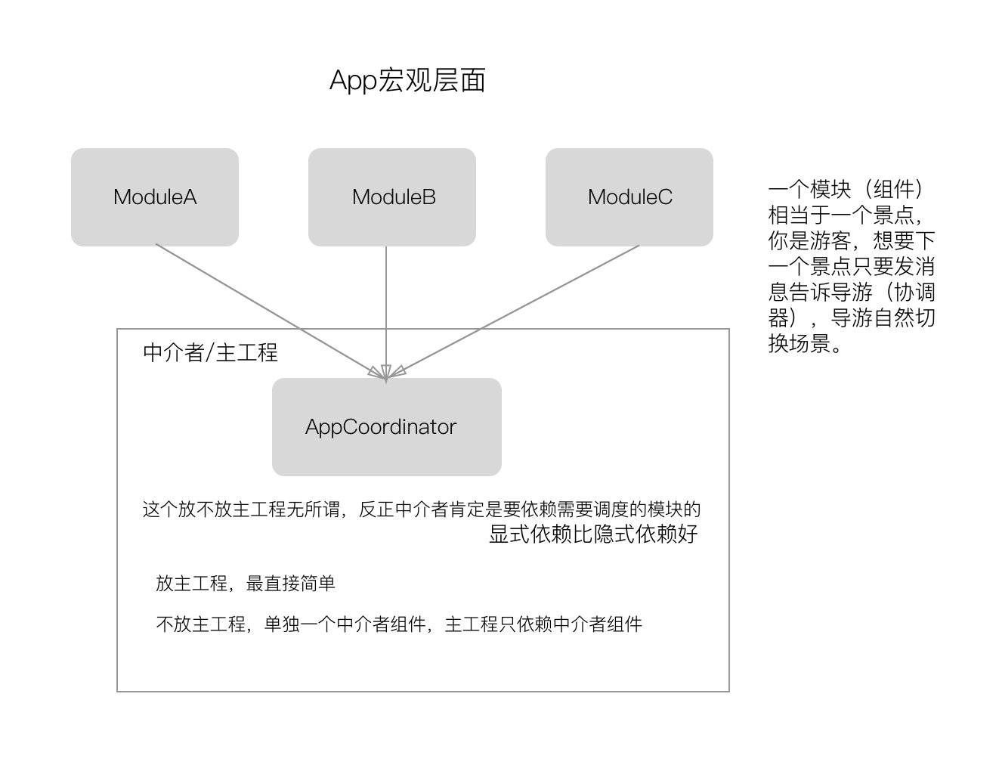

### 组件化使用的背景

组件化方案的出现，是为解决项目随着业务的不断发展，模块间的代码耦合越来越多，代码量急剧增加带来项目不易维护的问题。组件化方案，有利于项目工程的管理，解决了不同业务模块间的代码耦合。项目经过组件化的拆分，不仅可以解决代码耦合的问题，还可以增强代码的复用。

组件化的基础原型：路由(`Router`)就像是个调度中心，各个模块通过路由调度其他模块，模块之间不需要相互引用，调度方式更加统一、自由，能够实现解耦的作用。

### 什么是组件

* 从颗粒度大小角度来看(颗粒度从小到大)
  1. 一个符合单一职责原则的类是一个组件(单一职责原则，即不同的类具备不同的职责，各司其职)
  2. 为了完成某个独立功能的几个类可称为一个组件。如`NSArray`类簇
  3. 一个框架亦可称为一个组件。如`Foundation`等，通常意义上称为`framework`或`library`
  4. 一个完整独立的`App`亦可称之为一个组件

组件化的讨论分为功能组件、业务组件。组件化的核心是组件间的通信，即组件化讨论要考虑到组件间的通信。

上述`1`、`2`、`3`种颗粒度大小的组件间的通信，有通过构造传值、属性传值、`Block`闭包传值、协议回调传值以及单例传值。第`4`种颗粒度大小的组件间的通信，通过统一资源定位符，即`URL`路由来实现。每种颗粒度大小的组件最终都可以抽象为第一种颗粒度级别的情况，因为再多的类都得保证最后使用的时候要尽可能简单，即符合**迪米特法则**。迪米特法则特点是，低耦合、高内聚。

### 什么是耦合性

耦合性，有紧耦合性、松耦合性和无耦合性之分。紧耦合性，是在一个类里面实例化了另外一个实例；松耦合性，践行开闭原则和里氏替换原则，通过构造器或者属性传值解耦；无耦合性，通过协议来实现，通过协议来实现解耦的方式是大部分语言都有的功能。

开闭原则：类、模块、函数可以去扩展，但不要去修改。如果要修改代码，尽量用继承或组合的方式来扩展类的功能，而不是直接修改类的代码。即对软件实体的改动，最好用扩展而非修改的方式。

里氏替换原则：一个对象在其出现的任何地方，都可以用子类实例做替换，并且不会导致程序的错误。即子类可以扩展父类的方法，但不应该复写父类的方法。

**解决组件间通信的问题，就是解决传值和耦合的问题**

### 组件化实现过程的讨论

* `App`之间的通信是怎么做的
  * `App`之间的通信是通过`openURL`的方式，`url`其实就相当于一个协议，当一个应用指定了`URL Schemes`，系统就会实现这个`url`和这个`App`之间的绑定。当`openURL`的时候，系统就会调用这个`url`的实现，找到对应的`App`打开，并调用这个`App`的`delegate`方法。
  * 同理，在我们的`App`中，可以把业务组件等价于`App`，那么组件间的通信一样可以等价于`URL`路由方式，这种方式现在有所对应的实践，如`URLNavigator`、蘑菇街路由等。`URL`思路在同一个`App`中实现时，在代码层面上是不够直接的，性能上也不够好（因要进行额外解析或者内存常驻），此时就得通过设计模式来解决这个问题。

* `A`、`B`组件间跳转传值
  * 如在`A`组件的某个页面上点击一个按钮要进入到`B`组件的某个页面。从组件间需解耦的理论来看，当点击按钮后`A`组件不应该知道下一个组件是哪一个及怎样跳转到下一个组件。
  * 针对上面的场景，`CTMediator`的做法是通过`category`来实现，代码如下
  
  ```
  // A组件中
#pragma mark - event response
- (void)didTappedPushBViewControllerButton:(UIButton *)button
{
    UIViewController *viewController = [[CTMediator sharedInstance] B_viewControllerWithContentText:@"hello, world!"];
    [self.navigationController pushViewController:viewController animated:YES];
}
  ```
  
  `CTMediator`的这种实现方式，也造成了其作者所说的**命名域问题**，同时`category`这个`repo`是由`B`组件维护的，那很显然`A`组件侧要完成这个功能必须等待`B`组件侧完成，一个开发阶段的人员不应该互相等待，`A`组件侧只需要负责给中介者发个消息就行了，其他的不需要管。为了解耦与同步工作，`A`组件侧应该依赖于自己的抽象，即定义一个协议，代码如下
  
  ```
  @protocol AViewControllerMediating 
-(void)avc:(UIViewController *)vc didTappedPushBVCButtonWithContentText:(NSString *)text;
@end
#pragma mark - event response
- (void)didTappedPushBViewControllerButton:(UIButton *)button
{
    [self.mediator avc:self didTappedPushBVCButtonWithContentText:@"hello, world!"];
}
  ```
  
  这样`A`组件侧这边根本不需要等待`B`组件侧开发完成，自己完全可以写个单元测试的`mock`类来测试自己有没有正确的发送消息，`A`组件侧做到这一步就可以了。当`B`组件侧开发完后，只需要把跳转的逻辑实现搬到**中介者**的`AViewControllerMediating`协议实现处即可。
  
  上述通过`AViewControllerMediating`协议处理的流程，好处就是，当不再需要跳转到`B`组件或`B`组件被砍掉时，如跳到`C`组件，只需要`C`组件侧重写实现跳转逻辑即可，即只需要修改一处地方即可，不会影响到`A`组件侧的修改。相比于上述添加协议的处理方式，`CTMediator`的做法很显然要涉及到相关两个组件的改动。**改动的地方越少，维护性越高。**这才是真正的解耦做法，而不是把可编译的类名变成字符串，进行所谓的运行时解耦。
  
`push`、`present`、`dismiss`、`pop`这些其实才是真正的路由逻辑，这些代码应该出现在一个地方即**中介者**。一旦跳转逻辑需要改动或修改`bug`，只需要去中介者里面找就行。涉及到组件化的项目视图控制器肯定不少，而中介者一般不会有很多。

* 组件化中主工程的理解

抽象层面上可以把主工程看成是`MVC`中的`Controller`，基于`MVC`再怎么拆成`MVVM`或`VIPER`，`Controller`中协调`Model`和`View`的工作还在，`M`和`V`不就是组件的最细颗粒度级别(上述组件描述`1`的情况)吗？那么主工程就是一个天然调度各个组件的地方，调度不同业务组件的代码就应该放到主工程。

主工程是一个集成各个组件的地方，而中介者是调度各个组件的，中介者放到主工程里面一点问题都没有。同时注意，显式依赖显然比隐式依赖要更健壮。

### 现有组件化的实现方案

#### 蘑菇街

##### `url-block`方案

通过在启动时注册组件提供的服务，把调用组件使用的`url`和组件提供的服务`block`对应起来，保存到内存中。在使用组件的服务时，通过`url`找到对应的`block`，然后获取服务。

`url-block`方案的架构图


`MGJRouter`就是一个单例类，使用前需要通过注册组件，调用方通过`URL`调用服务方页面，通过路由表的映射关系进行关联，调用方可以传入复杂的参数、对象等。`MGJRouter`中使用`block`实现正反向传值。

基本跳转的步骤：先注册组件，然后调用`openURL`方法，传入参数即可。

实际使用中，使用一个类来统一管理注册方法，在`load`方法中进行注册，这样就不会到处看到注册的代码，方便管理。

[`url-block`的示例代码](https://github.com/meili/MGJRouter)

* `url-block`方案的优缺点
  * 优点
     * 可以使用定义好的路由实现页面间的跳转
  * 缺点
     * 需要在内存中维护`url-block`的表，组件多了可能会有内存问题
     * `url`注册对于实施组件化没必要，查找`url`的实现不够高效
     * 路由写错后编译没问题，而运行实现就出问题了，以后维护也不方便

##### `protocol-class`

这种方案，是通过`protocol`定义服务接口，组件通过实现该接口来提供接口定义的服务。具体实现就是把`protocol`和`class`做一个映射，同时在内存中保存一张映射表，使用的时候通过`protocol`找到对应的`class`来获取需要的服务。

`protocol-class`方案注册：在模块的协议实现类中的`load`方法里进行注册。

`protocol-class`方案的架构图


协议和类的一一对应关系中，类是实现了对应的协议的，所以通过协议获取到的类是可以按照`protocol`中声明的方法自由使用的。

[`protocol-class`的实例代码](https://github.com/zhfei/Engineer)

蘑菇街的`url-block`和`protocol-class`方案，都是通过单例模式对组件进行管理的。

#### 有赞

#### `CTMediator`

* 设计模式：中介(`Mediator`)模式 + `Target-Action`模式
* 流程简述：`[CTMediator shareInstance]` > `openUrl` > `parseUrl` > `performTarget:action:params` > `RunTime` > 分配到各个业务(`target`)下的各个业务逻辑(`action`)
* 调用：分为远程调用和本地调用，通过本地调用来支持远程调用
* 参数：对于非常规参数，如`UIImage/UIView`等，`openUrl`方式是没办法直接传递的，调用本地的`performTarget`方法，可直接通过`params`传递非常规参数
* 与其他组件化方案的区别：蘑菇街所有的组件化调用是建立在`URL`上的，这是`CTMediator`与蘑菇街最大的不同
* `CTMediator`组件化方案架构图


`CTMediator`主要用到的是`RunTime`中的让对象发送消息。`performSelector`本质上就是会转化成`objc_msgSend`来进行实现。

`CTMediator`中最关键的方法`- (id)performTarget:(NSString *)targetName action:(NSString *)actionName params:(NSDictionary *)params shouldCacheTarget:(BOOL)shouldCacheTarget`。其内部实现使用了运行时相关的`NSSelectorFromString`、`NSClassFromString`、`SEL`等方法。

`CTMediator`中主要代码的理解

```
[target performSelector:action withObject:params];

action(SEL)通过NSSelectorFromString获取了，target通过NSClassFromString获取，接下来只需要通过performSelector方法执行target(Class)中的action即可。
```

Tips：

```
RunTime的使用场景：让一个对象发送消息(即是执行方法)、交换方法(Method Swizzling)、动态添加方法、给分类增加属性、字典转模型等。
```

* 总结
  * `CTMediator`的实现得益于`RunTime`的存在，正因为如此我们可以解耦各个模块，实现`App`之间的模块化。

### 现有组件化方案的缺陷

* `CTMediator`

不要滥用单例，因为除了单例共享状态之外，还容易造成紧耦合性，就算要用也要通过依赖注入(即通过传入的参数进行初始化)的方式，这样也能增加可测试性。而`CTMediator`的使用很显然造成了单例的紧耦合。

`CTMediator`采用硬编码的方式，依赖于`OC`运行时，通用型也不高。按照作者的说法，`category`这个`repo`是服务方维护的，然后调用方要依赖于这个`category`，这同样是依赖于服务方，只不过原来可能要直接依赖`B`组件，现在分一个`B_category`组件然后依赖它，作者所谓的命名域一样渗透，依赖列表里同样出现了服务方的名字。

* `protocol-class`注册

蘑菇街和`Beehive`用到了这种方式。这个方式虽然用到了协议，但跟上面使用的`AViewControllerMediating`协议完全是两个意思。`protocol-class`注册中协议的这个意思，`A`组件调用`B`组件，然后`B`组件提供一个协议出来自己再实现，这个协议放`B`组件里又怕依赖侵入，然后就放到`PublicProtocolDomain.h`里面并下沉，再在`A`组件里通过`ModuleManager`取出来。这就是觉得这个方案很绕的原因。

`B`组件要对外提供服务，提供一个外观类就够了。协议是由`A`组件定义的，然后由中介者去实现，因为中介者本身就是要依赖各个组件的，自然而然的就能实现`A`组件中的协议调用`B`组件中的方法了。

### 组件化的`Coordinator`方案

根据上述的讨论理解，实现解耦，不需要再搞一个`category repo`，而所谓的`Target`其实相当于一个组件模块的外观类，提供一组较易用的方法，可称为`Service`或`Coordinator`。这个方案运用了真正的`POP`(面向过程编程，注重细节、功能)思想，把它用在组件化里完全合适，并且无需所谓的注册、无需运行时，内存占用少、运行速度快，有编译期检查，可`Mock`测试，无单例，和`URL`路由也能配合。

`Coordinator`方案的模型图如下




[`Coordinator`方案的代码](https://github.com/Bruce-pac/MainProject-MultiPod)

### 总结

组件化的目的是为了让代码复用性更强，并不是要把主工程架空，只要你遵守`SOLID`原则灵活运用设计模式，并且分好文件夹，就算你在一个工程中一样可以称之为组件化，做成`Pod`或者`Package`是画龙点睛的做法，拆分过头甚至适得其反。如果团队人不多，业务模块不多，完全没必要把业务进行`Pod`级别的隔离，做到基础组件的隔离就够了。

### 资料参考

[组件化的一个新想法](https://juejin.im/post/5e8d8ec5e51d4546dd2155c6#heading-4)