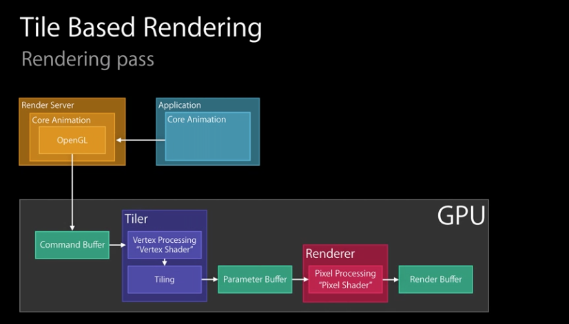

### `UIKit`框架结构


`UIKit`是常用的框架，显示、动画都通过`Core Animation`。`Core Animation`是核心动画，依赖于`OpenGL ES`做`GPU`渲染，`Core Graphics`做`CPU`渲染。最底层的`Graphics HardWare`是图形硬件。

### 视图绘制渲染过程

#### 整体流程

* 软硬件流程


在屏幕上显示视图，需要`CPU`和`GPU`一起协作。一部分数据通过`Core Graphics`、`Core Image`由`CPU`预处理，最终通过`OpenGL ES`将数据传送到`GPU`，最终显示到屏幕

**Tips：**`Core Image支持CPU、GPU两种处理模式`

* 硬件参与流程

上述流程硬件间数据的交互情况如下


整个流程中`CPU`将准备好的`bitmap`放到`RAM`里，`GPU`去搬这块内存到`VRAM`中处理。这个过程`GPU`所能承受的极限大概在`16.67ms`完成一帧的处理，所以`60fps`就是`GPU`能处理的最高频率

#### 流程详解

##### `UIView`从`Draw`到`Render`的过程


* 每一个`UIView`都有一个`layer`，每一个`layer`都有个`content`，这个`content`指向的是一块缓存，叫做`backing store`
* `UIView`的绘制和渲染是两个过程，当`UIView`被绘制时，`CPU`执行`drawRect`，通过`context`将数据写入`backing store`
* 当`backing store`写完后，通过`render server`交给`GPU`去渲染，将`backing store`中的`bitmap`数据显示在屏幕上

##### 底层显示逻辑


1. `Core Animation`：通过`CPU`创建绘制视图，提交会话，包括自己和子树`(view hierarchy)`的`layout`状态，图片的解码和格式转换等
2. `Render Server`：解析提交的子树状态，生成绘制指令
3. `GPU`：执行绘制指令
4. 显示渲染后的数据

* `Core Animation`和`Render Server`流程


* `Core Animation`中`Commit Transaction`的详细过程


* `Layout`(布局)


1. 调用`layoutSubviews`方法
2. 调用`addSubview`方法(会触发调用`drawRect`方法)
3. 填充内容，数据库查询
4. 通常会造成`CPU`或者`I/O`瓶颈

* `Display`(显示)


1. 通过`drawRect:`绘制内容
2. `String`绘制
3. 通常会造成`CPU`或者内存瓶颈
   1. 每个`UIView`都有`CALayer`，同时图层有一个像素存储空间，存放视图。调用`-setNeedsDisplay`的时候，仅会设置图层为`dirty`。当渲染系统准备就绪，调用视图的`-display`方法，同时装配像素存储空间，建立一个`Core Graphics`上下文(`CGContextRef`)，将上下文`push`进上下文堆栈，绘图程序进入对应的内存存储空间
   2. 如重写了视图的`-drawRect`，并在里面实现了指定的绘制代码，`UIKit`会将自动生成的`CGContextRef`放入上下文堆栈。当绘制完成后，视图的像素会被渲染到屏幕上。当下次再次调用视图的`-setNeedsDisplay`，将会再次调用`-drawRect`方法

* `Prepare`(准备提交)


1. 图片解码，把图片从`PNG`或`JPEG`等格式中解压出来，得到像素数据
2. 图片格式转换，如果`GPU`不支持这种颜色格式，`CPU`需要进行格式转换，因此尽量使用GPU能支持的图片格式。比如应用中有一些从网络下载的图片，而GPU恰好不支持这个格式，这就需要CPU预先进行格式转化

* `Commit`(提交)


1. 打包`layers`并且提交到`Render Server`中
2. 递归提交子树的`layers`
3. 如果子树很复杂，对`CPU`消耗很大，对性能造成影响，因此尽可能简化`viewTree`

##### 页面卡顿

* 相关概念
  * 帧率：以一致且稳定的帧速率呈现您的绘图。
     * `60fps`是`Apple`给出的最佳帧率，相当于每帧`16.67ms`。但是实际中如果能保证帧率可以稳定到`30fps`就能保证不会有卡顿的现象，`60fps`更多用在游戏上。所以如果应用能够保证`33.4ms`绘制一次屏幕，基本上就不会卡了
  * `VSync`信号
     * `iOS`的显示系统是由`VSync`信号驱动的，`VSync`信号由硬件时钟生成，每秒钟发出`60`次（这个值取决设备硬件，比如 iPhone 真机上通常是 59.97）。`iOS`图形服务接收到`VSync`信号后，会通过`IPC`通知到`App`内。`App`的`Runloop`在启动后会注册对应的`CFRunLoopSource`通过`mach_port`接收传过来的时钟信号通知，随后`Source`的回调会驱动整个`App`的动画与显示
     
* 卡顿原因


在`VSync`信号到来后，系统图形服务会通过`CADisplayLink`等机制通知`App`，`App`主线程开始在`CPU`中计算显示内容，比如视图的创建、布局计算、图片解码、文本绘制等。随后`CPU`会将计算好的内容提交到`GPU`去，由`GPU`进行变换、合成、渲染。随后`GPU`会把渲染结果提交到帧缓冲区去，等待下一次`VSync`信号到来时显示到屏幕上。由于垂直同步的机制，如果在一个`VSync`时间内，`CPU`或者`GPU`没有完成内容提交，则那一帧就会被丢弃，等待下一次机会再显示，而这时显示屏会保留之前的内容不变。这就是界面卡顿的原因。

由此可知`CPU`和`GPU`不论哪个阻碍了显示流程(执行的操作复杂，耗时超过了`16.67ms`)，都会造成掉帧产生卡顿现象。所以开发时，需要分别对`CPU`和`GPU`压力进行评估和优化(进行渲染性能优化的依据)。

##### 绘制渲染过程中`CPU`、`GPU`资源消耗的情况

###### `CPU`资源消耗的原因
* 对象创建 
   * 对象的创建会分配内存、调整属性、甚至还有读取文件等操作，比较消耗`CPU`资源。**尽量用轻量的对象代替重量的对象，可以对性能有所优化。**比如用`CALayer`代替`UIView`,用`CATextLayer`代替`UILabel`
   * 通过`Storyboard`创建视图对象时，其资源消耗会比直接通过代码创建对象要大非常多
* 对象销毁
   * 对象的销毁虽然消耗资源不多，但累积起来也是不容忽视的。通常当容器类持有大量对象时，其销毁时的资源消耗就非常明显
   * 如果对象可以放到后台线程去释放，那就挪到后台线程去释放
* 对象调整
   * 当视图层次调整时，`UIView`、`CALayer`之间会出现很多方法调用与通知，所以在**优化性能时，应该尽量避免调整视图层次、添加和移除视图**
* 布局计算
   * 视图布局的计算是`App`中最为常见的消耗`CPU`资源的地方
   * 如果能在后台线程提前计算好视图布局、并且对视图布局进行缓存，那么这个地方基本就不会产生性能问题了
* `Autolayout`
   * `Autolayout`对于复杂视图来说常常会产生严重的性能问题。随着视图数量的增长，`Autolayout`带来的`CPU`消耗会呈指数级上升。参考数据可看[这里](http://pilky.me/36/)
* 文本计算
   * 如果一个界面中包含大量文字，文本的宽高计算会占用很大一部分资源，并且不可避免
   * 如果对文本显示没有特殊要求，可以参考下`UILabel`内部的实现方式：用`[NSAttributedString boundingRectWithSize:options:context:]`来计算文本宽高，用`-[NSAttributedString drawWithRect:options:context:]`来绘制文本。另外这两个操作尽可能的在后台操作
* 文本渲染
   * 屏幕上能看到的所有文本内容控件，包括`UIWebView`，在底层都是通过`CoreText`排版、绘制为`Bitmap`显示的
   * 常见的文本控件(`UILabel`、`UITextView`等)，其排版和绘制都是在主线程进行的，当显示大量文本时，`CPU`的压力会非常大
       * 对此解决方案只有一个，那就是自定义文本控件，用`TextKit`或最底层的`CoreText`对文本异步绘制
       * 尽管这实现起来非常麻烦，但其带来的优势也非常大，`CoreText`对象创建好后，能直接获取文本的宽高等信息，避免了多次计算(调整`UILabel`大小时算一遍、`UILabel`绘制时内部再算一遍)。`CoreText`对象占用内存较少，可以缓存下来以备稍后多次渲染
* 图片的解码
   * 当用`UIImage`或`CGImageSource`的那几个方法创建图片时，图片数据并不会立刻解码。图片设置到`UIImageView`或者`CALayer.contents`中去，并且`CALayer`被提交到`GPU`前，`CGImage`中的数据才会得到解码。**这一步是发生在主线程的，并且不可避免。**
   * 如果想要绕开这个机制，常见的做法是在后台线程先把图片绘制到`CGBitmapContext`中，然后从`Bitmap`直接创建图片。目前常见的网络图片库都自带这个功能
* 图像的绘制
   * 图像的绘制通常是指用那些以`CG`开头的方法把图像绘制到画布中，然后从画布创建图片并显示这样一个过程。
   * 图像绘制最常见的地方就是`[UIView drawRect:]`里面了。由于`Core Graphic`方法通常都是线程安全的，所以图像的绘制可以很容易的放到后台线程进行
* 图片的格式
   * 把图片从`PNG`或`JPEG`等格式中解压出来，得到像素数据。如果`GPU`不支持这种颜色格式，需要`CPU`进行格式转换，所以，图片要用`GPU`支持的图片数据格式

###### 图片解码和图像绘制的代码示例


###### `GPU`资源消耗的原因

相对于`CPU`来说，`GPU`能干的事情比较单一：接收提交的纹理(`Texture`)和顶点描述(三角形)，应用变换(`transform`)、混合并渲染，然后输出到屏幕上。通常你所能看到的内容，主要也就是纹理(图片)和形状(三角模拟的矢量图形)两类

* 纹理的渲染
  * 所有的`Bitmap`，包括图片、文本、栅格化的内容，最终都要由内存提交到显存，绑定为`GPU Texture`
  * 不论是提交到显存的过程，还是`GPU`调整和渲染`Texture`的过程，都要消耗不少`GPU`资源
  * 当在较短时间显示大量图片时(比如`TableView`存在非常多的图片并且快速滑动时)，`CPU`占用率很低，`GPU`占用非常高，界面仍然会掉帧
  * 避免这种情况的方法只能是尽量减少在短时间内大量图片的显示，尽可能将多张图片合成为一张进行显示
  * 当图片过大，超过`GPU`的最大纹理尺寸时，图片需要先由`CPU`进行预处理，这对`CPU`和`GPU`都会带来额外的资源消耗
  * 目前来说，`iPhone 4S`以上机型，纹理尺寸上限都是`4096x4096`。所以，尽量不要让图片和视图的大小超过这个值。详细资料可看[这里](http://iosres.com)
* 视图的混合(`Composing`)
  * 当出现重叠的`UIView`或者`CALayer`的时候，`GPU`会去计算混合部分的像素，所以，尽可能少的设置`alpha`,尽可能多的设置背景颜色为纯色的背景
  * 设置`backgroundColor`较设置`opaque = true`更为有效
* 图形的生成
  * `CALayer`的**`border`、圆角、阴影、遮罩(`mask`)，`CASharpLayer`的矢量图形显示**，通常**会触发离屏渲染(`offscreen rendering`)**，而**离屏渲染通常发生在`GPU`中**。离屏渲染的过程会消耗大量的`GPU`资源，因此因尽量避免触发离屏渲染
     * 如，当一个列表视图中出现大量圆角的`CALayer`，并且快速滑动时，可以观察到`GPU`资源已经占满，而`CPU`资源消耗很少。这时界面仍然能正常滑动，但平均帧数会降到很低
     * 为了避免这种情况，可以尝试开启`CALayer.shouldRasterize`属性，但这会把原本离屏渲染的操作转嫁到`CPU`上去
  * 对于只需要圆角的某些场合，也可以用一张已经绘制好的圆角图片覆盖到原本视图上面来模拟相同的视觉效果
  * 最彻底的解决办法，就是把需要显示的图形在后台线程绘制为图片，避免使用圆角、阴影、遮罩等属性

##### `Tile-Based`渲染

`Tiled-Based`渲染是移动设备的主流。整个屏幕会分解成`N*Npixels`组成的瓦片(`Tiles`)，`tiles`存储于`SoC`缓存(`SoC=system on chip`，片上系统，是在整块芯片上实现一个复杂系统功能，如`intel cpu`，整合了集显，内存控制器，`cpu`运核心，缓存，队列、非核心和`I/O`控制器)。几何形状会分解成若干个`tiles`，对于每一块`tile`，把必须的几何体提交到`OpenGL ES`，然后进行渲染(光栅化)。完毕后，将`tile`的数据发送回`cpu`。资料见[落影大神的PDF](https://github.com/loyinglin/LearnOpenGLES/tree/master/util/资料)


* `GPU`屏幕渲染的两种方式
  * 当前屏幕渲染(`On-Screen Rendering`，即正常渲染)，指的是`GPU`的渲染操作是在当前用于显示的屏幕缓冲区中进行
  * 离屏渲染(`Off-Screen Rendering`)，指的是`GPU`在当前屏幕缓冲区以外新开辟一个缓冲区进行渲染操作

###### 正常渲染和离屏渲染

* 正常渲染的渲染管道



1. `Command Buffer：``OpenGL`提交一个渲染指令给`Command Buffer`，然后进行`GPU`渲染
2. `Tiler：`调用顶点着色器，把顶点数据进行分块(`Tiling`)
3. `Parameter Buffer：`接受分块完毕的`tile`和对应的渲染参数
4. `Renderer：`调用片元着色器，进行像素渲染
5. `Render Buffer:：`缓冲区，存储渲染完毕的像素

* 离屏渲染
  * 为什么需要离屏渲染
      * 一般情况下，`OpenGL`会将提交到渲染服务(`Render Server`)的动画直接渲染，但是对于一些复杂的图像动画不能直接进行叠加渲染显示，而是需要根据`Command Buffer`分通道进行渲染之后再组合，在组合过程中，有些渲染通道不会直接显示，而这些没有直接显示在屏幕上的通道就是`Offscreen Render Pass`
      * 离屏渲染(`Offscreen Render`)需要更多的渲染通道，而不同的渲染通道切换需要耗费一定的时间，这个时间内`GPU`会闲置，当通道达到一定数量，对性能会有较大的影响

  * 离屏渲染的渲染管道(不同的离屏渲染效果，会有不同数量的渲染通道)
      * 遮罩(`mask`)
  
  
  
 1. 在第一条渲染管道中，`GPU`创建了一个新的缓存区来存储相机纹理(`Texture`)的渲染结果(渲染`layer`的`mask`纹理，同`Tile-Based的`基本渲染逻辑)
  2. 在第二条渲染管道中，`GPU`创建了一个新的缓存区来存储蓝色的蒙版(`layer`)的渲染结果(渲染`layer`的`content`纹理，同`Tile-Based`的基本渲染逻辑)
  3. 在第三条渲染管道中，才把前面的两个渲染结果取出来，合并组合，放到`Render Buffer`中(`Compositing`操作，合并`1、2`的纹理)

  **注意：前面的两个渲染结果并没有直接放到Render Buffer中，而是临时保存**
  
  由此可见，离屏渲染的消耗主要体现在两方面：
  
  1. 创建新的缓存区
  2. 上下文的切换。先是从当前屏幕切换到离屏，等到离屏渲染结束以后，将离屏缓冲区的渲染结果显示到屏幕上又需要将上下文环境从离屏切换到当前屏幕。而上下文环境的切换是要付出很大代价的

     * 模糊效果(`UIBlurEffect`)

     
     
     

     使用`UIBlurEffect`，应该是尽可能小的`view`，因为性能消耗巨大
     
###### 常见的会触发离屏渲染操作的情况如下

* `shouldRasterize`(光栅化)
  * 这是一个手动开启离屏渲染的操作，开启光栅化是将一个`layer`预先渲染成位图(`bitmap`)，然后加入缓存中，当需要的时候再从缓存中拿出来，如果光栅化的元素在`100ms`内没有被使用就会被移除
  * 因此，光栅化适用于静态内容的视图，也就是内部结构和内容不发生变化的视图，当视图的内容和结构一直在发生变化，就不应该开启光栅化，因为它会一直创建缓存

* `masks`(遮罩)
  * 单独设置`cornerRadius`或者`masksToBounds = true`，并不会引起离屏渲染，他们的合体才会引起离屏渲染
  * 为避免遮罩引起的离屏渲染，效果上的处理，可参考[VVebo](https://github.com/johnil/VVeboTableViewDemo)，在要添加圆角的视图上再叠加一个部分透明的视图，只对圆角部分进行遮挡，遮挡的部分背景与周围背景相同
  * 彻底的方法还是在后台线程中利用`CoreGraphic`来绘制图片，避免引起离屏渲染

* `shadows`(阴影)
  * 可以通过指定阴影路径，避免离屏渲染。如，`imgView.layer.shadowPath =UIBezierPath(rect: imgView.bounds).CGPath`

* `EdgeAntialiasing`(抗锯齿)
  * 这个功能貌似在`iOS 8`和`iOS 9`上并不会触发离屏渲染，对性能也没有什么影响，也许这个功能已经被优化了

* `-(void)drawRect`(`CPU`离屏渲染)
  * 如果重写了`drawRect`方法，并且使用`Core Graphics`的技术进行了绘制操作，就涉及到了`CPU`渲染
  * 整个渲染过程由`CPU`在`App`内同步地完成，渲染得到的`bitmap`最后再交由`GPU`用于显示
  * 但是应该尽量避免这种方法，因为如果使用这个方法不恰当的话会使内存暴涨，因`CPU`自身做渲染的性能也不好。重写drawRect致使内存暴涨的原因见[内存恶鬼drawRect](https://bihongbo.com/2016/01/03/memoryGhostdrawRect/)
  * 因此，能避免重写drawRect方法就尽可能避免

离屏渲染的优化可见[离屏渲染优化详解：实例示范+性能测试](https://www.jianshu.com/p/ca51c9d3575b)
  
### 性能优化

`WWDC`推荐的检查项目


* 根据`WWDC`推荐的检查项目进行检查
  * 帧率一般在多少？
      * `60`帧每秒 (`TimeProfiler`)
  * 是否存在`CPU`和`GPU`瓶颈？(通过工具查看占有率来进行检查)
      * 更少的使用`CPU`和`GPU`可以有效的保存电量
  * 额外的使用`CPU`来进行渲染？
      * 重写了`drawRect`会导致`CPU`渲染
      * 在`CPU`进行渲染时，`GPU`大多数情况是处于等待状态
  * 是否存在过多离屏渲染？
      * 越少越好
      * 离屏渲染会导致上下文切换，`GPU`产生`idle`(闲置)；
  * 是否渲染过多视图？
      * 视图越少越好
      * 透明度为1的视图更受欢迎
  * 使用奇怪的图片格式和大小？
      * 避免格式转换和调整图片大小
      * 一个图片如果不被`GPU`支持，那么需要`CPU`来转换。（`Xcode`有对`PNG`图片进行特殊的算法优化）
  * 使用昂贵的特效？
      * 理解特效的消耗，同时调整合适的大小
      * 例如前面提到的`UIBlurEffect`
  * 视图树上不必要的元素？
      * 理解视图树上所有点的必要性，去掉不必要的元素
      * 忘记`remove`视图是很常见的事情，特别是当`View`的类比较大的时候，因此需检查`remove`掉不需要的视图

#### 性能检查中使用的工具

遇到性能问题，先分析、定位问题所在。分析、定位问题可使用工具`Xcode`、`Instrument`。

##### `Xcode`

使用`Xcode`查看应用的渲染情况。查看渲染情况选项的设置，`Xcode`导航栏 中的`Debug ->View Debuging ->Rendering`。

###### 具体选项的功能及标识颜色

* `Color Blended Layers`(混合)
  * 这个选项基于渲染程度对屏幕中的混合区域进行绿到红的高亮显示，**越红表示性能越差**，会对帧率等指标造成较大的影响。红色通常是由于多个半透明图层叠加引起
  
* `Color Hits Green and Misses Red`(命中/不命中)
  * 当`UIView.layer.shouldRasterize = YES`时，耗时的图片绘制会被缓存，并当做一个简单的扁平图片来呈现。这时候，如果页面的其他区块(比如`UITableViewCell`的复用)使用缓存直接命中，就显示绿色，反之，如果不命中，这时就显示红色。**红色越多，性能越差**。因为栅格化生成缓存的过程是有开销的，如果缓存能被大量命中和有效使用，则总体上会降低开销，反之则意味着要频繁生成新的缓存，这会让性能问题雪上加霜

* `Color Copied Images`
  * 对于`GPU`不支持的色彩格式的图片只能由`CPU`来处理，把这样的图片标为蓝色。**蓝色越多，性能越差**

* `Color Immediately`
  * 通常`Core Animation Instruments`以每毫秒`10`次的频率更新图层调试颜色。对某些效果来说，这显然太慢了。这个选项就可以用来设置每帧都更新（可能会影响到渲染性能，而且会导致帧率测量不准，所以不要一直都设置它）
  
* `Color Misaligned Images`
  * 这个选项检查了图片是否被缩放，以及像素是否对齐。被放缩的图片会被标记为黄色，像素不对齐则会标注为紫色。**黄色、紫色越多，性能越差**

* `Color Offscreen-Rendered Yellow`(离屏渲染)
  * 这个选项会把那些离屏渲染的图层显示为黄色。**黄色越多，性能越差**。这些显示为黄色的图层很可能需要用`shadowPath`或者`shouldRasterize`来优化

* `Color OpenGL Fast Path Blue`
  * 这个选项会把任何直接使用`OpenGL`绘制的图层显示为蓝色。蓝色越多，性能越好。如果仅仅使用`UIKit`或者`Core Animation`的`API`，那么不会有任何效果

* `Flash Updated Regions`
  * 这个选项会把重绘的内容显示为黄色。**黄色越多，性能越差**。通常我们希望只是更新的部分被标记为黄色

##### `Instrument`

开启`Instrument`，`command + I`

使用`Instrument`除了跟踪程序崩溃原因，还可使用其`Core Animation`和`GPU driver`来看视图渲染过程中的性能

* `Core Animation`
  * `Color Blended Layers`：看半透明`layer`的遮盖情况
  * `Core Animation template`只是能让开发者直观地看到哪些地方有可能需要优化，但是到底要不要优化，还是要看`GPU driver`的表现
* `GPU Driver`
  * `Renderer Utilization` ——如果这个值大于50%的话，表示`GPU`的性能受到`fill-rate`的限制，可能有太多的`Offscreen rendering`，`overdraw`，`blending`
  * `Tiler Utilization` ——如果这个值大于`50%`，表示可能有太多的`layers`

### 面试题

1. `APP`从点击屏幕（硬件）到完全渲染，中间发生了什么?(视图呈现到屏幕上，经过了哪些流程?)

程序执行`addSubview:`时，一个视图由`CPU`进行`Frame`布局，准备视图和图层的层级关系，查询是否有重写`drawRect:`或`drawLayer:inContext:`方法。**注意：如果有重写的话，这里的渲染是会占用CPU进行处理的。**`CPU`会将处理视图和图层的层级关系打包，通过`IPC`(内部处理通信)通道提交给渲染服务，渲染服务由`OpenGL ES`和`GPU`组成。渲染服务首先将图层数据交给`OpenGL ES`进行纹理生成和着色。生成前后帧缓存，再根据显示硬件的刷新频率，一般以设备的`Vsync`信号和`CADisplayLink`为标准，进行前后帧缓存的切换。最后，将最终要显示在画面上的后帧缓存交给`GPU`，进行采集图片和形状，运行变换，应用文理和混合。最终显示在屏幕上。

2. `UIView`是如何显示到屏幕上的
  * 需要从`RunLoop`开始，`RunLoop`是一个`60fps`的回调，即每`16.67ms`绘制一次屏幕，也就是需要在这个时间内完成`view`缓冲区的创建
  * `view`内容的绘制是`CPU`的工作，然后把缓冲区交给`GPU`渲染
  * 渲染包括了多个view的拼接`(compositing)`、纹理的渲染`(Texture)`等，最后`Display`到屏幕上
  * 但如果在`16.67ms`内要处理的操作太多，导致`CPU、GPU`无法在指定的时间内完成指定的工作，那么就会出现卡顿现象，即丢帧
     * `60fps`是`Apple`给出的最佳帧率，但是实际中如果能保证帧率可以稳定到`30fps`就能保证不会有卡顿的现象，`60fps`更多用在游戏上。所以如果应用能够保证`33.4ms`绘制一次屏幕，基本上就不会卡了

3. `UIView`从`Draw`到`Render`的过程有如下几步
  * 每一个`UIView`都有一个`layer`，每一个`layer`都有个`content`，这个`content`指向的是一块缓存，叫做`backing store`。**缓存区**
  * `UIView`的绘制和渲染是两个过程，当`UIView`被绘制时，`CPU`执行`drawRect`，通过`context`将数据写入`backing store`。**绘制数据写入缓存区**
  * 当`backing store`写完后，通过`render server`交给`GPU`去渲染，将`backing store`中的`bitmap`数据显示在屏幕上。**缓存区数据的渲染**
  * 总结：`CPU`就是做绘制的操作把内容放到缓存里，`GPU`负责从缓存里读取数据然后渲染到屏幕上。**CPU-绘制、GPU-渲染**。过程如下
  
  ```
  Screen -Display/Link-> GPU(VRAM) <-> CPU(RAM)
  ```
  
  即`CPU`将准备好的`bitmap`放到`RAM`里，`GPU`去搬这块内存到`VRAM`中处理。这个过程`GPU`所能承受的极限大概在`16.67ms`完成一帧的处理，所以`60fps`就是`GPU`能处理的最高频率
  
4. `iOS`上视图或动画渲染的各个阶段

共有`6`个步骤

在`APP`内部的有`4`个阶段

* 布局，在这个阶段，设置`layer`的属性
* 创建，创建`backing image`。可以通过`setContents`将一个`image`传给`layer`，或通过`drawRect:/drawLayer:inContext:`来画出来
* 准备，在这个阶段，准备要渲染的`layer`的各种属性数据，以及要做的动画的参数，准备传给`render server`。同时在这个阶段会解压要渲染的`image`
* 提交，在这个阶段，`Core Animation`打包`layer`的信息以及要做的动画的参数，通过`IPC`传递给`render server`

在`APP`外部的`2`个阶段，当提交的数据到达`render server`后，会做下面两件事

* 根据`layer`的各种属性(如果是动画的，会计算动画的`layer`的属性的中间值)，用`OpenGL`准备渲染
* 渲染这些可视的`layer`到屏幕

5. 渲染性能优化的注意点

* 隐藏的绘制：`catextlayer`和`uilabel`都是将`text`画入`backing image`的。如果改了一个包含`text`的`view`的`frame`的话，`text`会被重新绘制
* `Rasterize`：当使用`layer`的`shouldRasterize`的时候（记得设置适当的`layer`的`rasterizationScale`），`layer`会被强制绘制到一个`offscreen image`上，并且会被缓存起来。这种方法可以用来缓存绘制耗时（比如有比较绚的效果）但是不经常改的`layer`，如果`layer`经常变，就不适合用
* 避免离屏渲染，因使用圆角、遮罩、阴影等效果，会产生离屏渲染过程。因此想要上述效果时，能通过图片伸展实现的，就尽量不要使`layer`上对应的属性来实现上述效果。如，实现`rounded corner`，可以将一个圆形的图片赋值于`layer`的`content`的属性。并且设置好`contentsCenter`和`contentScale`属性
* `Blending and Overdraw `：如果一个`layer`被另一个`layer`完全遮盖，`GPU`会做优化不渲染被遮盖的`layer`，但是计算一个`layer`是否被另一个`layer`完全遮盖是很耗`cpu`的。将几个半透明的`layer`的`color`融合在一起也是很消耗`cpu`的

基于上述原因，在开发过程中，为保证渲染性能的最优，常依据如下规则进行操作

* 设置`view`的`backgroundColor`为一个固定的，不透明的`color`
* 如果一个`view`是不透明的，设置`opaque`属性为`YES`。（直接告诉程序这个是不透明的，而不是让程序去计算）这样会减少`blending`(调和)和 `overdraw`
* 如果使用`image`的话，尽量避免设置`image`的`alpha`为透明的，如果一些效果需要几个图片融合而成，就让设计用一张图画好，不要让程序在运行的时候去动态的融合
  
6. `GPU`的挑战

* 将数据从`RAM`搬到`VRAM`中
* 将`Texture`(纹理)渲染到屏幕上(主要的瓶颈点)，渲染纹理基本要处理以下问题
  * 合成`(compositing)`
     * `Compositing`是指将多个纹理拼到一起的过程，对应`UIKit`，是指处理多个`view`合到一起的情况(`drawRect`只有当`addsubview`情况下才会触发)。如果`view`之间没有叠加，那么`GPU`只需要做普通渲染即可。 如果多个`view`之间有叠加部分，`GPU`需要做混合`(blending)`
  * 尺寸`(Size)`
     * 这个问题，主要是处理`image`带来的，假如内存里有一张`400x400`的图片，要放到`100x100`的`imageview`里，如果不做任何处理，直接丢进去，问题就大了，这意味着，`GPU`需要对大图进行缩放到小的区域显示，需要做像素点的(取样)`sampling`，这种`smapling`的代价很高，又需要兼顾像素配向`pixel alignment`。计算量会飙升。
  * 离屏渲染`(Offscreen Rendering And Mask)`
     * `iOS`中图形绘制框架的结构
     `UIKit`是`iOS`中用来管理用户图形交互的框架，但是`UIKit`本身构建在`Core Animation`框架之上，`Core Animation`分成了两部分`OpenGL ES`和`Core Graphics`，`OpenGL ES`是直接调用底层的`GPU`进行渲染；`Core Graphics`是一个基于`CPU`的绘制引擎
     
     * `OpenGL`中，`GPU`屏幕渲染有以下两种方式
         * `On-Screen Rendering`即当前屏幕渲染，指的是`GPU`的渲染操作是在当前用于显示的屏幕缓冲区中进行
         * `Off-Screen Rendering`即离屏渲染，指的是`GPU`在当前屏幕缓冲区以外新开辟一个缓冲区进行渲染操作
         * 离屏渲染的代价主要包括两方面内容
             * 创建新的缓冲区
             * 上下文的切换
                 * 离屏渲染的整个过程，需要多次切换上下文环境：先是从当前屏幕`(On-Screen)`切换到离屏`(Off-Screen)`；等到离屏渲染结束以后，将离屏缓冲区的渲染结果显示到屏幕上有需要将上下文环境从离屏切换到当前屏幕。而上下文环境的切换是要付出很大代价的
         * 触发离屏渲染的方式
             * `shouldRasterize`（光栅化）
             * `masks`（遮罩）
             * `shadows`（阴影）
             * `edge antialiasing`（抗锯齿）
             * `group opacity`（不透明）
     
     * 对于**当屏渲染、离屏渲染和CPU渲染**的来说，当屏渲染永远是最好的选择